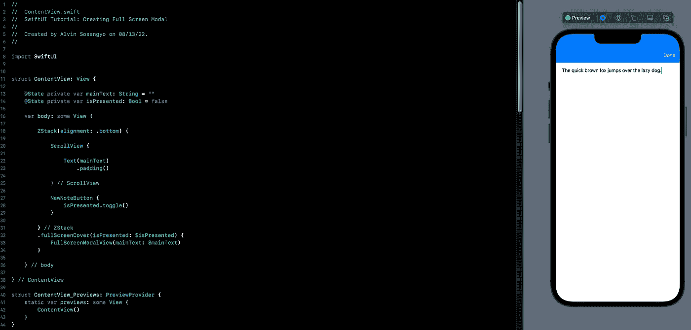
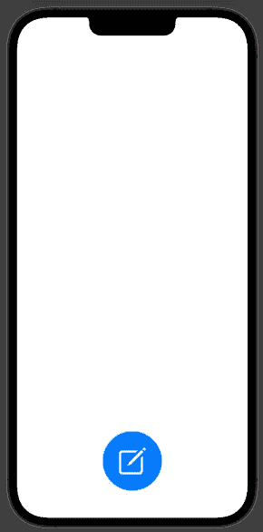
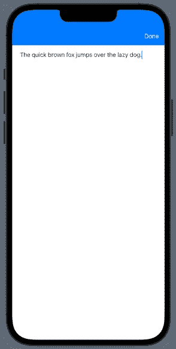
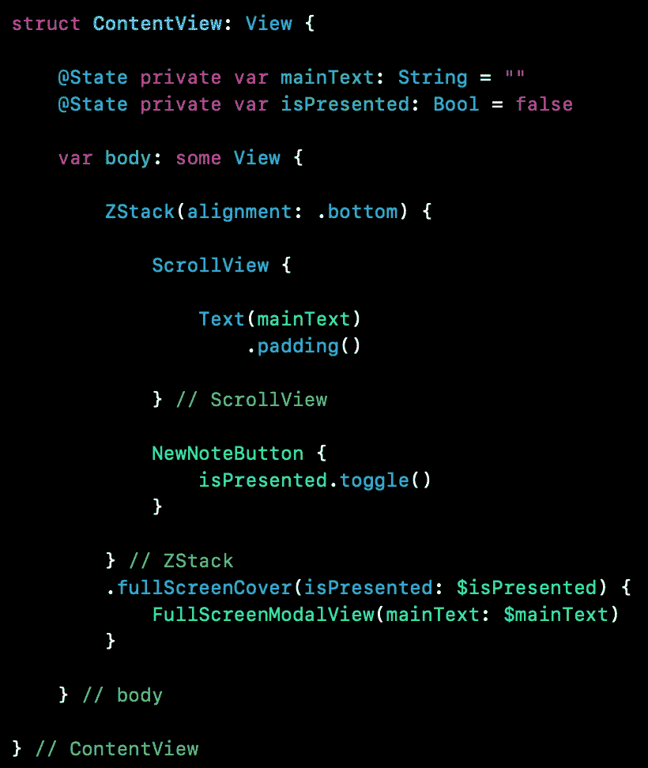
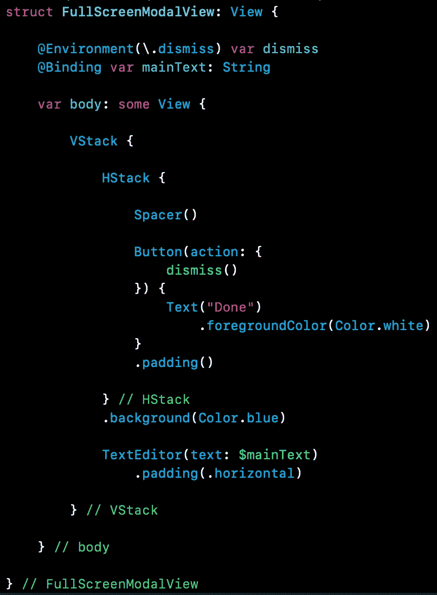
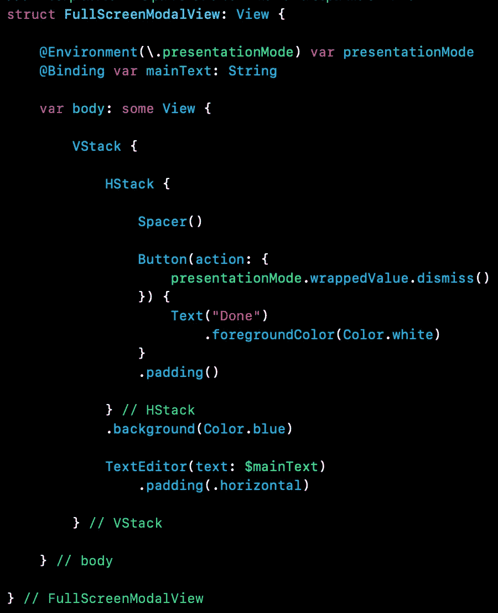

# SwiftUI 教程:创建全屏模式

> 原文：<https://blog.devgenius.io/swiftui-tutorial-creating-full-screen-modal-ada38f6360ae?source=collection_archive---------5----------------------->

## 如何在 SwiftUI 中使用 fullScreenCover



图一。

模态是在当前视图上显示为覆盖或弹出的视图。在 SwiftUI 中，我们基本上为模态使用了一个 [sheet](https://medium.com/dev-genius/swiftui-tutorial-working-with-sheet-6c9b97822e10) 修饰符，这实际上提供了开发人员需要的一般功能。

但是对于覆盖整个屏幕的模态，有一个为它构建的修改器，叫做 *fullScreenCover* ，可以在 **iOS14** 和更高版本上获得。

在本教程中，我们将创建一个简单的应用程序，当按钮被按下时，它将弹出一个全屏模式视图。新视图接受也出现在主视图中的文本。用户界面类似于下面的图 2 和图 3。



图二。主视图



图 3。全屏模式

所以让我们开始创建一个[新的](https://medium.com/dev-genius/introduction-to-swiftui-creating-new-project-9adc502e1804) SwiftUI 项目。

首先，让我们设置主视图。像这样编辑内容视图:

```
struct ContentView: View {

    @State private var mainText: String = ""

    var body: some View {

        ZStack {

            ScrollView {

                Text(mainText)
                    .padding()

            } // ScrollView

        } // ZStack

    } // body

} // ContentView
```

因此，主视图将保存一个从 modal 编写的可滚动的[文本](/swiftui-tutorial-working-with-text-15de81494a07)。

接下来我们需要的是一个[浮动动作按钮](/swiftui-tutorial-working-with-text-15de81494a07),点击它会让全屏模式出现。在 ContentView 之外编写以下代码:

```
struct NewNoteButton: View {

    var action: () -> Void

    var body: some View {

        Button(action: action) {
            Image(systemName: "square.and.pencil")
                .resizable()
                .scaledToFill()
                .frame(width: 50, height: 50)
                .padding(30)
        }
        .background(.blue)
        .foregroundColor(.white)
        .cornerRadius(.infinity)
        .padding()

    } // body

} // newNoteButton
```

然后将新创建的按钮放在 ZStack 内的 ContentView 中，就在 ScrollView 的下面，如下所示:

```
struct ContentView: View {

    @State private var mainText: String = ""

    var body: some View {

        ZStack {

            ScrollView {

                Text(mainText)
                    .padding()

            } // ScrollView

            NewNoteButton {}

        } // ZStack

    } // body

} // ContentView
```

查看 canvass，您会注意到按钮位于中间，看起来不像图 2 中所示的按钮。我们可以通过修改 ZStack 的对齐方式快速解决这个问题，如下所示:

```
ZStack(alignment: .bottom)
```

现在看起来和设计上的一模一样。

# 使用全屏覆盖

fullScreenCover 修改器的工作原理与 sheet 相同。它需要一个绑定的状态变量，这样你就可以控制它是否存在。在 ContentView 中添加此变量:

```
@State private var isPresented: Bool = false
```

然后将修改器附着到视图。将 fullScreenCover 修饰符放置到 ContentView 的 ZStack，如下所示:

```
.fullScreenCover(isPresented: $isPresented) {}
```

现在修改器已经准备好了，是时候创建外部全屏模式视图了。在 ContentView 之外编写以下代码:

```
struct FullScreenModalView: View {

    @Binding var mainText: String

    var body: some View {

        VStack {

            TextEditor(text: $mainText)
                .padding(.horizontal)

        } // VStack

    } // body

} // FullScreenModalView
```

所以上面的视图有一个[文本编辑器](/swiftui-tutorial-working-with-texteditor-a059eb899084)，我们将[把它的字符串](https://medium.com/geekculture/swiftui-tutorial-state-and-binding-b7e80b4de622)绑定到内容视图。

将新视图作为 fullScreenCover 的内容，如下所示:

```
.fullScreenCover(isPresented: $isPresented) {
    FullScreenModalView(mainText: $mainText)
}
```

剩下要做的事情是改变 isPresented 的状态，使全屏模式出现。将此操作放在 NewNoteButton 中，如下所示:

```
NewNoteButton {
    isPresented.toggle()
}
```

如果你迷路了，这里有一个代码截图:



图 4。内容视图源代码

让我们通过运行程序并点击浮动操作按钮来进行测试。轻按时，应该会出现一个新视图。

# 画龙点睛

好吧，我知道 UI 看起来不完全像图 3 中的那个，我们没有办法关闭弹出的模态。那是因为我们还没有完成。

在 FullScreenModalView 上添加带有“完成”按钮的标题。像这样编辑它:

```
struct FullScreenModalView: View {

    @Binding var mainText: String

    var body: some View {

        VStack {

            HStack {

                Spacer()

                Button(action: {

                }) {
                    Text("Done")
                        .foregroundColor(Color.white)
                }
                .padding()

            } // HStack
            .background(Color.blue)

            TextEditor(text: $mainText)
                .padding(.horizontal)

        } // VStack

    } // body

} // FullScreenModalView
```

现在视图看起来如图 3 所示。

对于 Done 按钮，我们将在它上面放置一个解除动作，点击它将关闭整个视图。首先创建一个包装在解散属性中的变量，如下所示:

```
@Environment(\.dismiss) var dismiss
```

然后简单地将消除功能放在按钮动作上，如下所示:

```
Button(action: {
    dismiss()
}) {
    Text("Done")
        .foregroundColor(Color.white)
}
.padding()
```

下面是全部源代码的截图，以防你迷路。



图 5。FullScreenModalView 源代码

**注:** \。解除仅适用于 iOS15 及以上版本。这里有一个替代方案。

```
@Environment(\.presentationMode) var presentationMode
```

然后你需要像这样调用整个 wrappedValue。

```
Button(action: {
    presentationMode.wrappedValue.dismiss()
}) {
    Text("Done")
        .foregroundColor(Color.white)
}
.padding()
```

这是使用*演示模式*的截图。



图 6。iOS14 及以下版本的 FullScreenModalView 源代码

我们期待已久的时刻。运行应用程序，并尝试在模式中键入语句。它应该会出现在主视图上。干得好。

这里是源代码的 github [链接](https://github.com/athurion/SwiftUI-Tutorial-Creating-Full-Screen-Modal/blob/main/ContentViewFullScreenCover.swift)。

愿法典与你同在，

-电弧