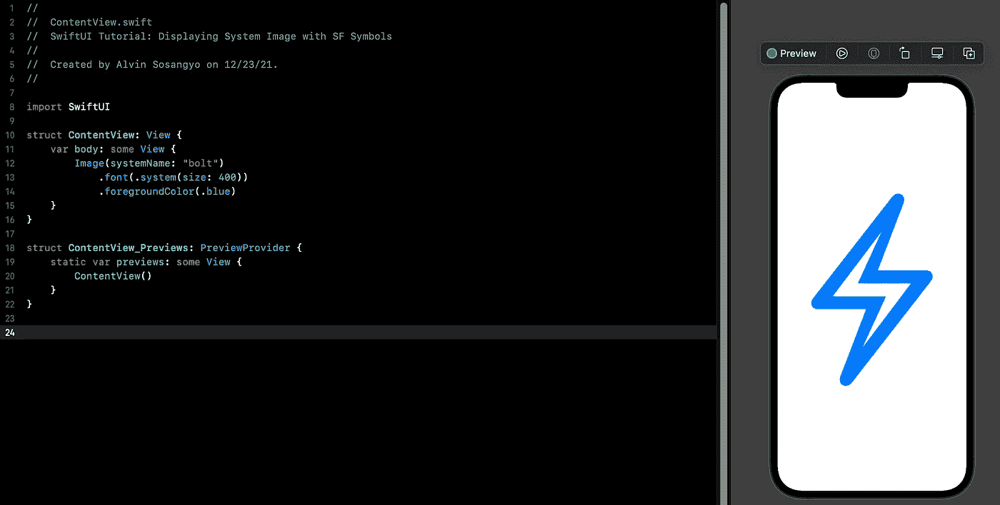
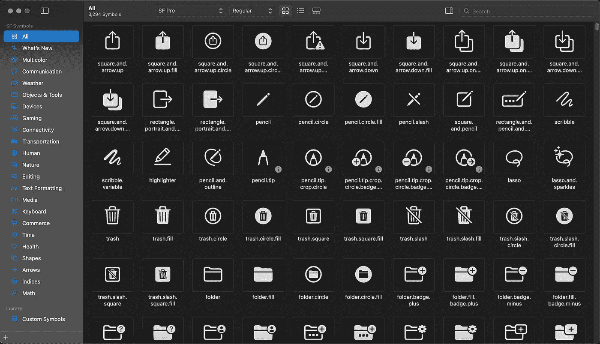
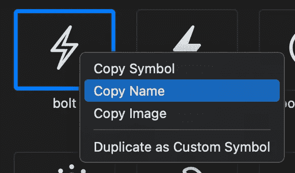
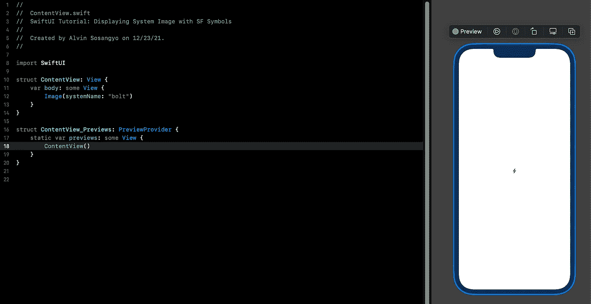
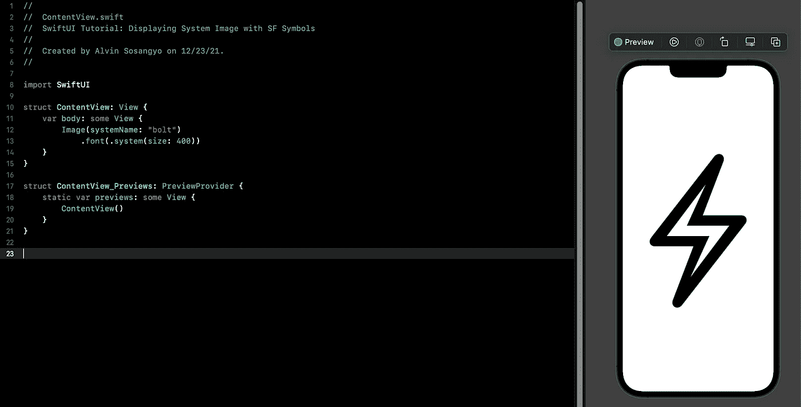
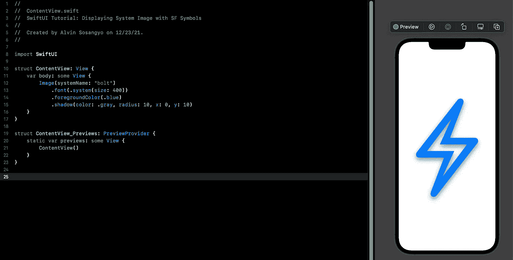

# SwiftUI 教程:用 SF 符号显示系统图像

> 原文：<https://blog.devgenius.io/swiftui-tutorial-displaying-system-image-with-sf-symbols-75c01b5bf421?source=collection_archive---------2----------------------->



图 1

在我之前的文章中，我们解决了在 SwiftUI 中使用你自己的[图像](https://arc-sosangyo.medium.com/swiftui-tutorial-working-with-images-62040c279960)的基础问题。

> *本教程是我的* [*SwiftUI 教程*](https://arc-sosangyo.medium.com/list/swiftui-tutorial-03734e631240) *系列的一部分。*

SF Symbols 是一个集成了苹果平台系统字体的图标集。它为开发人员提供了在应用程序上免费使用符号的便利。对于像我这样发布我们自己的应用程序的独立开发者来说，这是一个很大的帮助。它为我们节省了创建或购买我们需要的图标的时间和麻烦。在撰写本文时，已经有 3200 个可用的 SF 符号可供开发者用于他们的苹果平台应用程序。

> **重要提示:** SF Symbols 和 SwiftUI 仅在 iOS 13 或更高版本上兼容。

如果您没有现成的练习项目，请先创建一个新项目，按照此[链接](/introduction-to-swiftui-creating-new-project-9adc502e1804)上的步骤操作。

# SF 符号在哪里

SF 符号应用程序已经预装在现代 MAC 上。使用**command+空格键**，输入**“SF Symbols”**，然后选择并打开 **SF Symbols** ，即可简单搜索。



图二。SF 符号在 mac 上的应用

如果你的 mac 上没有 sf symbols 应用程序，你可以在 SF Symbols 官方[网站](https://developer.apple.com/sf-symbols/)上下载。

# 如何在你的应用程序中使用 SF 符号

一种方便且无错误的方法是首先复制所需符号的名称。这可以通过右击图标并选择*“复制名称”来完成。*下面的例子显示了我选择的螺栓系统图像。



图 3。“复制名称”螺栓系统图像

然后将其粘贴到 systemName 下，如下所示:

例如

```
Image(systemName: "bolt")
```



图 4。在应用程序上使用系统映像

# 调整系统图像的大小

SF Symbols 是为苹果平台字体打造的。所以在应用修饰符的时候基本上被当做[字体](/swiftui-tutorial-working-with-text-15de81494a07)来处理。

您可以在下的尺寸参数下调整系统图像的尺寸。字体修饰符。

例如

```
Image(systemName: "bolt")
    .font(.system(size: 400))
```



图 5。调整系统图像的大小

# 改变外观

同样，由于系统图像被视为[字体](/swiftui-tutorial-working-with-text-15de81494a07)，修饰符。前景颜色可以改变它的颜色。

例如

```
Image(systemName: "bolt")
    .foregroundColor(.blue)
```

还可以添加一些阴影效果。

```
Image(systemName: "bolt")
    .font(.system(size: 400))
    .foregroundColor(.blue)
    .shadow(color: .gray, radius: 10, x: 0, y: 10)
```



图 6。添加阴影效果

在我们的下一篇 SwiftUI 文章中期待另一个与图像相关的教程。

愿法典与你同在，

-电弧

## 脚注:

[](https://developer.apple.com/sf-symbols/) [## SF 符号-苹果开发者

### 拥有超过 3200 个符号，旧金山符号是一个图像学图书馆，旨在与旧金山无缝集成…

developer.apple.com](https://developer.apple.com/sf-symbols/) [](https://developer.apple.com/design/human-interface-guidelines/sf-symbols/overview/) [## SF 符号. SF 符号.人机界面指南.苹果开发者

### SF 符号提供了一组超过 3，200 个一致的、高度可配置的符号，您可以在您的应用程序中使用。苹果设计了…

developer.apple.com](https://developer.apple.com/design/human-interface-guidelines/sf-symbols/overview/)