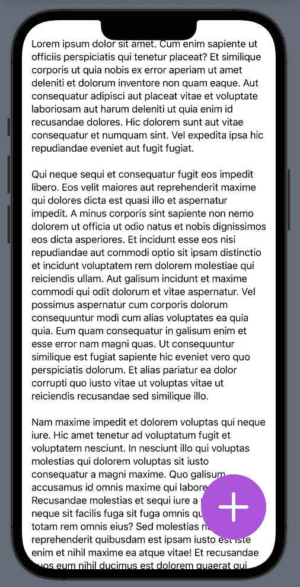

# SwiftUI 教程:如何制作一个浮动的动作按钮(FAB)

> 原文：<https://blog.devgenius.io/swiftui-tutorial-how-to-make-a-floating-action-button-fab-867d3183375?source=collection_archive---------3----------------------->

## 创建浮动操作按钮的不同方法


图一。

在现代应用程序 UI 标准中，浮动操作按钮(FAB)充当应用程序的主按钮。它通常被设计为最引人注目和最容易访问的按钮，用于执行应用程序的重要功能，例如为笔记应用程序创建新笔记，或为社交媒体应用程序创建新帖子。

> 本教程是我的 [SwiftUI 教程](https://arc-sosangyo.medium.com/list/swiftui-tutorial-03734e631240)系列的一部分。

本教程假设您已经知道如何在 SwiftUI 中使用[按钮](https://medium.com/dev-genius/swiftui-tutorial-working-with-buttons-ee3fdcfb8337)。用[系统映像](https://medium.com/dev-genius/swiftui-tutorial-displaying-system-image-with-sf-symbols-75c01b5bf421)在 SwiftUI 中创建一个 FAB 基本上很容易。在 ContentView 中写下以下代码:

```
struct ContentView: View {

    var body: some View {

        Button(action: {
            //Place your action here
        }) {
            Image(systemName: "plus.circle.fill")
                .font(.system(size: 100))
                .foregroundColor(.purple)
                .shadow(color: .gray, radius: 0.2, x: 1, y: 1)
                .padding()
        }

    } //body

} //ContentView
```


图二。

SF Symbols 有很多可用的循环系统图像，非常适合 FAB。

# 将它与其他视图放在一起

当谈到外观时，一个 FAB 通常在另一个视图之上，以产生漂浮的效果。最好是可滚动的，以便仍然可以访问被覆盖的项目。让我们像这样用 ZStack 嵌入按钮:

```
struct ContentView: View {

    var body: some View {

        ZStack {

            Button(action: {
                //Place your action here
            }) {
                Image(systemName: "plus.circle.fill")
                    .font(.system(size: 100))
                    .foregroundColor(.purple)
                    .shadow(color: .gray, radius: 0.2, x: 1, y: 1)
                    .padding()
            }

        } //ZStack

    } //body

} //ContentView
```

如果这是你第一次处理栈和嵌入视图，我强烈推荐你先学习这个教程。

现在让我们放一个带有文本的可滚动视图。对于本教程，我们只是要使用一个长的模拟文本。将此[常量](https://medium.com/@arc-sosangyo/swift-programming-tutorial-variables-670ceea20bd1)粘贴到内容视图之外:

```
let sampleText = """
Lorem ipsum dolor sit amet. Cum enim sapiente ut officiis perspiciatis qui tenetur placeat? Et similique corporis ut quia nobis ex error aperiam ut amet deleniti et dolorum inventore non quam eaque. Aut consequatur adipisci aut placeat vitae et voluptate laboriosam aut harum deleniti ut quia enim id recusandae dolores. Hic dolorem sunt aut vitae consequatur et numquam sint. Vel expedita ipsa hic repudiandae eveniet aut fugit fugiat.

Qui neque sequi et consequatur fugit eos impedit libero. Eos velit maiores aut reprehenderit maxime qui dolores dicta est quasi illo et aspernatur impedit. A minus corporis sint sapiente non nemo dolorem ut officia ut odio natus et nobis dignissimos eos dicta asperiores. Et incidunt esse eos nisi repudiandae aut commodi optio sit ipsam distinctio et incidunt voluptatem rem dolorem molestiae qui reiciendis ullam. Aut galisum incidunt et maxime commodi qui odit dolorum et vitae aspernatur. Vel possimus aspernatur cum corporis dolorum consequuntur modi cum alias voluptates ea quia quia. Eum quam consequatur in galisum enim et esse error nam magni quas. Ut consequuntur similique est fugiat sapiente hic eveniet vero quo perspiciatis dolorum. Et alias pariatur ea dolor corrupti quo iusto vitae ut voluptas vitae ut reiciendis recusandae sed similique illo.

Nam maxime impedit et dolorem voluptas qui neque iure. Hic amet tenetur ad voluptatum fugit et voluptatem nesciunt. In nesciunt illo qui voluptas molestias qui dolorem voluptas sit iusto consequatur a magni maxime. Quo galisum accusamus id omnis maxime qui labore molestiae. Recusandae molestias et sequi iure a reiciendis neque sit facilis fuga sit fuga omnis qui reiciendis totam rem omnis eius? Sed molestias nulla qui reprehenderit quibusdam est ipsam iusto est iste enim et nihil maxime ea atque vitae! Et recusandae quos eum nihil ducimus est dolorem quaerat qui rerum iusto.
"""
```

然后在 ContentView 的 ZStack 里面添加一个 [*TextView*](https://medium.com/dev-genius/swiftui-tutorial-working-with-text-15de81494a07) 和 *ScrollView* 如下:

```
struct ContentView: View {

    var body: some View {

        ZStack {

            ScrollView {
                Text(sampleText)
                    .padding()
            }

            Button(action: {
                //Place your action here
            }) {
                Image(systemName: "plus.circle.fill")
                    .font(.system(size: 100))
                    .foregroundColor(.purple)
                    .shadow(color: .gray, radius: 0.2, x: 1, y: 1)
                    .padding()
            }

        } //ZStack

    } //body

} //ContentView
```

现在这个应用程序看起来像这样:


图 3。滚动视图上的 FAB

虽然该应用程序正在按预期工作，但用户界面真的很差。FAB 通常放在屏幕下方，这样就很容易够到，也不会干扰内容。编辑底部的 ZStack 对齐方式，如下所示:

```
struct ContentView: View {

    var body: some View {

        ZStack(alignment: .bottom) {

            ScrollView {
                Text(sampleText)
                    .padding()
            }

            Button(action: {
                //Place your action here
            }) {
                Image(systemName: "plus.circle.fill")
                    .font(.system(size: 100))
                    .foregroundColor(.purple)
                    .shadow(color: .gray, radius: 0.2, x: 1, y: 1)
                    .padding()
            }

        } //ZStack

    } //body

} //ContentView
```

再次运行应用程序。现在看起来好多了。


图 4。滚动视图中基于标准 FAB 的用户界面

Github 上有源代码。点击这个[链接](https://github.com/athurion/SwiftUI-Tutorial-How-to-make-a-Floating-Action-Button-FAB-/blob/main/ContentViewFAB.swift)就可以了。

# 创建圆形按钮

在前面的例子中，我们依靠内置的系统映像来制作一个圆形按钮。然而，它有一些限制。如果用“照片”之类的系统镜像，就不好看了。让我通过修改如下代码向您展示:

```
Button(action: {
    //Place your action here
}) {
    Image(systemName: "photo")
        .font(.system(size: 100))
        .foregroundColor(.purple)
        .shadow(color: .gray, radius: 0.2, x: 1, y: 1)
        .padding()
}
```


图 5。使用非圆形系统图像的示例

看起来不太好，对吧？

也有一些人不喜欢按钮上的孔。我指的是这个:


图 6。孔按钮效应

因此，解决这类问题的方法是对圆形按钮设计进行编码。我们要做一个按钮，看起来像这样:


图 7。编码圆形按钮设计

使用与上一个例子相同的代码库。通过改变我们使用的 SF 符号**(加号)**来修改 ImageView，然后将系统图像视为[图像](https://medium.com/dev-genius/swiftui-tutorial-working-with-images-62040c279960)，在这里我们使其可调整大小、缩放并使用 frame modifier 调整其大小。代码如下:

```
Image(systemName: "plus")
    .resizable()
    .scaledToFill()
    .frame(width: 50, height: 50)
    .padding(30)
```

我们还添加了一些填充，让图像和边框之间有一些喘息的空间。

它看起来还不是圆形的，对吗？因为我们还没完。我们只是修改了图像的外观。我们还没有修改[按钮](https://medium.com/dev-genius/swiftui-tutorial-working-with-images-62040c279960)。将此修改器放置在按钮视图下方:

```
.background(.purple)
.foregroundColor(.white)
.cornerRadius(.infinity)
.padding()
```

这是我们调整颜色并将 cornerRadius 设置为无穷大以将按钮转换为圆形的地方。这是源代码的截图，以防你忘记了。


图 8。圆形按钮源代码

现在运行代码。这个应用程序现在看起来如图 7 所示。

让我们在新的按钮源代码中再次尝试使用 SF 符号中的“照片”。

```
Button(action: {
    //Place your action here
}) {
    Image(systemName: "photo")
        .resizable()
        .scaledToFill()
        .frame(width: 50, height: 50)
        .padding(30)
}
.background(.purple)
.foregroundColor(.white)
.cornerRadius(.infinity)
.padding()
```


图 9。使用非圆形系统映像

看起来比图 5 中的更好。

# 额外内容:将晶圆厂放置在右侧

你没看错。我们还没完。你会注意到很多常用的应用程序都把 FAB 放在右边，就像这样:



图 10。屏幕右侧的 FAB 位置

为此，您需要在 *HStack* 中再次嵌入按钮，然后在按钮之前先放置一个 *Spacer()* struct。代码如下:

```
struct ContentView: View {

    var body: some View {

        ZStack(alignment: .bottom) {

            ScrollView {
                Text(sampleText)
                    .padding()
            }

            HStack {

                Spacer()

                Button(action: {
                    //Place your action here
                }) {
                    Image(systemName: "plus")
                        .resizable()
                        .scaledToFill()
                        .frame(width: 50, height: 50)
                        .padding(30)
                }
                .background(.purple)
                .foregroundColor(.white)
                .cornerRadius(.infinity)
                .padding()

            } //HStack

        } //ZStack

    } //body

} //ContentView
```

现在，应用程序将如图 9 所示。

作为一个建议，你也应该给左撇子一个公平的待遇，让他们选择把 FAB 放在左边，就像这样:


图 11。FAB 放置在屏幕的左侧

代码几乎是一样的，你只需要先放上按钮，然后放上间隔结构，就像这样:

```
HStack {

    Button(action: {
        //Place your action here
    }) {
        Image(systemName: "plus")
            .resizable()
            .scaledToFill()
            .frame(width: 50, height: 50)
            .padding(30)
    }
    .background(.purple)
    .foregroundColor(.white)
    .cornerRadius(.infinity)
    .padding()

    Spacer()

} //HStack
```

我还在 [github](https://github.com/athurion/SwiftUI-Tutorial-How-to-make-a-Floating-Action-Button-FAB-/blob/main/ContentViewFABCircularButton.swift) 上传了源代码。

愿法典与你同在，

-电弧