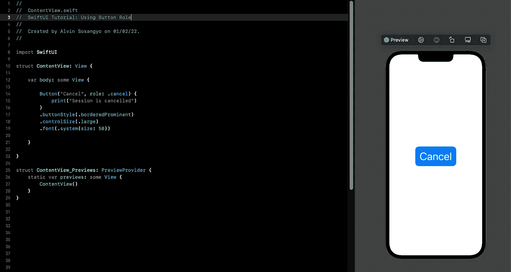
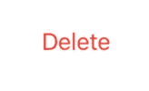
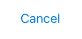
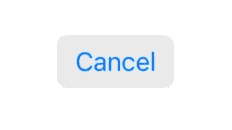
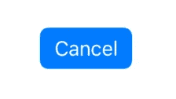
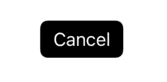
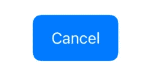
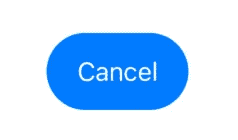

# SwiftUI 教程:使用按钮角色

> 原文：<https://blog.devgenius.io/swiftui-tutorial-using-button-role-17c6e1d1924f?source=collection_archive---------6----------------------->



图一。

在 SwiftUI 3 中引入，将仅在 iOS 15 或更高版本上兼容。按钮角色允许 iOS 根据可用的预定义的[枚举](https://arc-sosangyo.medium.com/swift-programming-tutorial-enums-542ebf55b0a5)自动生成适当的按钮外观，从而让您编写更少的代码。

> 本教程是我的 [SwiftUI 教程](https://arc-sosangyo.medium.com/list/swiftui-tutorial-03734e631240)系列的一部分。

在我们开始之前，请确保创建或打开一个现有的项目。如果你需要一步一步的过程，请点击这个[链接](/introduction-to-swiftui-creating-new-project-9adc502e1804)。如果你是第一次使用 SwiftUI 按钮，我还建议你先学习这个教程。

# 按钮角色

可以使用以下语法创建按钮角色:

```
Button(//Text label, role: //Either destructive or cancel) {
    //What will initiate when the button is pressed
}
    //What will the button look like
```

填充最需要的参数是角色。基本上，有两个可用角色:破坏性和取消。两者在选择时都已经有了一个预先准备好的外观。

这是一个破坏性的示例代码。

```
import SwiftUI

struct ContentView: View {

    var body: some View {

        Button("Delete", role: .destructive) {
            print("Deleted successfully")
        }

    }

}
```



图二。

这是取消的示例代码。

```
import SwiftUI

struct ContentView: View {

    var body: some View {

        Button("Cancel", role: .cancel) {
            print("Session is cancelled")
        }

    }

}
```



图 3。

测试这两个代码，注意默认字体颜色已经预先定义好了。取消使用蓝色，破坏性使用红色。

现在让我们使用不同的可用修改器来定制更多的按钮。

# 按钮样式

按钮样式提供了制作圆角按钮的便利。

的。buttonStyle 基本是这样用的:

```
Button("Cancel", role: .cancel) {
    print("Session is cancelled")
}
.buttonStyle(.bordered)
```



图 4。

使用。borderedProminent 提供了更强的背景色。

```
Button("Cancel", role: .cancel) {
    print("Session is cancelled")
}
.buttonStyle(.borderedProminent)
```



图 5。

# 按钮色调

的。色调修改器允许您覆盖按钮的默认强调色。

下面的代码覆盖了取消角色的默认蓝色，将其从蓝色改为黑色。

```
Button("Cancel", role: .cancel) {
    print("Session is cancelled")
}
.buttonStyle(.borderedProminent)
.tint(.black)
```



图 6。

# 按钮控件大小

按钮控件大小允许调整视图中控件的大小。选项有迷你、小型、常规和大型。

```
Button("Cancel", role: .cancel) {
    print("Session is cancelled")
}
.buttonStyle(.borderedProminent)
.controlSize(.large)
```



图 7。

# 按钮形状

还提供了预定义的修改器来改变按钮的边框形状。

```
Button("Cancel", role: .cancel) {
    print("Session is cancelled")
}
.buttonStyle(.borderedProminent)
.controlSize(.large)
.buttonBorderShape(.capsule)
```



图 8。

在我们的下一个教程中，我们将了解使用[堆栈](https://arc-sosangyo.medium.com/swiftui-tutorial-working-with-stacks-vstack-hstack-and-zstack-2b0070be18d7)在 SwiftUI 中布局用户界面是多么容易。

愿法典与你同在，

-电弧