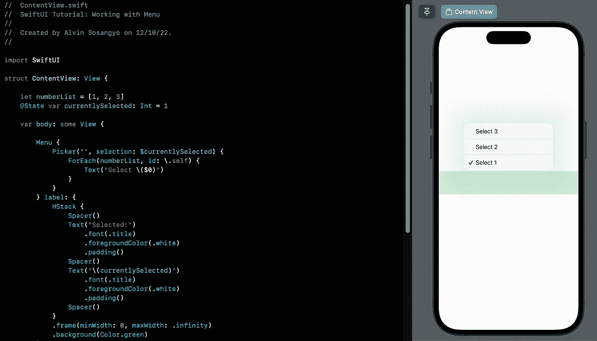
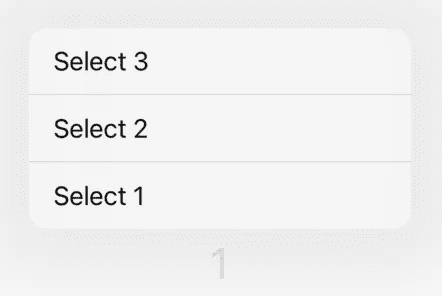
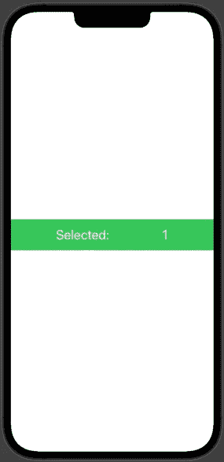
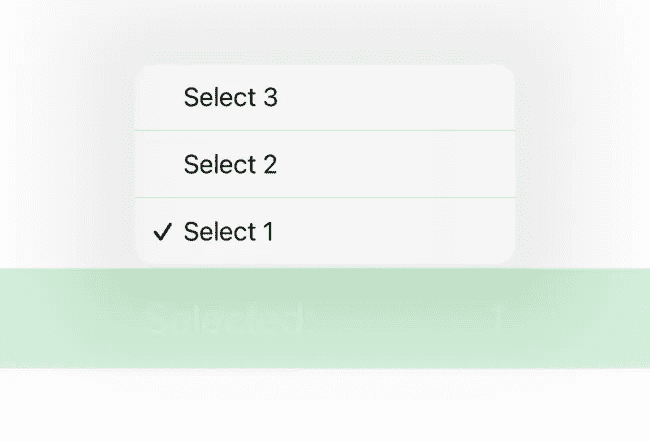
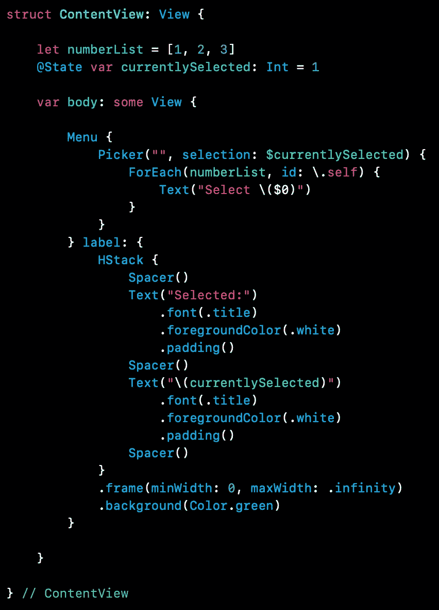

# SwiftUI 教程:在菜单中使用选择器

> 原文：<https://blog.devgenius.io/swiftui-tutorial-using-picker-in-menu-516d642689f8?source=collection_archive---------2----------------------->

## 如何在菜单中当前选中的项目上放置复选标记



图一。

这篇文章是我过去两个教程[使用菜单](/swiftui-tutorial-working-with-menu-2d19399a8f1c)和[使用选择器](https://medium.com/geekculture/swiftui-tutorial-working-with-picker-f3e68a0c2724)的延续。

除了[按钮](https://medium.com/dev-genius/swiftui-tutorial-working-with-buttons-ee3fdcfb8337)，你还可以在菜单视图中使用[选择器](https://medium.com/geekculture/swiftui-tutorial-working-with-picker-f3e68a0c2724)。这样，您可以轻松地弹出一个与 Picker 中的行为相同的弹出窗口。但在此之前，让我们先通过编写一个使用按钮的简单菜单视图来进行比较。记下这段代码:

```
struct ContentView: View {

    @State var currentlySelected: Int = 1

    var body: some View {

        Menu {
            Button("Select 1") {
                currentlySelected = 1
            }
            Button("Select 2") {
                currentlySelected = 2
            }
            Button("Select 3") {
                currentlySelected = 3
            }
        } label: {
            Text("\(currentlySelected)")
                .font(.title)
        }

    }

} // ContentView
```

运行该应用程序将为您提供一个如图 2 所示的菜单，其中按钮标签文本根据您选择的数字而变化。



图二。改变标签

记住首先使用菜单而不是选择器的好处。这就是定制标签的能力。现在让我们改变标签的设计，如图 3 所示。



图 3。不同的标签设计

这种设计可以通过如下编辑标签参数的代码来实现:

```
HStack {
    Spacer()
    Text("Selected:")
        .font(.title)
        .foregroundColor(.white)
        .padding()
    Spacer()
    Text("\(currentlySelected)")
        .font(.title)
        .foregroundColor(.white)
        .padding()
    Spacer()
}
.frame(minWidth: 0, maxWidth: .infinity)
.background(Color.green)
```

再次运行应用程序。它现在应该看起来如图 3 所示。

# 添加复选标记

在大多数情况下，当菜单显示时，知道当前选择的选项是很好的。如*拾取器*视图中的复选标记，如下所示:



图 4。当前所选项上带有复选标记的菜单

我并不是说没有 Picker 视图的帮助是不可能的。我唯一的观点是，既然已经有这样的视图，为什么还要从头开始编码呢？

要在菜单上添加复选标记，只需用选取器替换按钮。但是首先，创建一个包含选项的数组。在*内容视图*中写入这个常量属性:

```
let numberList = [1, 2, 3]
```

然后编辑菜单的内容参数，用如下所示的选择器替换按钮:

```
Picker("", selection: $currentlySelected) {
    ForEach(numberList, id: \.self) {
        Text("Select \($0)")
    }
}
```

我只在第一个参数上写了空白字符串，因为它不会出现在*菜单*上。这里重要的是[将](https://medium.com/geekculture/swiftui-tutorial-state-and-binding-b7e80b4de622)当前选择的*属性绑定到选择参数。这基本上会告诉*拾取器*查看当前选中的项目，其中会出现复选标记。然后我们使用了一个 [ForEach](https://medium.com/dev-genius/swiftui-tutorial-working-with-list-using-foreach-a4b7451fbcf0) 循环来避免代码重复。*

下面是源代码的截图，以防你迷路:



图 5。带有选择器的菜单的源代码

运行程序。您的菜单现在应该有一个如图 4 所示的复选标记。

这里 github [链接](https://github.com/athurion/SwiftUI-Tutorial-Using-Picker-in-Menu/blob/main/ContentViewMenuPicker.swift)为全部源代码。

愿法典与你同在，

-电弧