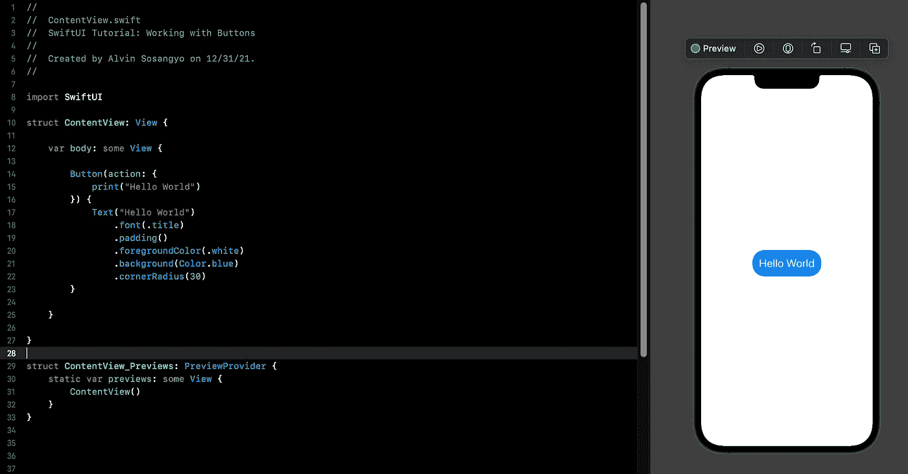
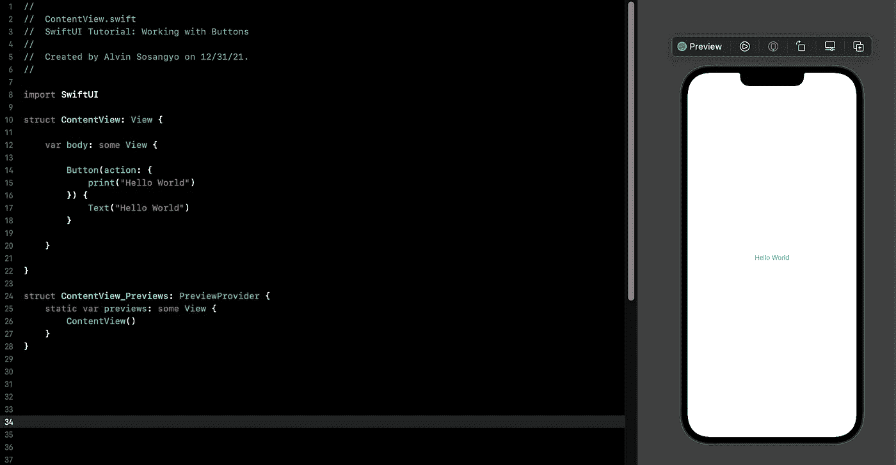
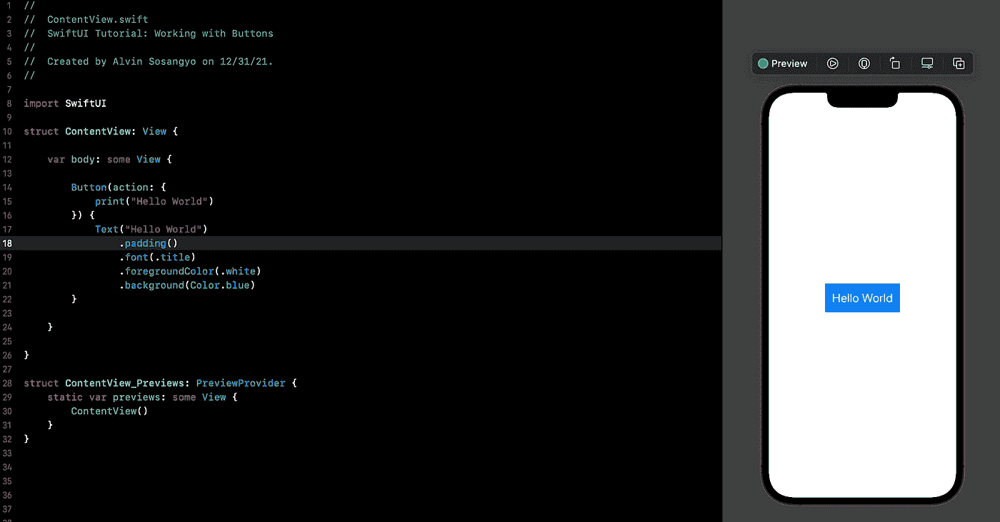
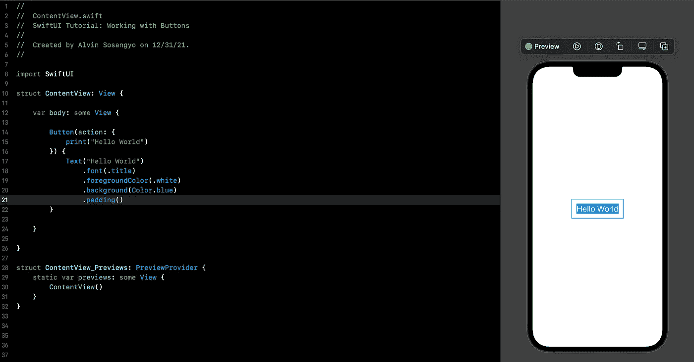
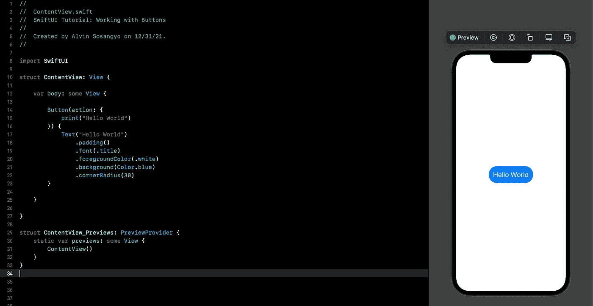
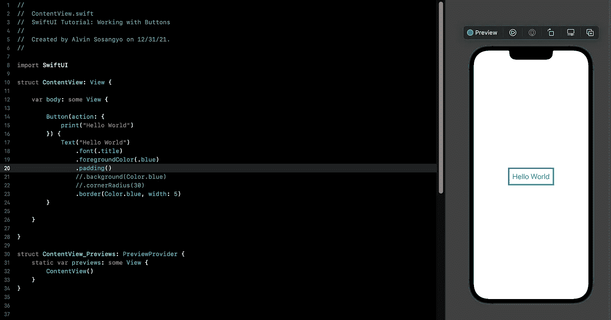
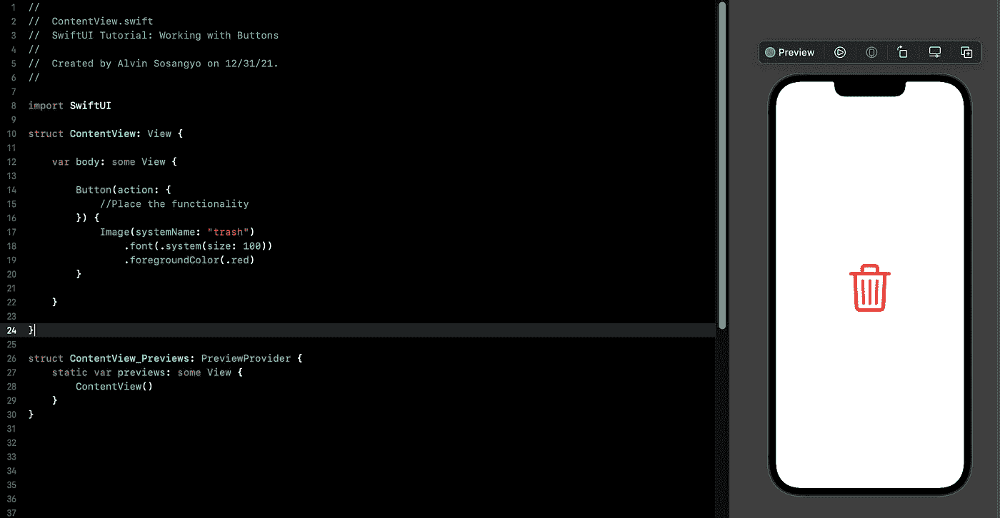
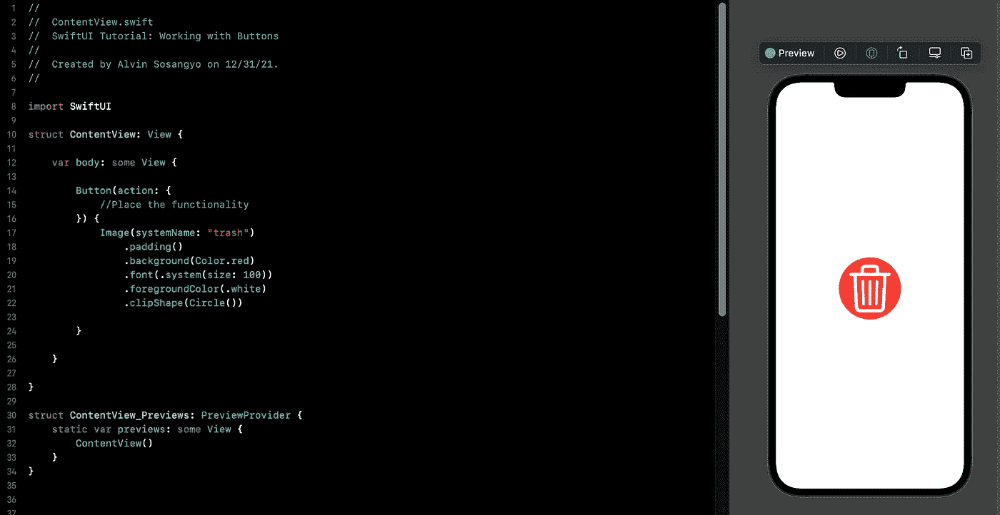
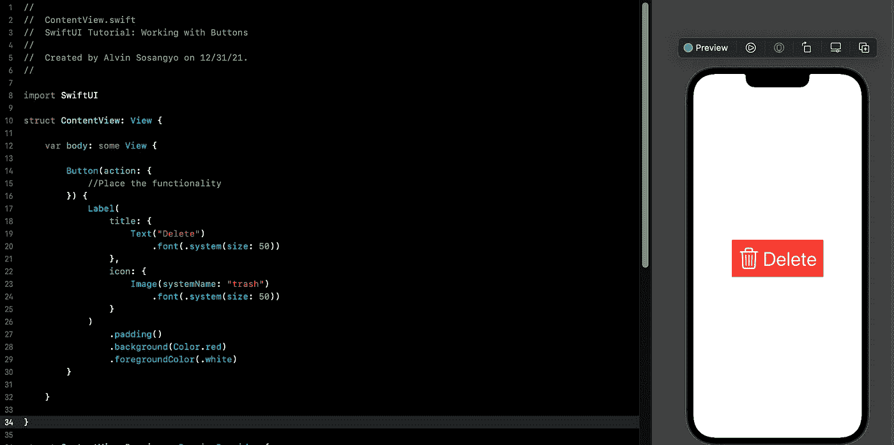

# SwiftUI 教程:使用按钮

> 原文：<https://blog.devgenius.io/swiftui-tutorial-working-with-buttons-ee3fdcfb8337?source=collection_archive---------3----------------------->



图 1

按钮被按下时启动或触发一个动作。在 SwiftUI 中，与 UIButton 相比，自定义按钮要容易得多。

在本教程中，您将学习如何创建按钮，自定义按钮的外观，并使它们在被按下时启动功能。

> *本教程是我的* [*SwiftUI 教程*](https://arc-sosangyo.medium.com/list/swiftui-tutorial-03734e631240) *系列的一部分。*

在我们开始之前，请确保创建或打开一个现有的项目。如果你需要一步一步的过程来做这件事，请跟随这个[链接](/introduction-to-swiftui-creating-new-project-9adc502e1804)。

# 创建按钮

在 SwiftUI 中编写一个按钮真的很简单。下面的语法显示了如何操作:

```
Button(action: {
    // What will initiate when the button is pressed
}) {
    // What will the button look like
}
```

让我们在注释块中放置一些代码，如下所示:

```
struct ContentView: View {

    var body: some View {

        Button(action: {
            print("Hello World")
        }) {
            Text("Hello World")
        }

    }

}
```



图二。创建 SwiftUI 按钮

默认情况下，您不能按画布上的按钮。要测试该按钮的功能，可以通过按下左上角的 play 按钮在模拟器上运行它，或者只需点击快捷键: **command+r** 。

> **注意:**写这篇文章的时候我用的是 Xcode 13。

当控制台消息出现在 Xcode 的下半部分时，您将知道代码是有效的。

# 自定义按钮的外观

让我们使用从[使用 SwiftUI text](/swiftui-tutorial-working-with-text-15de81494a07) 教程中学到的东西，并在这里应用它来改变按钮的字体外观。

```
import SwiftUI

struct ContentView: View {

    var body: some View {

        Button(action: {
            print("Hello World")
        }) {
            Text("Hello World")
                .font(.title)
                .foregroundColor(.white)
                .background(Color.blue)
        }

    }

}
```

看到画布中的输出，您会注意到文本需要更多的呼吸空间。所以我们添加了 padding()来提供所需的空间。

```
Text("Hello World")
    .padding()
    .font(.title)
    .foregroundColor(.white)
    .background(Color.blue)
```



图 3。更改按钮的字体外观

> **重要提示:**确保在其他修饰符之前先插入填充。否则，外观将会不同，如下图 4 所示。



图 4。最后放置衬垫

如果您想要一个圆形边框按钮，您可以使用。cornerRadius()修饰符。

```
Text("Hello World")
    .padding()
    .font(.title)
    .foregroundColor(.white)
    .background(Color.blue)
    .cornerRadius(30)
```



图 5。添加圆角半径

让按钮没有背景色的边框怎么样？

```
Text("Hello World")
    .font(.title)
    .foregroundColor(.blue)
    .padding()
    .border(Color.blue, width: 5)
```



图 6。带边框的按钮

# 使用图像更改按钮的外观

更改按钮的外观不仅限于自定义其字体样式。[图像](/swiftui-tutorial-working-with-images-62040c279960)也可用于改变 SwiftUI 按钮的外观。在下面的例子中，我们将使用[系统图像](/swiftui-tutorial-displaying-system-image-with-sf-symbols-75c01b5bf421)来设计我们的按钮。

```
import SwiftUI

struct ContentView: View {

    var body: some View {

        Button(action: {
            //Place the functionality
        }) {
            Image(systemName: "trash")
                .font(.system(size: 100))
                .foregroundColor(.red)
        }

    }

}
```



图 7。在按钮上使用图像

大多数应用程序会制作一个圆形图像按钮，背景颜色如下:

```
Image(systemName: "trash")
    .padding()
    .background(Color.red)
    .font(.system(size: 100))
    .foregroundColor(.white)
    .clipShape(Circle())
```



图 8。带有背景色的圆形图像按钮

# 组合文本和图像

在 SwiftUI 按钮上使用标签视图允许您并排放置图像和文本。

> **重要提示:**标签视图仅在 iOS 14 及以上版本上可用。

```
import SwiftUI

struct ContentView: View {

    var body: some View {

        Button(action: {
            //Place the functionality
        }) {
            Label(
                title: {
                    Text("Delete")
                        .font(.system(size: 50))
                },
                icon: {
                    Image(systemName: "trash")
                        .font(.system(size: 50))
                }
            )
                .padding()
                .background(Color.red)
                .foregroundColor(.white)
        }

    }

}
```



图 9。在按钮上使用标签

在我们的下一个教程中，我们将解决设计我们的 [SwiftUI 按钮](https://arc-sosangyo.medium.com/swiftui-tutorial-using-button-role-17c6e1d1924fhttps://arc-sosangyo.medium.com/swiftui-tutorial-using-button-role-17c6e1d1924f)的便捷方法。

愿法典与你同在，

-电弧