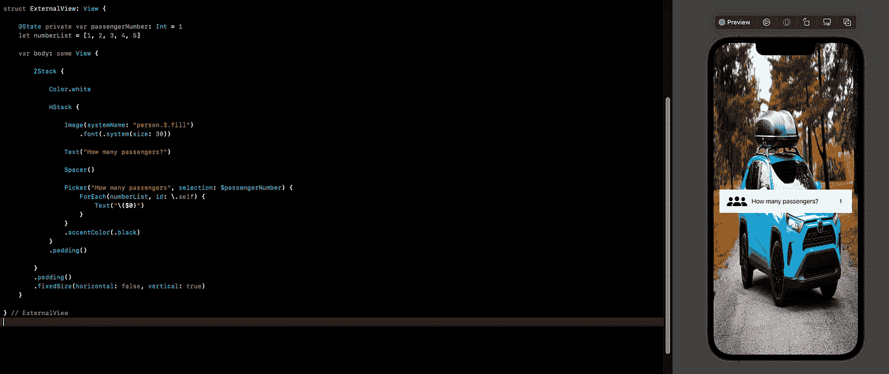
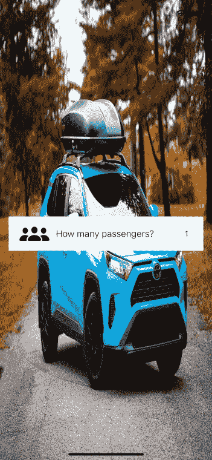
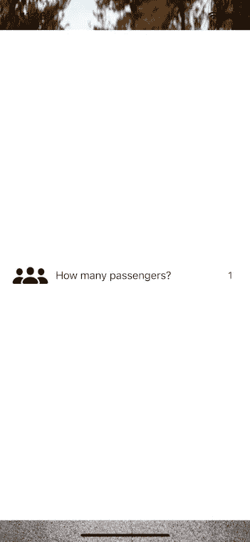

# SwiftUI 教程:使用固定大小的修改器

> 原文：<https://blog.devgenius.io/swiftui-tutorial-working-with-fixedsized-modifier-91a1676a7941?source=collection_archive---------8----------------------->

## 固定大小的修饰符如何使 SwiftUI 编码更容易



图一。

*fixedSize()* 修饰符允许一定程度的控制，开发者可以选择不遵从父视图给定的大小。

> 这篇文章是我的 [SwiftUI 教程](https://arc-sosangyo.medium.com/list/swiftui-tutorial-03734e631240)系列的一部分。

为了更好地理解 *fixedSize()，*的重要性，我们将创建一个这样的简单 UI。



图二。UI 截图

但是在我们开始之前，本教程假设你已经有了 SwiftUI 的基础。

我们开始吧。在 ContentView 之外写下这段代码。

```
struct ExternalView: View {

    @State private var passengerNumber: Int = 1
    let numberList = [1, 2, 3, 4, 5]

    var body: some View {

        ZStack {

            Color.white

            HStack {

                Image(systemName: "person.3.fill")
                    .font(.system(size: 30))

                Text("How many passengers?")

                Spacer()

                Picker("How many passengers", selection: $passengerNumber) {
                    ForEach(numberList, id: \.self) {
                        Text("\($0)")
                    }
                }
                .accentColor(.black)
            }
            .padding()

        }

    }

} // ExternalView
```

然后像这样编辑内容视图。

```
struct ContentView: View {

    var body: some View {

        ZStack {

            Image("lee-chinyama")
                .resizable()
                .ignoresSafeArea(.all)

            ExternalView()

        }

    }

} // ContentView
```

> 这是我在这个例子中使用的背景图片的[链接](https://unsplash.com/photos/Mz5p7ViO71A)。这张照片来自 unsplash.com 的李·钦亚马。

运行应用程序。该应用程序应该如下所示:



图 3。将外部视图放在内容视图中

请注意，如果您没有指定 ZStack 的大小，它将尽可能多地填充空间。

因为目标是让应用程序看起来像图 2 所示的那样，所以我们可以执行以下操作:在 *ExternalView()* 上放置一个填充。然后指定 ZStack 的大小。

像这样更新*外部视图*()的代码:

```
struct ExternalView: View {

    @State private var passengerNumber: Int = 1
    let numberList = [1, 2, 3, 4, 5]

    var body: some View {

        ZStack {

            Color.white

            HStack {

                Image(systemName: "person.3.fill")
                    .font(.system(size: 30))

                Text("How many passengers?")

                Spacer()

                Picker("How many passengers", selection: $passengerNumber) {
                    ForEach(numberList, id: \.self) {
                        Text("\($0)")
                    }
                }
                .accentColor(.black)
            }
            .padding()

        }
        .padding()
        .frame(height: 100)

    }

} // ExternalView
```

如果您运行该应用程序，它现在将看起来像图 2 中的屏幕截图。虽然*帧*修改器解决了尺寸问题。我进行了多次高度调整，才能够获得视图所需的大小。

这就是使用 FixedSize 修饰符可以使事情变得更简单的地方。忽略前面的代码，使用下面的代码:

```
struct ExternalView: View {

    @State private var passengerNumber: Int = 1
    let numberList = [1, 2, 3, 4, 5]

    var body: some View {

        ZStack {

            Color.white

            HStack {

                Image(systemName: "person.3.fill")
                    .font(.system(size: 30))

                Text("How many passengers?")

                Spacer()

                Picker("How many passengers", selection: $passengerNumber) {
                    ForEach(numberList, id: \.self) {
                        Text("\($0)")
                    }
                }
                .accentColor(.black)
            }
            .padding()

        }
        .padding()
        .fixedSize(horizontal: false, vertical: true)

    }

} // ExternalView
```

这一次，我们使用*固定大小*修改器代替框架。

运行应用程序将产生相同的结果。

在上面的例子中，我们只想垂直固定大小。这就是为什么我们设置水平为假，垂直为真。默认情况下，您可以选择不指定参数，只需像这样写:

```
.fixedSize()
```

这对于水平和垂直都将返回 true。

下面是源代码的 github [链接](https://github.com/athurion/SwiftUI-Tutorial-Fixed-sized-modifier/blob/main/ContentViewFixedSized.swift)。

愿法典与你同在，

-电弧