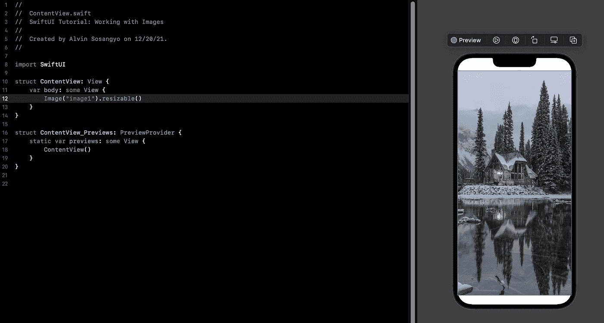

# SwiftUI 教程:使用图像

> 原文：<https://blog.devgenius.io/swiftui-tutorial-working-with-images-62040c279960?source=collection_archive---------7----------------------->


图 1

> *本教程是我的* [*SwiftUI 教程*](https://arc-sosangyo.medium.com/list/swiftui-tutorial-03734e631240) *系列的一部分。*

就像文本一样，处理图像是你在应用程序开发中要处理的另一个基础。在本教程中，您将学习如何在 SwiftUI 中显示图像，以及一些用于更改大小的有用修改器。

在我们继续之前，让我们创建一个新项目。要么使用现有的一个进行练习，或者如果您在创建一个时遇到困难，您可以遵循此[链接](https://arc-sosangyo.medium.com/introduction-to-swiftui-creating-new-project-9adc502e1804)中的逐步过程。

# 导入图像

> **注意:**在本教程中可以随意使用自己的图像。如果你没有练习用的图片，你可以使用来自[unsplash.com](https://unsplash.com/)的图片，并确保将文件重命名为“*image1.jpg*”。如果你想使用本文中的图片，这里有我在这个项目中使用的图片的链接。


图二。摄影:伊恩·基夫谈 unsplash.com

在将图像用于项目之前，第一步是将图像导入到资产目录中。假设您已经有了图像，并且已经将其重命名为“image1.jpg ”,请将其拖放到 Xcode 的资源目录中。你可以参考下面的图 3。


图 3。Xcode 上的资产目录

> **注意:**在上面的例子中，我的项目名称是“SwiftUI Introduction”。在任何情况下，左侧的项目导航器丢失，只需按下**命令+0** 即可显示。

如果您是 iOS 应用程序开发的新手，资源目录是存储图像的地方。它还可以存储另一种资源，如颜色。

# 显示图像

在屏幕上显示图像就像在 body 变量中编写这样的代码一样简单:

例如

```
Image("image1")
```

下面的图 4 显示了显示所需图像是多么简单。您只需要确保图像名称是正确的。


图 4。使用资产目录上的图像

> ***注意:*** *如果右边的画布没有显示出来，转到 Xcode 的右上方，点击* ***调整编辑器选项*** *，确保* ***画布*** *被勾选，如下图 5 所示。*


图 5。显示画布

# 调整图像大小

如果你注意到，使用的图像太大，你只能看到它的一小部分。别担心，调整图像大小就像使用。resizable()修饰符。

例如

```
Image("image1").resizable()
```



图 6。使用可调整大小的修改器

默认情况下，原始图像被缩放以填充整个屏幕(除了顶部和底部的安全区域)。

> **注意:**安全区域是 iOS 的一个定义概念，防止用户意外使用导航栏、状态栏、标签栏等 UI 组件。

因为这只是一张没有任何功能的图片，所以全屏显示也无妨。您可以使用忽略安全区域。edgesIgnoringSafeArea(。所有)修饰符。

例如

```
Image("image1")
    .resizable()
    .edgesIgnoringSafeArea(.all)
```


图 7。忽略安全区域

顺便说一下，你可以像这样选择忽略顶部:

例如

```
.edgesIgnoringSafeArea(.top)
```

或者像这样忽略底部:

例如

```
.edgesIgnoringSafeArea(.bottom)
```

# 修改纵横比

上例中的图像被拉伸以适应视图区域。如果您想保持图像的原始纵横比，可以使用。scaledToFit()修饰符如下:

例如

```
Image("image1")
    .resizable()
    .scaledToFit()
```


图 8。保持图像的原始纵横比

或者，您可以使用。aspectRatio(内容模式:。fit)修饰符，它将提供与此相同的结果:

例如

```
Image("image1")
    .resizable()
    .aspectRatio(contentMode: .fit)
```

contentMode 上的另一个选项是保持图像的原始纵横比，但进行拉伸。这可以通过使用. fill 来实现。

例如

```
Image("image1")
    .resizable()
    .aspectRatio(contentMode: .fill)
```

# 手动设置图像尺寸

帧修改器允许您手动调整图像的大小。

例如

```
Image("image1")
    .resizable()
    .frame(width: 400, height: 400)
```


图 9。手动调整图像尺寸

可以只调整图像的宽度或高度。

例如

```
Image("image1")
    .resizable()
    .frame(width: 400)
```

或者

```
Image("image1")
    .resizable()
    .frame(height: 400)
```

# 使图像透明

当谈到使图像透明时，SwiftUI 有不透明度修改器来处理它。不透明度介于 0 到 1 之间，其中 0 表示图像完全不可见，1 表示图像完全可见。

在下面的例子中，我们将设置不透明度值为 0.5，使图像部分透明。

例如

```
Image("image1")
    .resizable()
    .aspectRatio(contentMode: .fit)
    .opacity(0.5)
```


图 10。使图像部分透明

在我们的下一个教程中，我们将处理更多有用的[图像](https://arc-sosangyo.medium.com/swiftui-tutorial-displaying-system-image-with-sf-symbols-75c01b5bf421)修改器。

愿法典与你同在，

-电弧