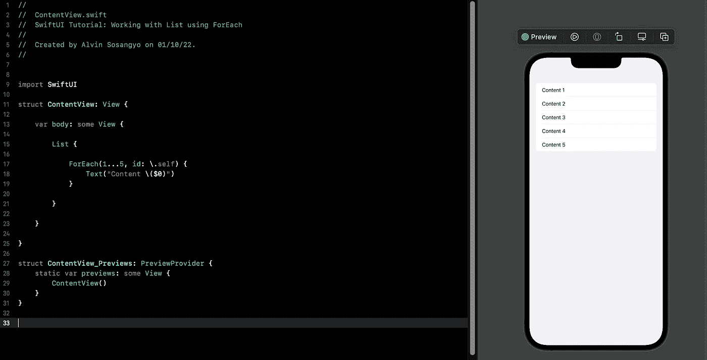
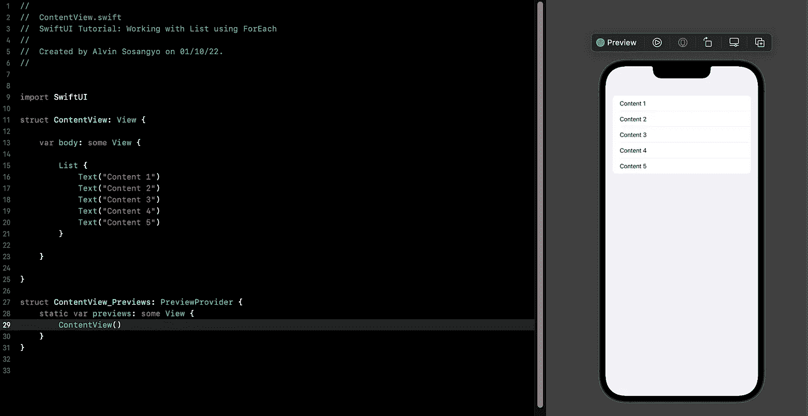
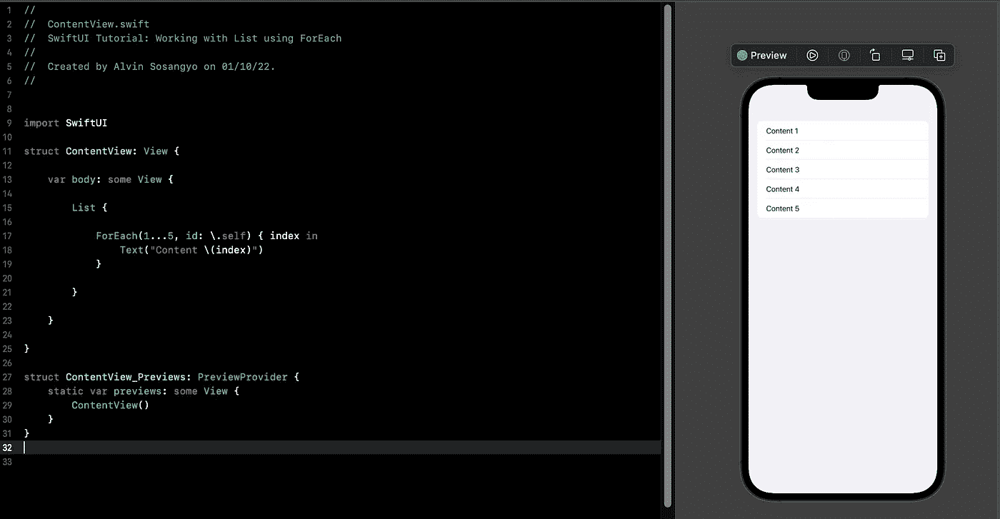
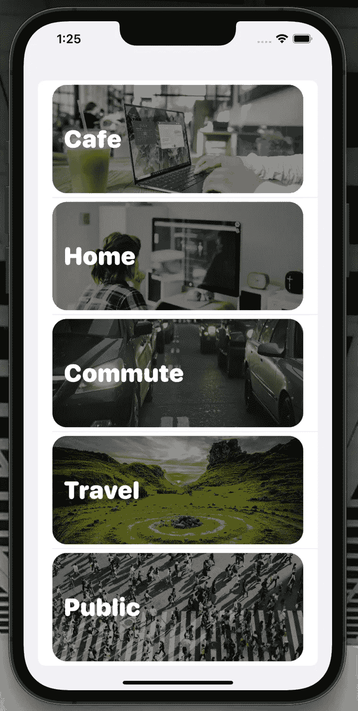
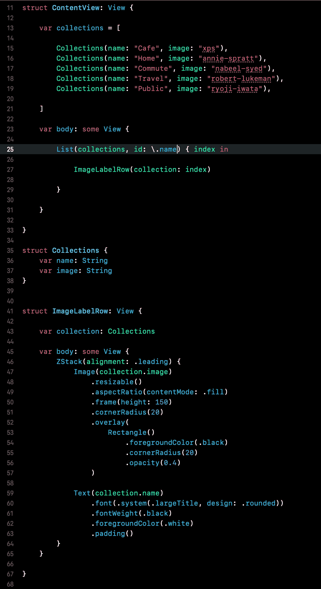
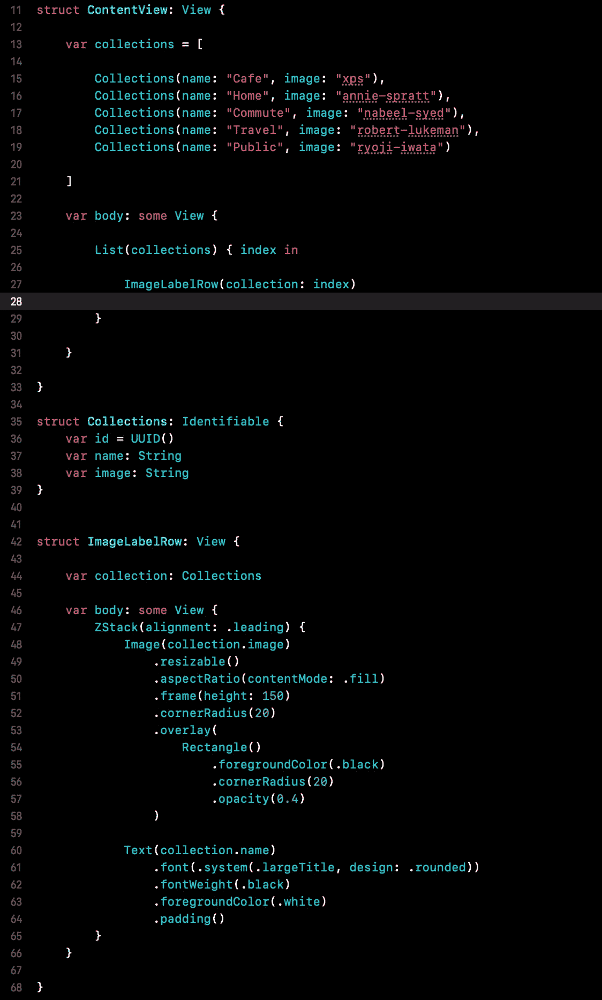

# SwiftUI 教程:使用 ForEach 处理列表

> 原文：<https://blog.devgenius.io/swiftui-tutorial-working-with-list-using-foreach-a4b7451fbcf0?source=collection_archive---------5----------------------->

## 了解如何使用 ForEach 和 Identifiable



图一。

该列表允许显示组织在单个列中的数据行。它的工作方式与 UIKit 中的 UITableView 相同，后者是 iOS 中最常见的 UI 控件。它的主要用途是呈现数据列表，常见于基于内容或基于新闻的应用程序中。

如果您以前有过使用 UITableView 的经验，您就会知道创建一个基本表格有多繁琐。用定制单元构建更困难。好的一面是，SwiftUI 的 list 可以通过简化过程，只用几行代码就能执行它。即使是定制的细胞也只需要很少的努力。

> *本教程是我的* [*SwiftUI 教程*](https://arc-sosangyo.medium.com/list/swiftui-tutorial-03734e631240) *系列的一部分。*

让我们创建一个新项目或打开一个现有项目来练习。如果你需要一步一步的过程，你可以使用这个[链接](/introduction-to-swiftui-creating-new-project-9adc502e1804)。

# 基本列表

为了理解列表是如何工作的。让我们先开始创建一个简单的。下面的代码显示了使用 List 是多么简单。

```
struct ContentView: View {

    var body: some View {

        List {
            Text("Content 1")
            Text("Content 2")
            Text("Content 3")
            Text("Content 4")
            Text("Content 5")
        }

    }

}
```



图二。SwiftUI 中的列表

# 使用 ForEach

如果您有一些内容要插入，上面的代码是有效的。但是如果你有成百上千的东西要放呢？手动输入一切不是一个好的编程习惯。更不用说输入大量数据所需的时间和精力了。这就是使用 ForEach 使我们列表中的代码高效的原因。

下面的代码显示了如何使用 ForEach 来实现这一点。

```
struct ContentView: View {

    var body: some View {

        List {

            ForEach(1...5, id: \.self) { index in
                Text("Content \(index)")
            }

        }

    }

}
```

这将给出相同的结果。



图 3。在列表中使用 ForEach

我们可以通过省略索引和使用简写 ***$0*** 来进一步简化代码。这意味着引用范围的第一个参数。这与[数组](https://arc-sosangyo.medium.com/swift-programming-tutorial-collection-types-arrays-set-and-dictionaries-b22bd8c8ecec)处理索引的方式相同。

我们还没有完成，我们仍然可以通过让列表处理集合来做得更好。下面是最简单的代码形式:

```
struct ContentView: View {

    var body: some View {

        List (1...5, id: \.self) {
            Text("Content \($0)")
        }

    }

}
```


图 4。简化代码

# 理解可识别

id 的简称。它的主要目的是唯一地标识每个项目。当你有精致的收藏品时，你会体会到它的用处。例如，既有文本又有图像的项目。

让我们创建一个设计良好的列表，如下图所示。



图 5。

但是首先，我们需要一些图像。随意使用你喜欢的任何图像。如果你没有这个练习的照片，你可以从 [unsplash](https://unsplash.com/) 下载。

> 感谢我在本教程中使用的来自 unsplash 的照片的所有者:**安妮·斯普拉特，纳比尔·赛义德，罗伯特·卢克曼，岩田良治，**和 **XPS** 。

确保您将要使用的所有图像都已经在 ***Assets*** 目录中。如果这是您第一次处理图像，这个[链接](/swiftui-tutorial-working-with-images-62040c279960)为如何在 SwiftUI 中处理图像提供了良好的基础。

我们需要做的第一件事是创建一个专用的[结构](https://arc-sosangyo.medium.com/swift-programming-tutorial-structs-6521663fee84)，在这里我们可以将文本和图像放在一起，然后每一对将被单独识别。在 ContentView 下面写这段代码。

```
struct Collections {
    var name: String
    var image: String
}
```

接下来我们创建一个[数组](https://arc-sosangyo.medium.com/swift-programming-tutorial-collection-types-arrays-set-and-dictionaries-b22bd8c8ecec)来存储图片和文本。在 ContentView 中编写以下代码。

```
var collections = [

    Collections(name: "Cafe", image: "xps"),
    Collections(name: "Home", image: "annie-spratt"),
    Collections(name: "Commute", image: "nabeel-syed"),
    Collections(name: "Travel", image: "robert-lukeman"),
    Collections(name: "Public", image: "ryoji-iwata")

]
```

> **重要提示:**确保将图像更改为您将使用的图像的文件名。如果你不确定怎么做，我推荐你先上这个[教程](/swiftui-tutorial-working-with-images-62040c279960)。

在制作列表之前，让我们先设计一下行的外观。在结构集合下创建一个单独的结构，并将此代码。

```
struct ImageLabelRow: View {

    var collection: Collections

    var body: some View {
        ZStack(alignment: .leading) {
            Image(collection.image)
                .resizable()
                .aspectRatio(contentMode: .fill)
                .frame(height: 150)
                .cornerRadius(20)
                .overlay(
                    Rectangle()
                        .foregroundColor(.black)
                        .cornerRadius(20)
                        .opacity(0.4)
                )

            Text(collection.name)
                .font(.system(.largeTitle, design: .rounded))
                .fontWeight(.black)
                .foregroundColor(.white)
                .padding()
        }
    }

}
```

最后，让我们创建列表。在 ContentView 中输入这段代码。

```
var body: some View {

    List(collections, id: \.name) { index in

        ImageLabelRow(collection: index)

    }

}
```

注意我们使用。在参数中以 id 的形式命名，以唯一标识每一对。也可以用。因为结构集合有两个变量:名称和图像。

所以整个程序应该是这样的:



图 6。源代码截图

但是等等。虽然这段代码可以工作，但它不是最佳实践。例如，你将使用相同的“咖啡馆”名称或相同的图像。当您为每一行创建链接时，这会导致问题。

编辑 struct 集合并将其转换为 ***可识别的*** 协议。这意味着您告诉它为每个创建的实例分配一个惟一的 id。所以像这样更新代码:

```
struct Collections: Identifiable {
    var id = UUID()
    var name: String
    var image: String
}
```

那么您将不再需要 id 参数，因为由于可识别的协议，每个项目已经有了唯一的标识符。更新列表中的代码，如下所示。

```
var body: some View {

    List(collections) { index in

        ImageLabelRow(collection: index)

    }

}
```

这是最终源代码的样子:



图 7。最终源代码。

我为这个项目的全部源代码添加了一个 GitHub 链接:

[https://github . com/athurion/swift ui-Tutorial-Working-with-List-using-ForEach](https://github.com/athurion/SwiftUI-Tutorial-Working-with-List-using-ForEach)

在我们的下一个教程中，我们将理解[状态和绑定](https://medium.com/geekculture/swiftui-tutorial-state-and-binding-b7e80b4de622)的概念。

愿法典与你同在，

-电弧