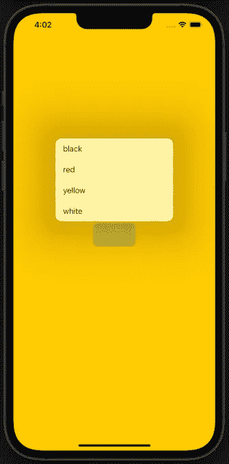

# SwiftUI 教程:使用菜单

> 原文：<https://blog.devgenius.io/swiftui-tutorial-working-with-menu-2d19399a8f1c?source=collection_archive---------2----------------------->

## 如何在 SwiftUI 中轻松显示菜单


图一。

在 **iOS14** 之前，我们使用经过修改的[拾取器](https://medium.com/geekculture/swiftui-tutorial-working-with-picker-f3e68a0c2724)。pickerStyle(。menu)以便在 SwiftUI 中显示菜单。然后在 SwiftUI 2 中引入了**菜单**视图，作为显示包含按钮的弹出菜单的专用视图(默认)。菜单也提供了比 Picker 更多的定制。

基本上，菜单可以很容易地编码成这样:

```
struct ContentView: View {

    var body: some View {

        Menu("Hello") {
            Button("World", action: {
                print("Hello World")
            })
            Button("Earth", action: printHelloEarth)
        }

    } // body

    func printHelloEarth() {
        print("Hello Earth")
    }

} // ContentView
```

上面的代码显示了创建一个菜单是多么简单，只需在它下面添加[按钮](https://medium.com/dev-genius/swiftui-tutorial-working-with-buttons-ee3fdcfb8337)，这取决于你打算呈现多少选项。它还显示了放置动作的不同方式。

运行该程序会给你一个弹出菜单的点击按钮(如图 2 所示)。


图二。使用菜单的简单 Hello World 示例

也可以通过在父菜单下放置另一个菜单视图来制作分层类型的菜单。这里有一个例子:

```
struct ContentView: View {

    var body: some View {

        Menu("DC") {
            Button("Batman", action: printBatman)
            Button("Superman", action: printSuperman)
            Menu("Justice League") {
                Button("JLA", action: printJLA)
                Button("JSA", action: printJSA)
            }
        }

    }

    func printBatman() {
        print("Batman issue #1")
    }

    func printSuperman() {
        print("Superman issue #1")
    }

    func printJLA() {
        print("JLA vol #1")
    }

    func printJSA() {
        print("JSA vol #1")
    }

} // ContentView
```

运行该程序将会给出一个分层类型的菜单(如下面的图 3 所示)。


图 3。菜单的层次类型

# 添加按钮角色

在 SwiftUI 3 中为 **iOS15** 及以上版本引入。[按钮角色](https://medium.com/dev-genius/swiftui-tutorial-using-button-role-17c6e1d1924f)可以根据按钮的作用方便地使按钮看起来合适(点击链接了解更多关于按钮角色的信息)。以下是在菜单中使用按钮角色的示例:

```
struct ContentView: View {

    var body: some View {

        Menu("DC") {
            Button("Delete All", role: .destructive, action: deleteAll)
            Button("Batman", action: printBatman)
            Button("Superman", action: printSuperman)
            Menu("Justice League") {
                Button("JLA", action: printJLA)
                Button("JSA", action: printJSA)
            }
        }

    }

    func printBatman() {
        print("Batman issue #1")
    }

    func printSuperman() {
        print("Superman issue #1")
    }

    func printJLA() {
        print("JLA vol #1")
    }

    func printJSA() {
        print("JSA vol #1")
    }

    func deleteAll() {
        print("Copies are removed")
    }

} // ContentView
```

以下是输出结果:


图 4。使用按钮角色

# 使用主要操作

对于 **iOS15** 及以上版本，SwiftUI 3 中也引入了该参数。当菜单本身被点击时，触发主要动作。然后你需要按住按钮更长时间，菜单才会弹出。这里有一个例子:

```
struct ContentView: View {

    var body: some View {

        Menu("DC") {
            Button("Batman", action: printBatman)
            Button("Superman", action: printSuperman)
            Menu("Justice League") {
                Button("JLA", action: printJLA)
                Button("JSA", action: printJSA)
            }
        } primaryAction: {
            menuIsTapped()
        }

    }

    func printBatman() {
        print("Batman issue #1")
    }

    func printSuperman() {
        print("Superman issue #1")
    }

    func printJLA() {
        print("JLA vol #1")
    }

    func printJSA() {
        print("JSA vol #1")
    }

    func menuIsTapped() {
        print("Welcome. Please select a title.")
    }

} // ContentView
```

# 定制标签

通过填充标签参数上的视图，菜单的标签可以具有与标准标签不同的外观。在本教程的最后一部分，我们将创建一个简单的基于菜单的应用程序来改变背景颜色。下面是一个截图示例:



图 5。项目截图

让我们从定制我们将与[枚举](https://medium.com/@arc-sosangyo/swift-programming-tutorial-enums-542ebf55b0a5)一起使用的数据类型开始。创建 ContentView 的扩展，并将以下代码放入:

```
extension ContentView {

    enum ColorList: String, CaseIterable, Identifiable {
        case white, yellow, red, black
        var id: Self { self }
    }

}
```

> **注意:**虽然没有 enum 的帮助我们也可以做这个项目。这种做法最好适应一下，习惯一下。Swift 是一种类型安全的编程语言。这意味着它在声明值类型时鼓励清晰性。当您在一个复杂的现实世界项目中工作时，这种实践极大地减少了不必要的相关错误。

除了在我们的枚举中使用 String 之外，我们还使用了 *CaseIterable* ，这样我们就可以使用 allCases 属性。这意味着我们可以生成该枚举案例的数组。最后，我们还将*标识为*，这样案例就有了唯一的标识。我知道一开始你会困惑这样做的目的是什么。一旦您将这个枚举应用于 [ForEach](https://medium.com/dev-genius/swiftui-tutorial-working-with-list-using-foreach-a4b7451fbcf0) 和 switch case 语句，您就会明白了。

因为我们有了自定义的数据类型，所以不再需要创建数组。我们只需要一个保存颜色列表的属性。在 ContentView 中编写该属性:

```
@State private var backgroundColor: ColorList = .white
```

所以我们选择白色作为背景的默认值。

接下来我们创建一个 ZStack，作为背景色的背景和占位符。在主体中编写以下代码:

```
ZStack {

    switch backgroundColor {
    case .yellow: Color.yellow.ignoresSafeArea(.all)
    case .red: Color.red.ignoresSafeArea(.all)
    case .black: Color.black.ignoresSafeArea(.all)
    default: Color.white.ignoresSafeArea(.all)
    }

}
```

所以我们使用的 [switch](https://medium.com/@arc-sosangyo/swift-programming-tutorial-conditional-statement-f57aefd630ce) 语句允许 ZStack 根据 backgroundColor 属性的值来改变它的颜色。

接下来，我们将添加菜单视图。在 switch 语句下面的 ZStack 下编写以下代码:

```
Menu {
    ForEach(ColorList.allCases) { index in
        Button("\(index.rawValue)", action: {
            backgroundColor = index
        })
    }
}
```

我们使用 ForEach 语句来避免多次写下同一个按钮代码。在我们之前创建的 enum 的帮助下，代码更加简洁。

最后，我们将定制触发弹出菜单的菜单按钮的外观。我们希望菜单有一个圆角的蓝色按钮外观和白色文本(如图 6 所示)。


图 6。按钮样式

就像 Picker 视图的行为一样，我们也希望文本根据当前的背景颜色进行更改。在菜单视图上添加一个标签参数，并按如下方式进行编辑:

```
Menu {
    ForEach(ColorList.allCases) { index in
        Button("\(index.rawValue)", action: {
            backgroundColor = index
        })
    }
} label: {
    Text("\(backgroundColor.rawValue)")
        .font(.title3)
        .foregroundColor(Color.white)
        .frame(width: 90, height: 50)
        .background(Color.blue)
        .cornerRadius(10)
}
```

我们所做的就像设计我们自己的按钮。运行应用程序并尝试更改背景颜色。

# 不要限制自己

就像我们对待 SwiftUI 视图层次结构一样。让我们通过编辑 label 参数将图像添加到菜单按钮，如下所示:

```
Menu {
    ForEach(ColorList.allCases) { index in
        Button("\(index.rawValue)", action: {
            backgroundColor = index
        })
    }
} label: {
    HStack {
        Image(systemName: "eyedropper.full")
            .font(.system(size: 20))
            .foregroundColor(Color.white)
            .padding(EdgeInsets(top: 12, leading: 7, bottom: 12, trailing: 0))
        Text("\(backgroundColor.rawValue)")
            .font(.title3)
            .foregroundColor(Color.white)
            .padding(EdgeInsets(top: 12, leading: 0, bottom: 12, trailing: 7))
    }
}
.frame(width: 120)
.background(Color.blue)
.cornerRadius(15)
```

下面是源代码的截图，以防你迷路:


图 7。最终源代码截图

再次运行应用程序，并尝试使用创建的菜单按钮更改背景。很好地完成了本教程。

下面是源代码的 [github](https://github.com/athurion/SwiftUI-Tutorial-Working-with-Menu) 链接。

愿法典与你同在，

-电弧