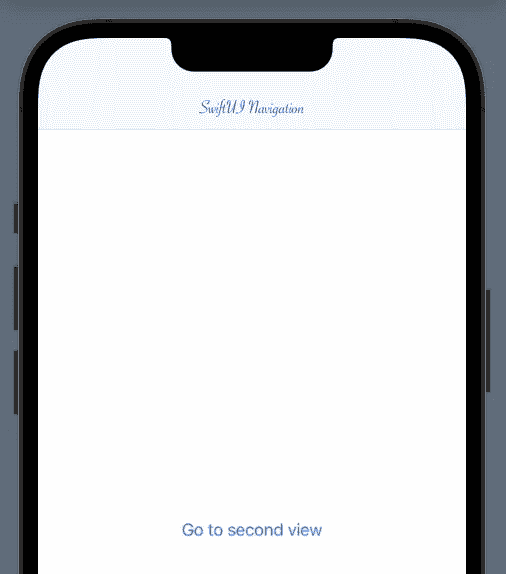

# SwiftUI 教程:使用 NavigationView

> 原文：<https://blog.devgenius.io/swiftui-tutorial-working-with-navigationview-2f72c18a30d1?source=collection_archive---------2----------------------->

## 如何在 SwiftUI 中使用 NavigationLink


图一。

NavigationView 允许以分层的方式从一个视图移动到另一个视图。这包括返回到先前导航的页面。这是 SwiftUI 的重要组成部分，因为大多数应用程序都有多个屏幕来展示其功能。

> *本教程是我的* [*SwiftUI 教程*](https://arc-sosangyo.medium.com/list/swiftui-tutorial-03734e631240) *系列的一部分。*

创建一个新项目或打开一个用于练习的现有项目。本[指南](/introduction-to-swiftui-creating-new-project-9adc502e1804)包含如何创建新项目的分步过程。

# 导航视图如何工作？

基本上，导航视图的语法是这样的:

```
NavigationView {
    NavigationLink(destination: //The next view) {
        //What will the user tap
    }
    //How will the link look like
}
//How will the view look like
```

让我们通过填写语法注释来创建一个简单的例子。

```
struct ContentView: View {

    var body: some View {

        NavigationView {
            NavigationLink(destination: Text("This is the second view")) {
                Text("Go to second view")
            }
        }

    } //body

} //ContentView
```

下面的图 2 显示了它的样子。运行代码并点击“转到第二个视图”。应用程序将移动到另一个包含“这是第二个视图”的视图。


图二。基本导航视图示例

在实际的应用程序中，您将为第二个视图创建一个[单独的](https://betterprogramming.pub/swiftui-tutorial-working-with-stacks-vstack-hstack-and-zstack-2b0070be18d7) [struc](https://arc-sosangyo.medium.com/swift-programming-tutorial-structs-6521663fee84) t。按住命令按钮并点按“文本”。将出现一个选项列表。然后单击提取子视图。下面的图 3 显示了如何做。


图 3。提取子视图

它将以名为 ExtractedView 的结构形式创建一个子视图。由于使用通用名称不被认为是最佳实践，所以让我们将其重命名为 SecondView。下面的图 4 显示了源代码应该是什么样子。


图 4。提取的子视图

# 导航栏

首先，让我们使用 navigationTitle 在应用程序上添加一些标题。

```
NavigationView {
    NavigationLink(destination: SecondView()) {
        Text("Go to second view")
    }
    .navigationTitle("SwiftUI Navigation")
}
```


图 5。添加 navigationTitle

默认情况下，导航栏显示为大标题。然后，当你向上滑动列表时，它最终会变小。

您可以保持导航栏紧凑，并防止使用大标题，方法是使用。像这样的内嵌修饰符:

```
NavigationLink(destination: SecondView()) {
    Text("Go to second view")
}
.navigationTitle("SwiftUI Navigation")
.navigationBarTitleDisplayMode(.inline)
```


图 6。使导航标题简洁

# 导航栏字体和颜色

在撰写本文时，还没有 SwiftUI 修饰符来配置导航栏的字体和颜色。配置它的唯一可用选项是通过 UIKit 中的 UINavigationBarAppearance。

例如，我们想将标题颜色改为蓝色，将字体样式改为 Savoye LET，并将字体大小改为。在 ContentView 中添加以下代码:

```
init() {

    let navBarAppearance = UINavigationBarAppearance()

    navBarAppearance.largeTitleTextAttributes = [.foregroundColor: UIColor.blue, .font: UIFont(name: "Savoye LET", size: 40)!]
    navBarAppearance.titleTextAttributes = [.foregroundColor: UIColor.blue, .font: UIFont(name: "Savoye LET", size: 20)!]

    UINavigationBar.appearance().standardAppearance = navBarAppearance
    UINavigationBar.appearance().scrollEdgeAppearance = navBarAppearance
    UINavigationBar.appearance().compactAppearance = navBarAppearance

} //init
```


图 7。配置字体和颜色

我们将*UINavigationBarAppearance*命名为 navbaraappearance，并将其存储在一个名为*navbaraappearance*的常量中。下面解释了我们接触的配置:

*   largeTitleTextAttributes 配置大尺寸标题。
*   titleTextAttributes 配置标准大小的标题。

设置配置后，我们将其分配给*标准外观*、*滚动外观*和*紧凑外观*。如果你掌握了其中的诀窍，你可以为提到的每一个物体分配不同的外观。

基于上面的代码，导航栏应该是这样的:



图 8。修改导航栏字体和颜色

# 后退按钮

默认情况下，导航视图字体的后退按钮设置为蓝色。您也可以在*UINavigationBarAppearance*下修改其颜色。让我们通过在 init()中添加以下代码，将 back 按钮的颜色改为红色。

```
UINavigationBar.appearance().tintColor = .red
```


图 9。将后退按钮改为红色

# 对 ForEach 列表使用 NavigationView

让我们在 ForEach 列表中应用 NavigationView。这是一个重要的概念，因为这是大多数基于内容的应用程序的构建方式。如果这是您第一次处理 List 和 ForEach，我强烈建议您在继续本节之前先学习本[教程](/swiftui-tutorial-working-with-list-using-foreach-a4b7451fbcf0)。

我们将创建这个应用程序，当点击它时，它会引导您到相应的视图。


图 10。带有导航应用程序的 ForEach 列表

> *照片来源于*[*unsplash*](https://unsplash.com/)*:****RR Abrot、伊恩·哈伯、安德鲁·尼尔、查理·先行者、克莱班克斯*** *、* ***纳斯图·阿布特莱比*** *和* ***凯特·萨德*** *。*

首先准备好您将要使用的图像。如果你没有这种练习的照片，你可以从 [unsplash](https://unsplash.com/) 下载。然后确保您导入了**资产**目录中的所有图像。如果这是你第一次处理图像，这个[链接](/swiftui-tutorial-working-with-images-62040c279960)提供了如何在 SwiftUI 中处理图像的良好基础。

当所有需要的资产都就位后，创建一个专用的[结构](https://arc-sosangyo.medium.com/swift-programming-tutorial-structs-6521663fee84)来将图像和文本放在一起。在 ContentView 之外编写以下代码:

```
struct Collections: Identifiable {
    var id = UUID()
    var name: String
    var image: String
    var content: String
}
```

接下来是存储数据的数组。在 ContentView 中编写以下代码:

```
var collections = [

        //Make sure to change the image name to the one that you'll be using
        Collections(name: "Cafe", image: "rr-abrot", content: "Cafe. Lorem ipsum dolor sit amet."),
        Collections(name: "Home", image: "ian-harber", content: "Home. Lorem ipsum dolor sit amet."),
        Collections(name: "Commute", image: "charles-forerunner", content: "Commute. Lorem ipsum dolor sit amet."),
        Collections(name: "Travel", image: "andrew-neel", content: "Travel. Lorem ipsum dolor sit amet."),
        Collections(name: "Public", image: "clay-banks", content: "Public. Lorem ipsum dolor sit amet."),
        Collections(name: "Office", image: "kate-sade", content: "Office. Lorem ipsum dolor sit amet."),
        Collections(name: "Conference", image: "nastuh-abootalebi", content: "Conference. Lorem ipsum dolor sit amet.")

]
```

> ***重要:*** *确保您将图像更改为您将要使用的图像的文件名。如果你不确定怎么做，我推荐你先拿这个* [*教程*](/swiftui-tutorial-working-with-images-62040c279960) *。*

让我们来设计这些行的外观。使用下面的代码创建一个单独的结构:

```
struct ImageLabelRow: View {

    var collection: Collections

    var body: some View {
        ZStack(alignment: .trailing) {
            Image(collection.image)
                .resizable()
                .aspectRatio(contentMode: .fill)
                .frame(height: 150)
                .cornerRadius(20)
                .overlay(
                    Rectangle()
                        .foregroundColor(.black)
                        .cornerRadius(20)
                        .opacity(0.4)
                )

            Text(collection.name)
                .font(.system(.largeTitle, design: .rounded))
                .fontWeight(.black)
                .foregroundColor(.white)
                .padding()
        }
    }

}
```

当我们点击一个链接，它应该被导向另一个视图。所以让我们用这段代码创建一个简单的版本:

```
struct DetailView: View {

    var collection: Collections

    var body: some View {

        Text(collection.content)
            .font(.body)

    }

}
```

既然所有的外部结构都准备好了，那么就该对 NavigationView 进行编码了。将这段代码放在 ContentView 的 body 中。

```
NavigationView {

    List(collections) { index in

        ZStack {

            ImageLabelRow(collection: index)
            NavigationLink(destination: DetailView(collection: index)) {}

        } //ZStack

    } //List
    .navigationTitle("Where are you?")

} //NavigationView
```

我们首先创建了一个 NavigationView，然后在其中创建了一个 ForEach 列表来读取 collections 变量中的所有数据。然后，我们将 ImageLabelRow 结构声明为我们的列表的设计，以及它对应的导航链接，该链接将被重定向到它对应的 DetailView。不要忘记将两者放入一个 [ZStack](https://betterprogramming.pub/swiftui-tutorial-working-with-stacks-vstack-hstack-and-zstack-2b0070be18d7) 中。否则图像和链接不会在同一个可点击的地方。

下面的截图显示了最终的代码应该是什么样子:


图 11。内容视图最终代码


图 12。集合、ImageLabelRow 和 DetailView 最终代码

运行程序并尝试点击链接。它应该会将您重定向到相应的内容。

你可以点击这个[链接](https://github.com/athurion/SwiftUI-Tutorial-Working-with-NavigationView/blob/main/ContentViewNavigationForEach.swift)在 github 上查看完整的源代码。

在我们的下一个教程中，我们将处理[动画](https://arc-sosangyo.medium.com/swiftui-tutorial-basic-animations-edb78c97eb01)的基础。

愿法典与你同在，

-电弧