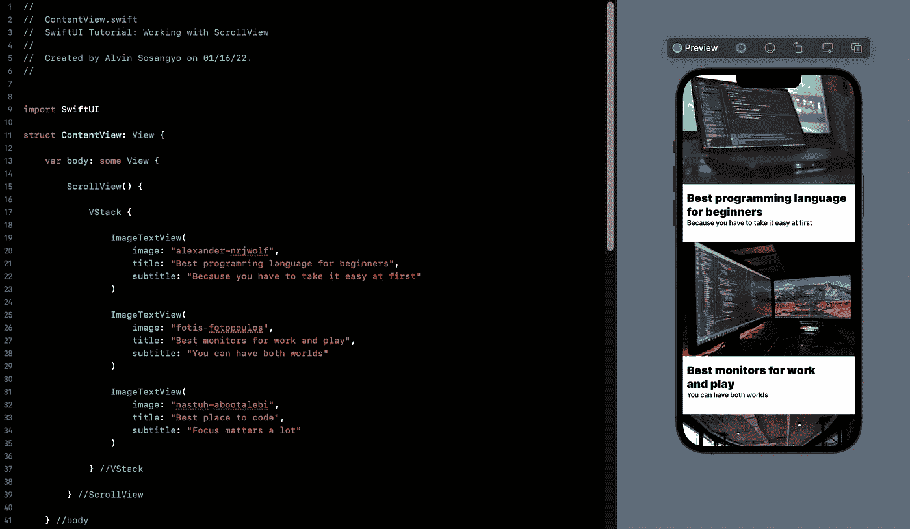
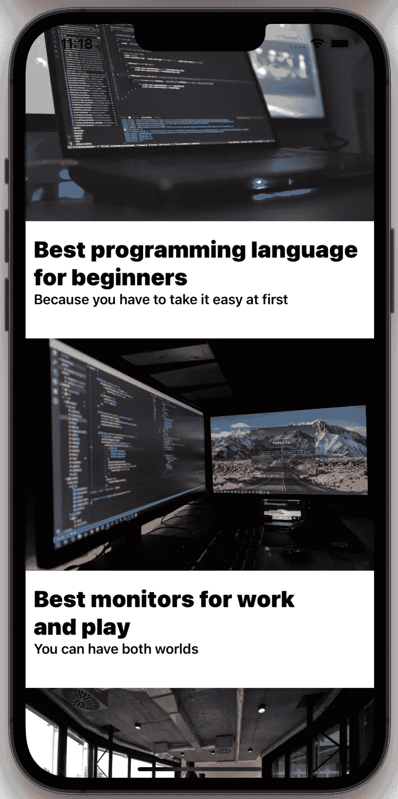
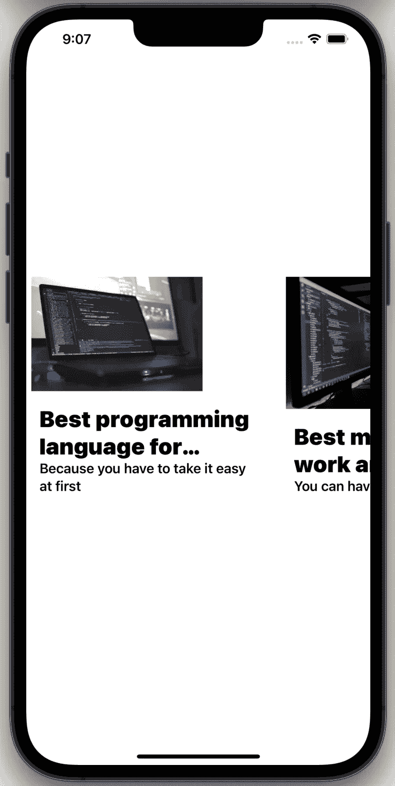
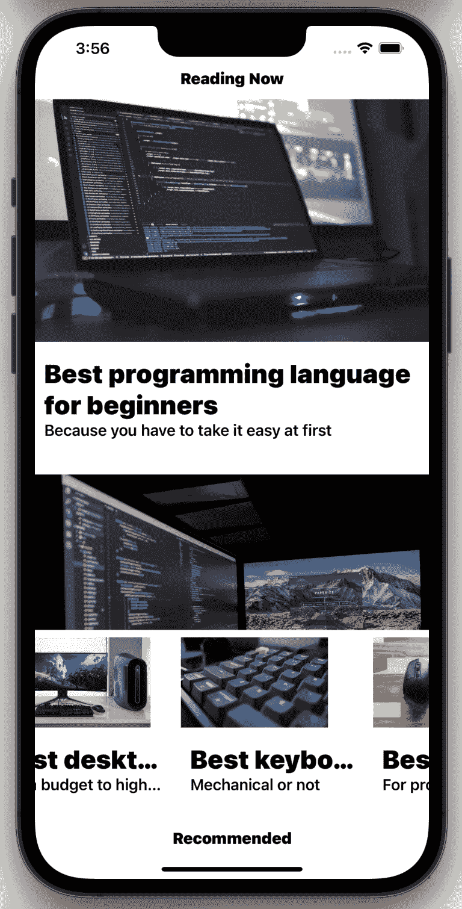
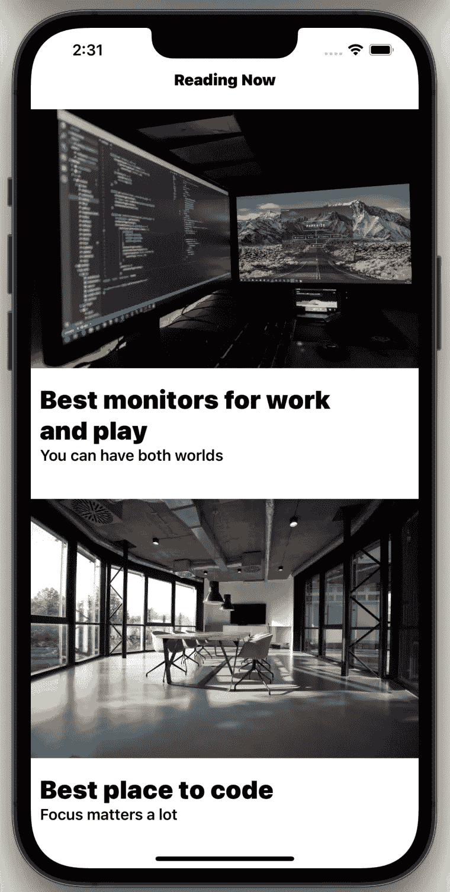

# SwiftUI 教程:使用 ScrollView

> 原文：<https://blog.devgenius.io/swiftui-tutorial-working-with-scrollview-7add5eb6b1bb?source=collection_archive---------7----------------------->

## 如何制作一个类似旋转木马的用户界面



图一。

SwiftUI 中的 ScrollView 允许高效地创建滚动容器。该视图会自动调整其大小以适应内部放置的对象，并且还会进行调整以避开安全区域。ScrollView 可以水平和/或垂直滚动。

> 本教程是我的 [SwiftUI 教程](https://arc-sosangyo.medium.com/list/swiftui-tutorial-03734e631240)系列的一部分。

创建一个滚动视图很容易。基本上，语法是这样的:

```
ScrollView {
    //Contents are placed here
}
```

为了更好地解释 ScrollView，我们将创建一个如图 1 所示的可滚动用户界面。

# 设置内容

创建一个新项目或打开一个用于练习的现有项目。如果你需要一步一步的过程，你可以按照这个[指南](/introduction-to-swiftui-creating-new-project-9adc502e1804)去做。

但是首先，我们需要一些我们将在本教程中使用的图片。然后确保图像被导入到**资产**目录。如果这是你第一次处理图像，这个[链接](/swiftui-tutorial-working-with-images-62040c279960)为如何在 SwiftUI 中处理图像提供了一个很好的基础。

> 感谢以下来自 [unsplash](https://unsplash.com/) 的图片所有者: **Alexander Nrjwolf、Fotis Fotopoulos、Nastuh Abootalebi** 、 **Chris J. Davis** 、 **Antonio Manaligod** 和**外星人**。如果没有照片可以练习，可以从 unsplash 下载。

我们将从创建多个带有[文本](/swiftui-tutorial-working-with-text-15de81494a07)和图像的矩形[视图](https://betterprogramming.pub/swiftui-tutorial-working-with-stacks-vstack-hstack-and-zstack-2b0070be18d7)开始。在 ContentView 下面编写以下代码:

```
struct ImageTextView: View {

    var image: String
    var title: String
    var subtitle: String

    var body: some View {

        VStack(alignment: .leading) {

            Image(image)
                .resizable()
                .aspectRatio(contentMode: .fit)

            VStack(alignment: .leading) {

                Text(title)
                    .font(.title)
                    .fontWeight(.black)

                Text(subtitle)
                    .font(.headline)

            }
            .padding(10)

        }
        .padding(.bottom, 20)

    }

}
```

上面的代码将为用户界面创建一个子视图，这样我们就不需要重复编写相同的代码了。一旦创建了子视图，在一个 ScrollView 中放置多个设计良好的项目将会更加方便。

接下来，请在 ContentView 中编写这段代码。

```
struct ContentView: View {

    var body: some View {

        ScrollView {

            VStack {

                ImageTextView(
                    image: "alexander-nrjwolf",
                    title: "Best programming language for beginners",
                    subtitle: "Because you have to take it easy at first"
                )

                ImageTextView(
                    image: "fotis-fotopoulos",
                    title: "Best monitors for work and play",
                    subtitle: "You can have both worlds"
                )

                ImageTextView(
                    image: "nastuh-abootalebi",
                    title: "Best place to code",
                    subtitle: "Focus matters a lot"
                )

            } //VStack

        } //ScrollView

    } //body

} //ContentView
```

> **重要提示:**确保您在照片上使用了正确的图像名称。否则不会出现在 app 上。

该应用程序应该如下所示:



图二。基本滚动视图

运行代码并尝试滚动应用程序。

通过更改 ScrollView 代码，您可以选择取消右侧部分的指示器，如下所示:

```
ScrollView(showsIndicators: false)
```

我在 github 上传了源代码。点击这个[链接](https://github.com/athurion/SwiftUI-Tutorial-Working-with-ScrollView/blob/main/ContentViewVertical.swift)就可以了。

# 创建旋转木马用户界面

默认情况下，ScrollView 设置为垂直方向。要将其更改为水平方向，只需将参数修改为。水平，并将堆栈更改为 HStack。下面的代码显示了如何操作:

```
struct ContentView: View {

    var body: some View {

        ScrollView(.horizontal) {

            HStack {

                ImageTextView(
                    image: "alexander-nrjwolf",
                    title: "Best programming language for beginners",
                    subtitle: "Because you have to take it easy at first"
                )

                ImageTextView(
                    image: "fotis-fotopoulos",
                    title: "Best monitors for work and play",
                    subtitle: "You can have both worlds"
                )

                ImageTextView(
                    image: "nastuh-abootalebi",
                    title: "Best place to code",
                    subtitle: "Focus matters a lot"
                )

            } //VStack

        } //ScrollView

    } //body

} //ContentView
```

如果您运行该应用程序，您会注意到这些对象对于 iPhone 的屏幕尺寸来说太大了。让我们对 ImageTextView 的框架进行一些调整。

```
struct ImageTextView: View {

    var image: String
    var title: String
    var subtitle: String

    var body: some View {

        VStack(alignment: .leading) {

            Image(image)
                .resizable()
                .aspectRatio(contentMode: .fit)

            VStack(alignment: .leading) {

                Text(title)
                    .font(.title)
                    .fontWeight(.black)

                Text(subtitle)
                    .font(.headline)

            }
            .padding(10)

        }
        .padding(.bottom, 20)
        .frame(width: 300, height: 300)

    }

}
```

该应用程序应该如下所示:



图 3。轮播用户界面

我在 github 上传了源代码。点击这个[链接](https://github.com/athurion/SwiftUI-Tutorial-Working-with-ScrollView/blob/main/ContentViewHorizontal.swift)就可以了。

# 使用水平和垂直

也可以在滚动视图中使用两种方向。下面是如何实现它的语法:

```
ScrollView([.horizontal, .vertical]) {
    //Contents are placed here
}
```

# 使用 ScrollView 创建复杂的用户界面

是时候结合我们在本教程中学到的一切，使用 ScrollView 创建这种类型的用户界面了。



图 4。在单个窗口中垂直和旋转滚动查看

这个用户界面的特别之处在于，顶部的内容是垂直滚动的，而下部的内容是水平滚动的。

我们将通过添加帧大小的参数来对 ImageTextView 结构进行一些小的修改。

```
struct ImageTextView: View {

    var image: String
    var title: String
    var subtitle: String
    var size: CGFloat

    var body: some View {

        VStack(alignment: .leading) {

            Image(image)
                .resizable()
                .aspectRatio(contentMode: .fit)

            VStack(alignment: .leading) {

                Text(title)
                    .font(.title)
                    .fontWeight(.black)

                Text(subtitle)
                    .font(.headline)

            }
            .padding(10)

        }
        .padding(.bottom, 20)
        .frame(width: size, height: size)

    }

}
```

现在是最主要也是最具挑战性的部分。分析图 4 所示的 UI，app 由 [VStack](https://betterprogramming.pub/swiftui-tutorial-working-with-stacks-vstack-hstack-and-zstack-2b0070be18d7) 中的 4 个部分组成。首先创建一个 VStack，并为每个部分放置[注释](https://arc-sosangyo.medium.com/swift-programming-tutorial-comments-fd86e42c0ac3)，以便在我们添加更多代码时消除混淆。

```
struct ContentView: View {

    var body: some View {

        VStack {

            //1\. Reading Now Text

            //2\. Vertical ScrollView

            //3\. Horizontal ScrollView

            //4\. Recommended Text

        } //VStack

    } //body

} //ContentView
```

把这个代码放在 1 号上。正在阅读文本。

```
//1\. Reading Now Text
Text("Reading Now")
    .font(.headline)
    .fontWeight(.black)
```

然后把这个代码放在 2 号上。垂直滚动视图。

```
//2\. Vertical ScrollView
ScrollView(showsIndicators: false) {

    VStack {

        ImageTextView(
            image: "alexander-nrjwolf",
            title: "Best programming language for beginners",
            subtitle: "Because you have to take it easy at first",
            size: .infinity
        )

        ImageTextView(
            image: "fotis-fotopoulos",
            title: "Best monitors for work and play",
            subtitle: "You can have both worlds",
            size: .infinity
        )

        ImageTextView(
            image: "nastuh-abootalebi",
            title: "Best place to code",
            subtitle: "Focus matters a lot",
            size: .infinity
        )

    } //VStack

} //ScrollView
```

> **重要提示:**如前所述，确保将图像名称更改为您将使用的图像的文件名。

当你运行这个程序时，这个应用程序将会是这样的。



图 5。顶部有标题的垂直滚动视图

顶部添加的标题比我们的第一个垂直滚动视图示例提供了更好的用户体验。

让我们继续这一部分的另一半。把这个代码放在 3 号上。水平滚动视图。

```
//3\. Horizontal ScrollView
ScrollView(.horizontal, showsIndicators: false) {

    HStack {

        ImageTextView(
            image: "alienware",
            title: "Best desktop for gaming",
            subtitle: "From budget to high end",
            size: 200
        )

        ImageTextView(
            image: "chris-j-davis",
            title: "Best keyboard for programmers",
            subtitle: "Mechanical or not",
            size: 200
        )

        ImageTextView(
            image: "antonio-manaligod",
            title: "Best computer mouse",
            subtitle: "For productivity or gaming",
            size: 200
        )

    } //HStack

} //ScrollView
```

最后，把这个写在数字 4 上。推荐文本。

```
//4\. Recommended Text
Text("Recommended")
    .font(.headline)
    .fontWeight(.black)
```

就是这样。运行程序，尝试滚动垂直和水平部分。现在你在一个视图中有两个方向。对自己出色完成的工作给予鼓励。这是 GitHub [链接](https://github.com/athurion/SwiftUI-Tutorial-Working-with-ScrollView/blob/main/ContentViewScrollView.swift)的全部源代码。

在我们的下一个教程中，我们将解决如何在 SwiftUI 中的视图间导航。

愿法典与你同在，

-电弧