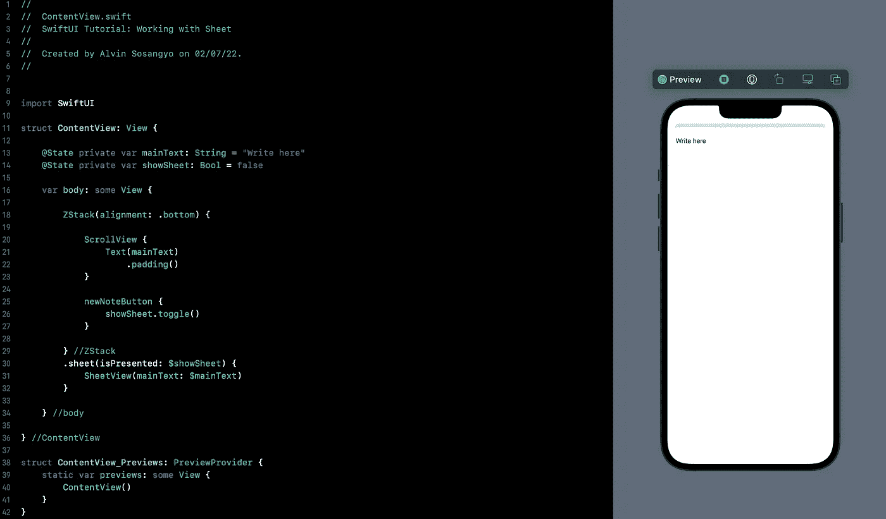
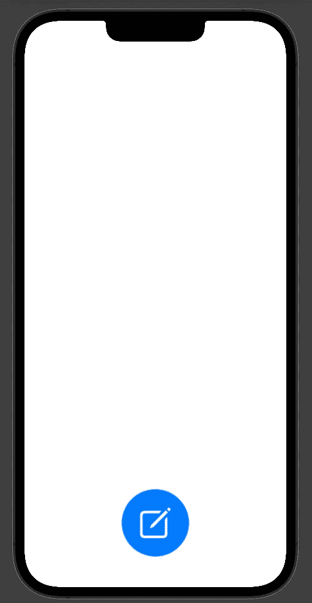
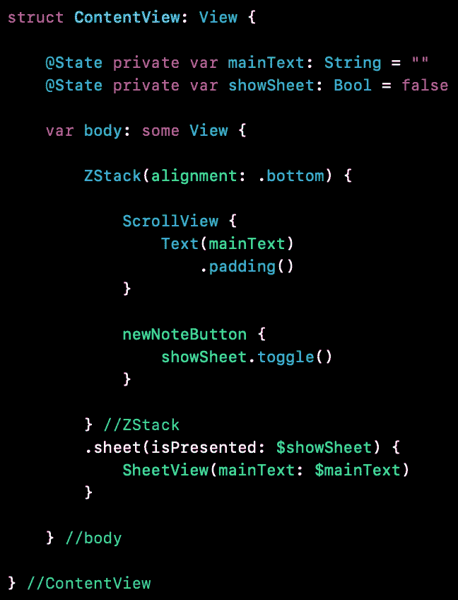
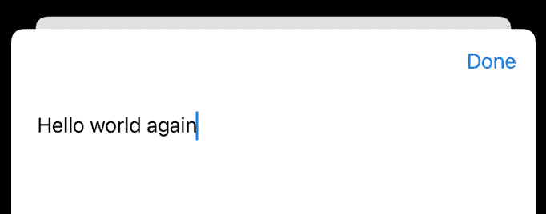
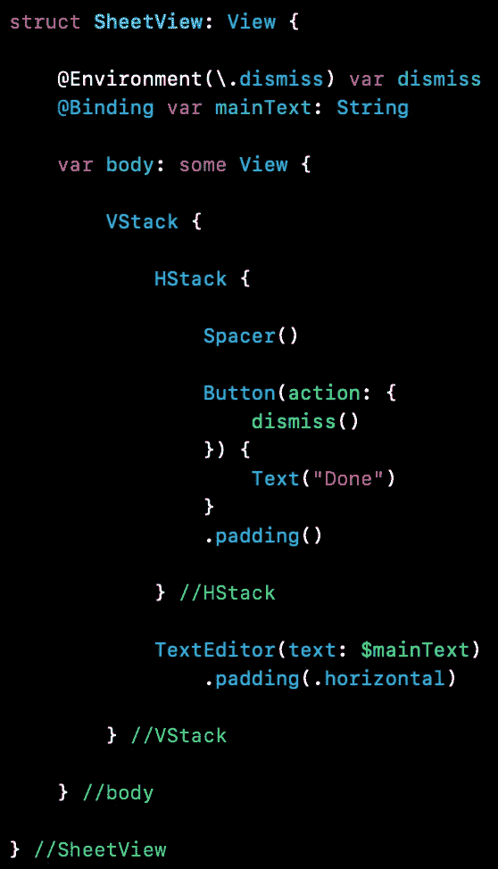

# SwiftUI 教程:使用工作表

> 原文：<https://blog.devgenius.io/swiftui-tutorial-working-with-sheet-6c9b97822e10?source=collection_archive---------12----------------------->

## 如何使用工作表显示模态视图



图一。

SwiftUI 中的 Sheet modifier 用于在当前视图上弹出一个新视图，但仍可拖动以关闭。

> *本文是我的* [*SwiftUI 教程*](https://arc-sosangyo.medium.com/list/swiftui-tutorial-03734e631240) *系列的一部分。*

我们将制作一个简单的应用程序，当按钮被按下时，它将显示一个模态视图。然后我们可以在弹出的新视图中写下一些东西。内容也会出现在我们的主视图上。所以让我们开始吧。

首先，让我们创建将弹出的工作表视图。在 ContentView 之外写下这段代码:

```
struct SheetView: View {

    @Binding var mainText: String

    var body: some View {

        TextEditor(text: $mainText)
            .padding()

    } //body

} //SheetView
```

SheetView 包含一个[*text editor*](https://medium.com/geekculture/swiftui-tutorial-working-with-texteditor-a059eb899084)*，我们将在其中输入一些字符串。那么它将被绑定到 ContentView。*

*接下来，我们将创建一个浮动的动作按钮 [fab](https://medium.com/dev-genius/swiftui-tutorial-how-to-make-a-floating-action-button-fab-867d3183375) ，作为显示工作表的触发器。在 ContentView 之外写下这段代码:*

```
*struct newNoteButton: View {

    var action: () -> Void

    var body: some View {
        Button(action: action) {
            Image(systemName: "square.and.pencil")
                .resizable()
                .scaledToFill()
                .frame(width: 50, height: 50)
                .padding(30)
        }
        .background(.blue)
        .foregroundColor(.white)
        .cornerRadius(.infinity)
        .padding()
    }

}*
```

*因为我们的外部结构已经创建。是时候编写内容视图了。*

*该应用程序的功能是将字符串从工作表视图传递到主视图。所以让我们创建一个状态变量来处理这个值。在 ContentView 中编写以下代码:*

```
*@State private var mainText: String = ""*
```

*接下来是 UI。像这样修改 ContentView 的主体:*

```
*var body: some View {

    ZStack(alignment: .bottom) {

        ScrollView {
            Text(mainText)
                .padding()
        }

        newNoteButton { }

    } //ZStack

} //body*
```

*现在用户界面看起来像这样:*

**

*图二。实践应用程序用户界面*

# *如何让一张表发挥作用？*

*要使工作表工作，需要一个[状态](https://medium.com/geekculture/swiftui-tutorial-state-and-binding-b7e80b4de622)变量[来存储显示和不显示状态。因此，它将是一个布尔类型，将绑定传递给的 *isPresented* 参数。*纸张*修改者。在 ContentView 中写下以下代码:](https://arc-sosangyo.medium.com/swift-programming-tutorial-variables-670ceea20bd1)*

```
*@State private var showSheet: Bool = false*
```

*我们还没有一个*工作表*修改器。它将被固定在 [ZStack](https://medium.com/better-programming/swiftui-tutorial-working-with-stacks-vstack-hstack-and-zstack-2b0070be18d7) 上，这样它就能为其内部的每个视图固定板材。将此修改器附加到 ZStack 上:*

```
*.sheet(isPresented: $showSheet) {
    SheetView(mainText: $mainText)
}*
```

*这里发生的是 sheet 修饰符的参数被绑定到 showSheet 变量上。这将告诉修改器是否基于布尔值显示工作表。然后内部是我们放置 SheetView 的地方，它将会弹出。它的正文是相互绑定的。*

*现在，我们需要的最后一件事是将成为控件的切换。让我们把它放在我们先前创建的按钮中。*

```
*newNoteButton {
    showSheet.toggle()
}*
```

*下面是源代码的截图，以防你迷失了方向:*

**

*图 3。内容视图源代码*

*立即运行应用程序。试着按下按钮。会出现一张纸，你可以在上面写些东西。向下滑动屏幕将关闭表单。您会注意到，无论您在 SheetView 上键入什么，都会出现在主视图上。*

# *创建解散按钮*

*不是每个 iOS 用户都知道如何关闭表单(向下滑动)。让我们的应用程序尽可能的用户友好是我们的责任。因此，让我们以编程方式创建一个如下所示的“解散”按钮:*

**

*图 4。带有消除按钮的工作表*

*使用相同的代码库，我们将修改 *SheetView。*我们首先需要的是从视图环境中读取值的东西。这将用于关闭纸张。在*工作表视图*中写下这个变量:*

```
*@Environment(\.dismiss) var dismiss*
```

*好歹做几个 UI 改进也不会差。在 SheetView 的主体中，使用 VStack 嵌入 TextEditor，如下所示:*

```
*var body: some View {

    VStack {

        TextEditor(text: $mainText)
            .padding(.horizontal)

    } //VStack

} //body*
```

*然后在文本编辑器的上方是我们将要放置按钮的地方。我们希望按钮位于右侧，因此使用 Spacer()结构的 HStack 可以达到这个目的。将此代码放在 VStack 内 TextEditor 之上:*

```
*HStack {

    Spacer()

    Button(action: {

    }) {
        Text("Done")
    }
    .padding()

} //HStack*
```

*现在按钮还没有任何动作。在按钮内部，放置我们之前编写的解散函数，如下所示:*

```
*Button(action: {
    dismiss()
}) {
    Text("Done")
}
.padding()*
```

*下面是源代码的截图，以防你迷路:*

**

*图 5。SheetView 的最终源代码*

*运行应用程序。现在，您有了一个按钮，当按下该按钮时，它将执行消除功能。这个应用程序现在更加用户友好了。干得好！*

*我在 github 上传了完整的源代码。点击这个[链接](https://github.com/athurion/SwiftUI-Tutorial-Working-with-Sheet/blob/main/ContentViewSheet.swift)就可以了。*

*愿法典与你同在，*

*-电弧*