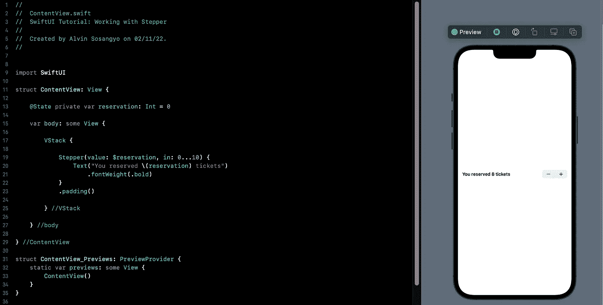

# SwiftUI 教程:使用 Stepper

> 原文：<https://blog.devgenius.io/swiftui-tutorial-working-with-stepper-972994ffb3f1?source=collection_archive---------2----------------------->

## 创建步进器的不同方法



图一。

SwiftUI 中的 Stepper 与 UIKit 中的 UIStepper 工作方式相同。它创建了一个增量和减量按钮，可以通过点击来改变给定值。

> 这篇文章是我的 [SwiftUI 教程](https://arc-sosangyo.medium.com/list/swiftui-tutorial-03734e631240)系列的一部分。

为此练习准备一个打开的项目。如果你需要一步一步的过程，你可以使用这个[链接](/introduction-to-swiftui-creating-new-project-9adc502e1804)。

让我们创建一个使用 Stepper 的简单预订功能。首先，你需要一个[状态](https://medium.com/geekculture/swiftui-tutorial-state-and-binding-b7e80b4de622) [变量](https://arc-sosangyo.medium.com/swift-programming-tutorial-variables-670ceea20bd1)来存储步进器的值。在 ContentView 中编写以下代码:

```
@State private var reservation: Int = 0
```

然后，我们将把我们创建的这个变量绑定到 Stepper 的*值*参数。因此，让我们在 VStack 中创建一个步进器，这样我们就可以有一个组织有序的 UI。我们还将放入一个文本，显示 reservation 变量的当前值。在主体中编写以下代码:

```
VStack {

    Stepper("How many?", value: $reservation, in: 0...10)
    Text("You reserved \(reservation) tickets")

} //VStack
```

我们在这里补充的另一个重要参数是。我们所做的是使用[范围](https://medium.com/@arc-sosangyo/swift-programming-tutorial-basic-operators-72dc48116b1c)操作符指定最小值和最大值。

这是全部源代码的截图，以防你迷路:


图二。步进机的基本示例

运行应用程序并尝试按增量和减量按钮。当你按下这些按钮时，数字也会改变。因为我们在修饰符中的*下指定了范围仅从 0 到 10，所以您不能超过这些数字。*

我们放一些衬垫来增加呼吸的空间，并把文字加粗，怎么样？我们是这样做的:

```
VStack {

    Stepper(value: $reservation, in: 0...10) {
        Text("How many")
            .fontWeight(.bold)
    }
    .padding()

    Text("You reserved \(reservation) tickets")

} //VStack
```

现在用户界面看起来更好了:


图 3。基本步进器应用程序

这种格式也是一个好主意:

```
VStack {

    Stepper(value: $reservation, in: 0...10) {
        Text("You reserved \(reservation) tickets")
            .fontWeight(.bold)
    }
    .padding()

} //VStack
```

这为其他视图提供了更多空间。


图 4。将所有东西贴上标签

# 自定义增量和减量

以防您需要以编程方式进行递增和递减。添加更多变量或使用小数的示例。您可以使用以下格式:

```
VStack {

    Stepper(onIncrement: {
        reservation += 2
    }, onDecrement: {
        reservation -= 2
    }) {
        Text("You reserved \(reservation) tickets")
            .fontWeight(.bold)
    }
    .padding()

} //VStack
```

使用上面的代码，我们放弃绑定*值*以及范围内的*。作为替代，我们用增量*上的*来编码加号按钮的动作，用增量*上的*来编码减号按钮的动作。我把增加和减少分成两个数字来说明这种方法。尝试用代码做实验。*

# 附加内容:固定单复数形式

这可能与步进机无关。但是我的强迫症冲动想让我纠正这个问题。虽然这只是一个练习，但我想在数字为 0 或 1 时只显示“ticket”。这可以通过在文本视图中使用三元运算符轻松解决，如下所示:

```
Text("You reserved \(reservation) \(reservation <= 1 ? "ticket" : "tickets")")
```

这是源代码在以下情况下的样子:


图 5。最终源代码

立即运行应用程序。如果预订只有 0 或 1，它应该只显示“票”。完成本教程的伟大工作。

下面是源代码的 github [链接](https://github.com/athurion/SwiftUI-Tutorial-Working-with-Stepper/blob/main/ContentViewStepper.swift)。

愿法典与你同在，

-电弧