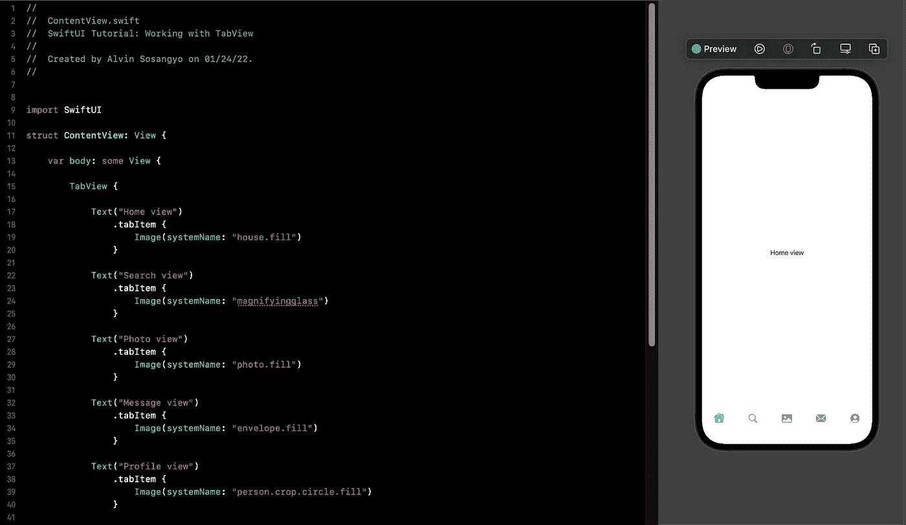
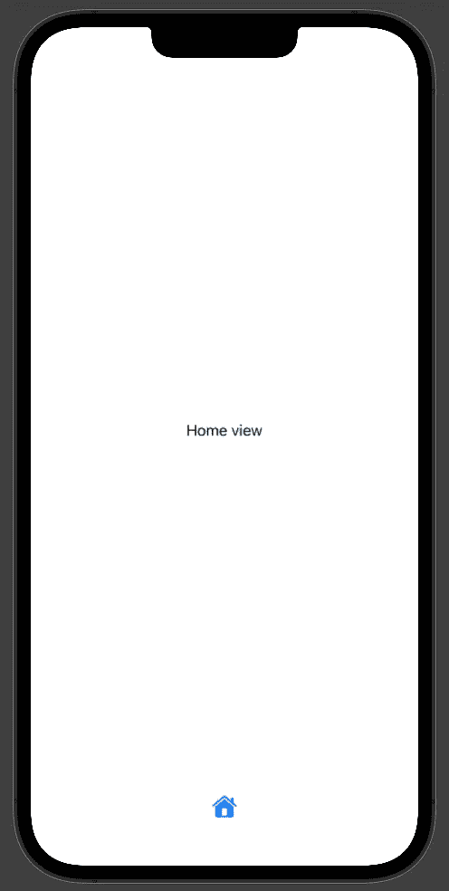
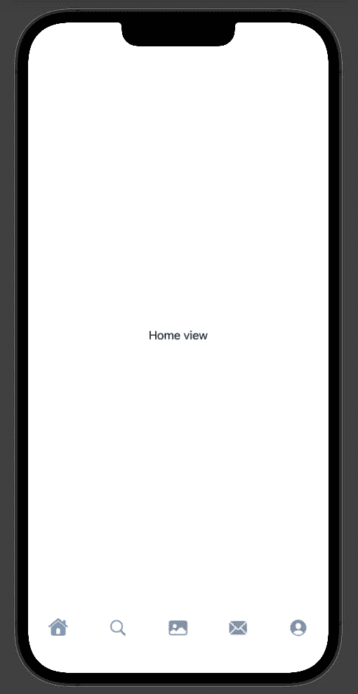
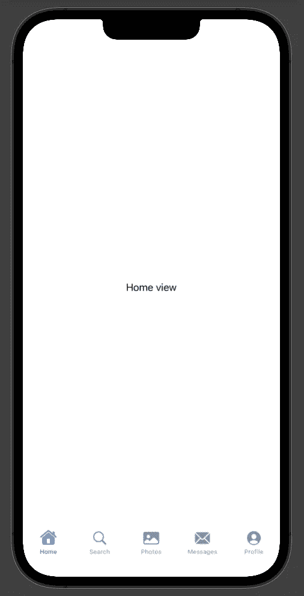
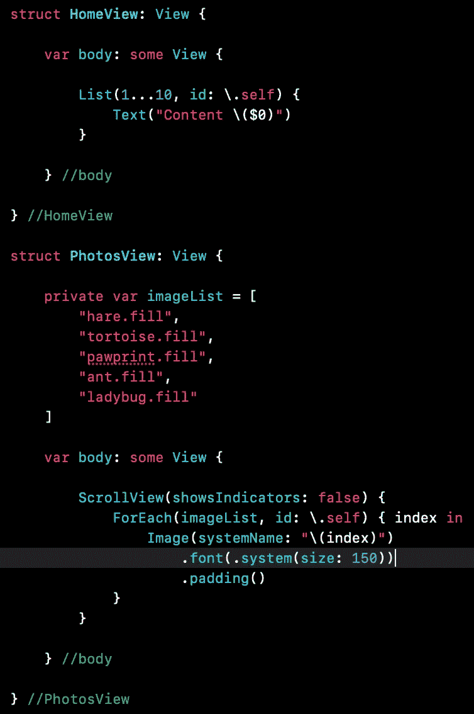
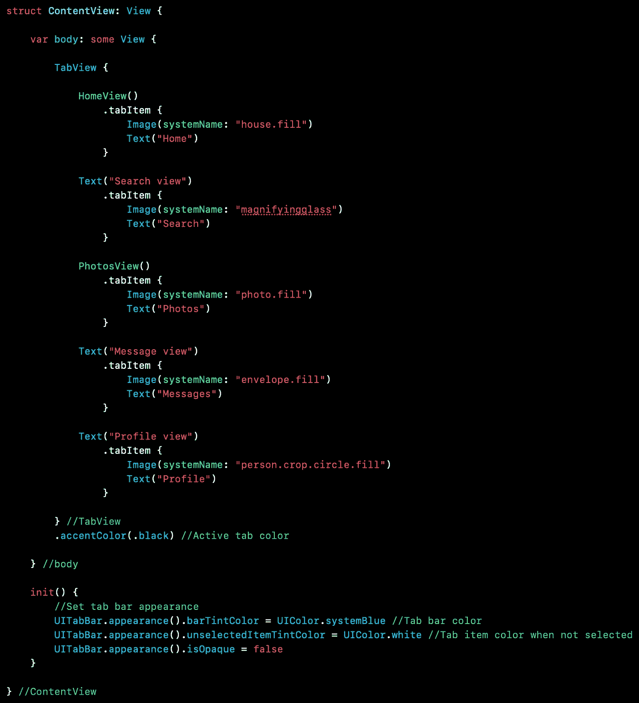
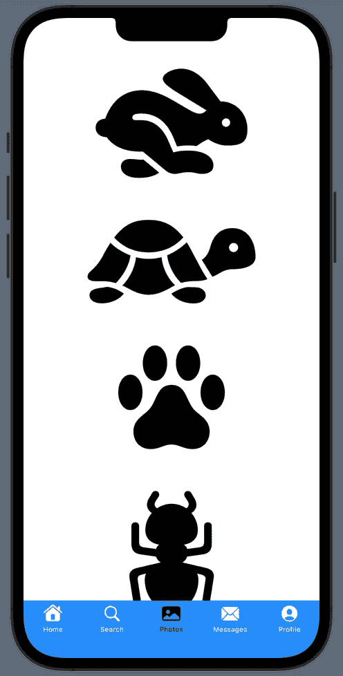
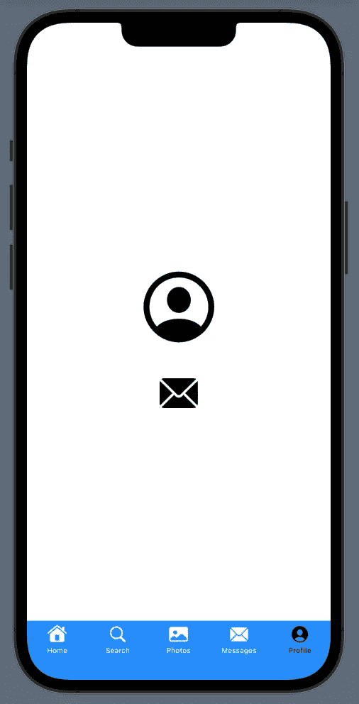

# SwiftUI 教程:使用 TabView

> 原文：<https://blog.devgenius.io/swiftui-tutorial-working-with-tabview-1922de2647b8?source=collection_archive---------2----------------------->

## 了解如何创建和自定义选项卡栏



图一。

如果说大多数流行的移动应用有一个值得注意的地方，那就是它们都使用了一个出现在屏幕底部的标签栏。标签栏的作用是让用户可以方便地在应用程序的不同重要部分之间切换。在 SwiftUI 中，由于有了 TabView，创建标签栏 UI 变得很容易。

在本教程中，我将向您展示如何创建一个标签栏，并自定义其外观。

> *本教程是我的* [*SwiftUI 教程*](https://arc-sosangyo.medium.com/list/swiftui-tutorial-03734e631240) *系列的一部分。*

在做任何事情之前，确保有一个新的项目可以实践。如果你需要一步一步的过程，你可以使用这个[链接](/introduction-to-swiftui-creating-new-project-9adc502e1804)。

让我们制作一个包含单个选项卡的简单 TabView。像这样修改内容视图:

```
struct ContentView: View {

    var body: some View {

        TabView {

            Text("Home view")
                .tabItem {
                    Image(systemName: "house.fill")
                }

        } //TabView

    } //body

} //ContentView
```

这是它在画布中的样子:



图二。单一标签

您将所有视图都放在了 TabView 中。在上面的例子中，我们放入的视图是一个文本。通过附加一个. *tabItem* 修饰符，我们还设置了它将在标签栏中代表哪种按钮。对于这个例子，我使用了一个[系统映像](/swiftui-tutorial-displaying-system-image-with-sf-symbols-75c01b5bf421)作为选项卡按钮的设计。

拥有一个单独的标签条目是没有用的，因为它会消除使用标签栏的目的。所以我们来做多个 tab 项。像这样修改内容视图中的代码:

```
struct ContentView: View {

    var body: some View {

        TabView {

            Text("Home view")
                .tabItem {
                    Image(systemName: "house.fill")
                }

            Text("Search view")
                .tabItem {
                    Image(systemName: "magnifyingglass")
                }

            Text("Photo view")
                .tabItem {
                    Image(systemName: "photo.fill")
                }

            Text("Message view")
                .tabItem {
                    Image(systemName: "envelope.fill")
                }

            Text("Profile view")
                .tabItem {
                    Image(systemName: "person.crop.circle.fill")
                }

        } //TabView

    } //body

} //ContentView
```

这是修改代码后应用程序的外观:



图 3。多个选项卡

运行应用程序并尝试按选项卡。您会注意到它根据各自的选项卡项目改变了视图。

您可以通过向每个选项卡项目添加标签来使 UI 更加友好。让我们通过修改内容视图中的代码来添加一些文本，如下所示:

```
struct ContentView: View {

    var body: some View {

        TabView {

            Text("Home view")
                .tabItem {
                    Image(systemName: "house.fill")
                    Text("Home")
                }

            Text("Search view")
                .tabItem {
                    Image(systemName: "magnifyingglass")
                    Text("Search")
                }

            Text("Photo view")
                .tabItem {
                    Image(systemName: "photo.fill")
                    Text("Photos")
                }

            Text("Message view")
                .tabItem {
                    Image(systemName: "envelope.fill")
                    Text("Messages")
                }

            Text("Profile view")
                .tabItem {
                    Image(systemName: "person.crop.circle.fill")
                    Text("Profile")
                }

        } //TabView

    } //body

} //ContentView
```

这是修改代码后的样子:



图 4。多个带标签的选项卡

在真实的应用程序中，单个选项卡将由多个视图组成。所以这里的最佳实践是为每个选项卡创建一个单独的[结构](https://arc-sosangyo.medium.com/swift-programming-tutorial-structs-6521663fee84)。在 ContentView 之外编写以下代码:

```
struct HomeView: View {

    var body: some View {

        List(1...50, id: \.self) {
            Text("Content \($0)")
        }

    } //body

} //HomeView
```

这只是一个简单的 [ForEach List](/swiftui-tutorial-working-with-list-using-foreach-a4b7451fbcf0) 视图，用来模拟基于内容的应用程序的典型主页。

我们再单独说一个观点。例如，对于照片选项卡。使用以下代码创建另一个单独的结构:

```
struct PhotosView: View {

    private var imageList = [
        "hare.fill",
        "tortoise.fill",
        "pawprint.fill",
        "ant.fill",
        "ladybug.fill"
    ]

    var body: some View {

        ScrollView(showsIndicators: false) {
            ForEach(imageList, id: \.self) { index in
                Image(systemName: "\(index)")
                    .font(.system(size: 150))
                    .padding()
            }
        }

    } //body

} //PhotosView
```

这是我们编写的独立结构的屏幕截图:



图 5。分离结构

然后编辑内容视图，替换主页和照片的视图，如下所示:

```
struct ContentView: View {

    var body: some View {

        TabView {

            HomeView()
                .tabItem {
                    Image(systemName: "house.fill")
                    Text("Home")
                }

            Text("Search view")
                .tabItem {
                    Image(systemName: "magnifyingglass")
                    Text("Search")
                }

            PhotosView()
                .tabItem {
                    Image(systemName: "photo.fill")
                    Text("Photos")
                }

            Text("Message view")
                .tabItem {
                    Image(systemName: "envelope.fill")
                    Text("Messages")
                }

            Text("Profile view")
                .tabItem {
                    Image(systemName: "person.crop.circle.fill")
                    Text("Profile")
                }

        } //TabView

    } //body

} //ContentView
```

运行应用程序，尝试进入不同的选项卡，尤其是主页和照片。

# 自定义选项卡栏颜色

默认情况下，活动选项卡栏项目的颜色是蓝色。假设我们想把它改成黑色。这是怎么做的:

```
TabView {
    //Code
}
.accentColor(.black)
```

在撰写本文时，SwiftUI 还没有定制标签栏颜色的修改器。要改变它的颜色，我们必须点击 UIKit 的 UITabBar.appearance，然后将代码放在 init()下。例如，我们想将标签栏的颜色改为 systemBlue。在 ContentView 中编写以下代码:

```
init() {
    UITabBar.appearance().barTintColor = UIColor.systemBlue
}
```

默认情况下，未选中的选项卡是灰色的。假设我们想把它改成白色。代码如下:

```
UITabBar.appearance().unselectedItemTintColor = UIColor.white
```

如果不希望标签栏透明，可以将不透明设置为 false，如下所示:

```
UITabBar.appearance().isOpaque = false
```

让我们把所有这些代码放在一起，制作我们定制的 UI。



图 6。自定义选项卡栏颜色的代码

这是这款应用的外观:



图 6。自定义选项卡栏颜色

# 以编程方式在选项卡之间切换

选项卡视图已经被编程为根据它被分配到的选项卡项目在选项卡之间切换。在标签栏外创建一个与标签按钮功能相同的按钮怎么样？假设有一个按钮，它会像这样立即从个人资料视图转到邮件视图:



图 7。以编程方式切换选项卡按钮

让我们先对概要文件的设计进行编码。在 ContentView 之外，创建包含以下代码的单独结构:

```
struct ProfileView: View {

    var selection: () -> Void

    var body: some View {

        VStack {

            Image(systemName: "person.crop.circle")
                .font(.system(size: 100))
                .padding()

            Button(action: selection) {
                Image(systemName: "envelope.fill")
                    .font(.system(size: 50))
            }
            .padding()

        } //ZStack

    } //body

} //ProfileView
```

回到 ContentView，我们首先需要一个保存值的[状态](https://medium.com/geekculture/swiftui-tutorial-state-and-binding-b7e80b4de622) [变量](https://arc-sosangyo.medium.com/swift-programming-tutorial-variables-670ceea20bd1)。将此内容添加到 ContentView 中:

```
@State private var selection = 0
```

接下来，在 TagView a 中添加一个方法，在那里绑定选择变量。像这样修改代码:

```
TabView(selection: $selection)
```

然后为每个选项卡项目定义标记值。加一个*。为每个视图标记*修饰符，并替换我们之前创建的*文本(" Profile")* 到 *ProfileView* 。代码将如下所示:

```
TabView(selection: $selection) {

    HomeView()
        .tabItem {
            Image(systemName: "house.fill")
            Text("Home")
        }
        .tag(0)

    Text("Search view")
        .tabItem {
            Image(systemName: "magnifyingglass")
            Text("Search")
        }
        .tag(1)

    PhotosView()
        .tabItem {
            Image(systemName: "photo.fill")
            Text("Photos")
        }
        .tag(2)

    Text("Message view")
        .tabItem {
            Image(systemName: "envelope.fill")
            Text("Messages")
        }
        .tag(3)

    ProfileView(selection: {

    })
        .tabItem {
            Image(systemName: "person.crop.circle.fill")
            Text("Profile")
        }
        .tag(4)

} //TabView
```

这里缺少的是触发 tab 开关的动作。修改 ProfileView 并添加以下代码:

```
selection = (selection + 4) % 5
```

请允许我分解代码的重要部分。 **% 5** 是放置标签栏中标签项目数量的地方。例如，如果你只有 3 个，你就写 **% 3** 。然后在括号下面是选择的地方+你想要切换的标签。消息视图是第四个，这就是为什么我们把 4 放在那里。

现在运行应用程序，并尝试在配置文件视图中按下按钮。每次按下按钮时，它应该切换到消息视图。

我在 github 上上传了这个项目的全部源代码。点击这个[链接](https://github.com/athurion/Working-with-TabView/blob/main/ContentViewTabView.swift)就可以了。

愿法典与你同在，

-电弧