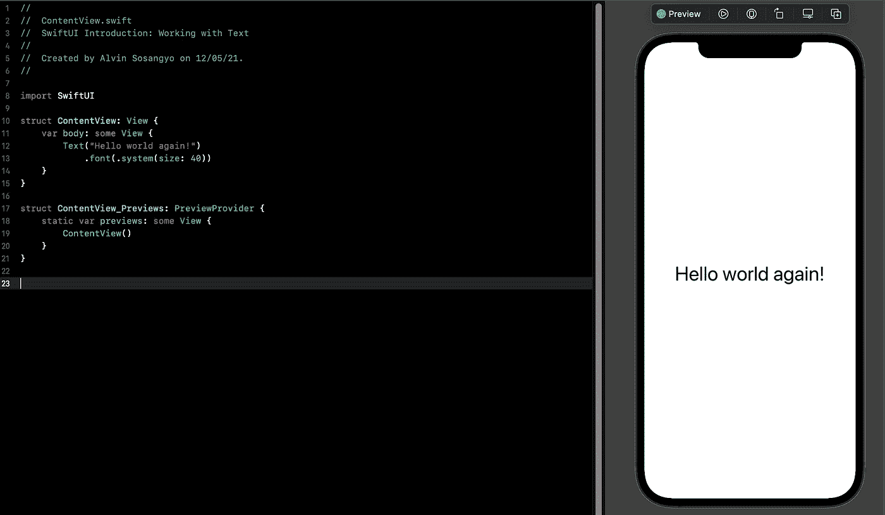
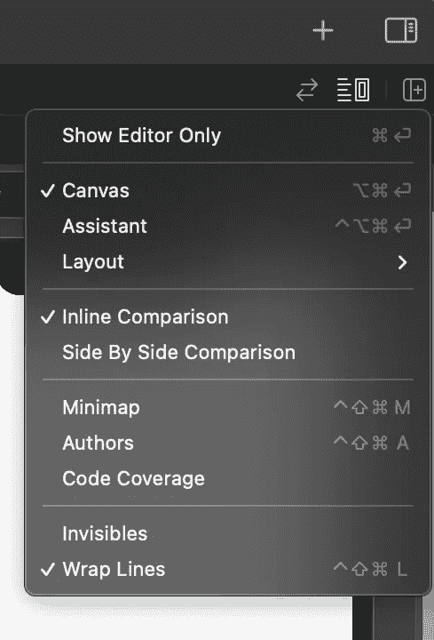
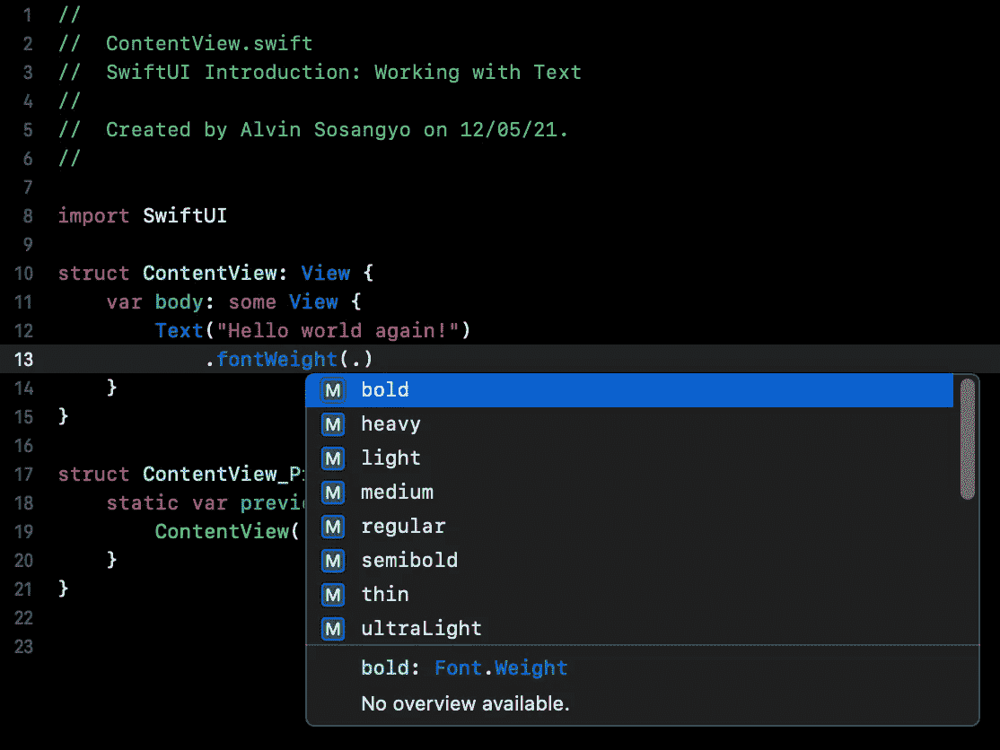
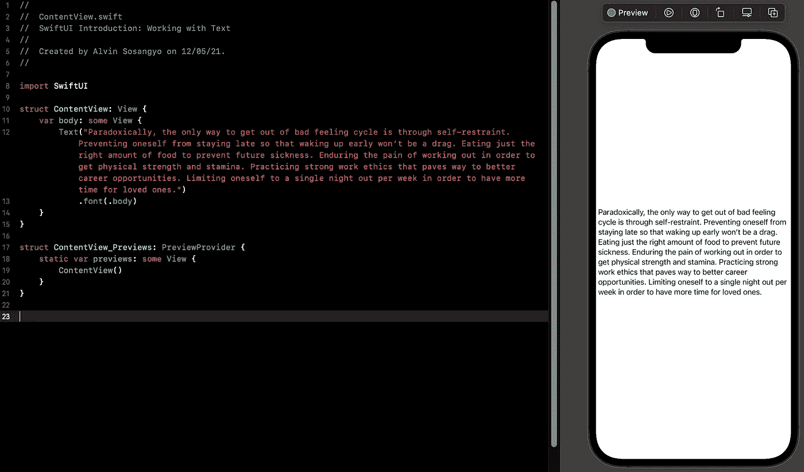
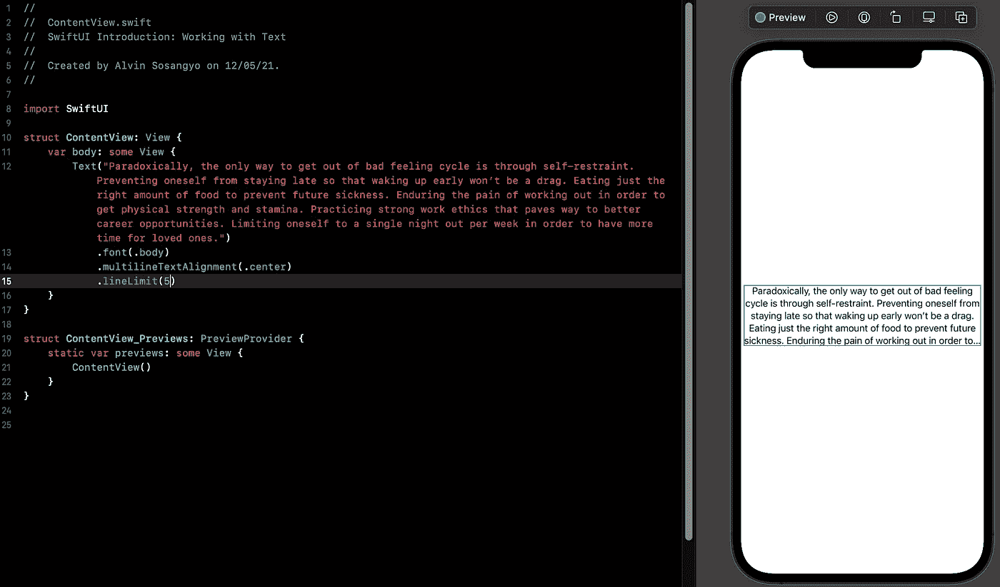
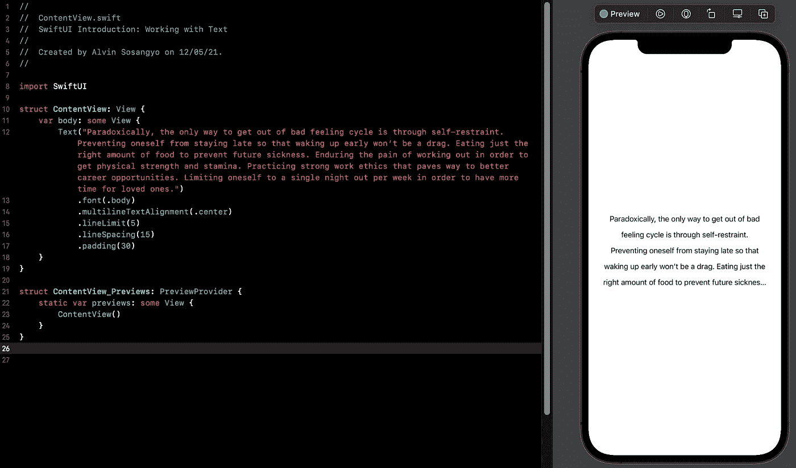
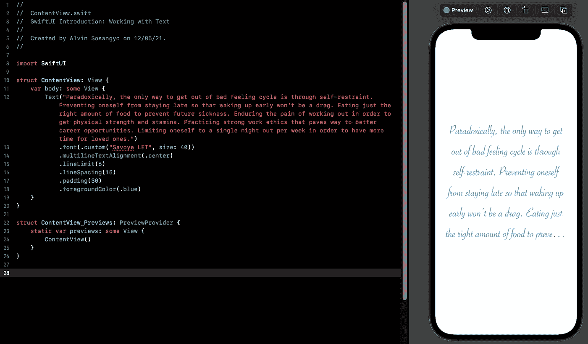

# SwiftUI 教程:使用文本和学习修改器

> 原文：<https://blog.devgenius.io/swiftui-tutorial-working-with-text-15de81494a07?source=collection_archive---------4----------------------->



图一。又是你好世界！

SwiftUI 中的文本是不可编辑的只读文本，用于在屏幕上显示信息。

> 本教程是我的 [SwiftUI 教程](https://arc-sosangyo.medium.com/list/swiftui-tutorial-03734e631240)系列的一部分。

在本教程中，您将学习使用 SwiftUI 文本呈现或显示信息的基础知识。还将介绍如何用不同的字体、颜色和背景定制文本。

首先，让我们创建一个新项目。如果你已经有了一个，可以随意使用现有的进行练习，或者如果你还不知道如何创建一个新项目，你可以按照这个[链接](https://arc-sosangyo.medium.com/introduction-to-swiftui-creating-new-project-9adc502e1804)中的步骤操作。

创建新项目后，ContentView 中会生成一个示例代码，向您展示如何显示文本。显示文本就像使用文本对象一样简单:

例如

```
Text("Hello world again!")
```

为了便于练习，您可以随意将文本更改为您想要的任何值。右边的画布将立即显示您的更改。

> **注意:**如果右边的画布没有出现，转到 Xcode 的右上方，点击**调整编辑器选项**，确保**画布**被选中，如下图 2 所示。



图二。显示画布

# 更改字体

SwiftUI 使用修改器来改变属性。这些可以通过点语法来访问。假设您想要将信息格式设置为类似标题的样式，那么您可以这样做:

例如

```
Text("Hello world again!").font(.title)
```

或者你可以把语法做成这种格式(有些人或大多数人更喜欢这种编码方式):

```
Text("Hello world again!")
            .font(.title)
```

比方说，你想让字体加粗。您可以使用**字体重量**并像这样指示首选重量:

例如

```
Text("Hello world again!").fontWeight(.bold)
```

每当您键入点时，Xcode 都会列出您可以使用的所有可能的修饰符。例如，您可以使用其他字体粗细，如 heavy 或 black。



图 3。Xcode 列出了所有可能的修饰符

# **链接字体修饰符**

大多数情况下，你想为你的文本组合不同的修饰语。好的一面是，你可以像这样简单地链接修饰符:

例如

```
struct ContentView: View {
    var body: some View {
        Text("Hello world again!")
            .font(.largeTitle)
            .fontWeight(.black)
    }
}
```

# 更改字体大小

字体大小可以在中调整。系统正在运行。字体修饰符，它有多个可以应用于文本的参数。

例如

```
Text("Hello world again!")
            .font(.system(size: 40))
```

# 更改字体颜色

用于更改文本的颜色。使用了前景颜色修饰符。

例如

```
Text("Hello world again!")
            .foregroundColor(.blue)
```

# 使用通过更改字体样式来自定义字体

字体样式可以通过使用。内部定制。字体修饰符。假设您想要将字体样式更改为" *Savoye LET"* 。

例如

```
Text("Hello world again!")
            .font(.custom("Savoye LET", size: 50))
```

> **注:**您可以在 mac 中打开**字体册**应用程序，查看可用字体列表。

# 制作多行文本

Text 能够显示段落文本，而无需使用任何额外的修饰符。

例如



图 4。SwiftUI 自动将文本格式化为多行

您可以使用以下命令更改多行对齐方式:

```
.multilineTextAlignment(.center)
```

您还可以使用以下命令来限制行数:

```
.lineLimit(5)
```

例如



图 5。将文本对齐居中，并将其限制为 5 行

# 调整空间

如果你认为行距给你的应用带来了一些小麻烦，你可以使用。行距():

例如

```
.lineSpacing(15)
```

如果您认为文本的边缘太近，您可以使用。padding()给它一些额外的空间。

例如

```
.padding(6)
```

例如



图 6。添加行距和填充，以提供更多的呼吸空间。

# 把它们连在一起



图 7。使用修饰符链自定义文本

希望你喜欢在 SwiftUI 上创建和修改文本是多么容易。您可以参考[官方文档](https://developer.apple.com/documentation/swiftui/font)来检查字体的所有支持值。

在我们的下一个教程中，我们将解决如何在 SwiftUI 中处理[图像](https://arc-sosangyo.medium.com/swiftui-tutorial-working-with-images-62040c279960)。

愿法典与你同在，

-电弧