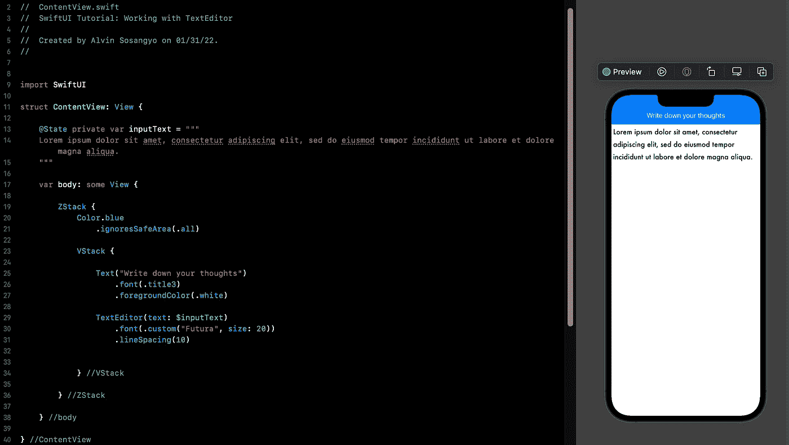
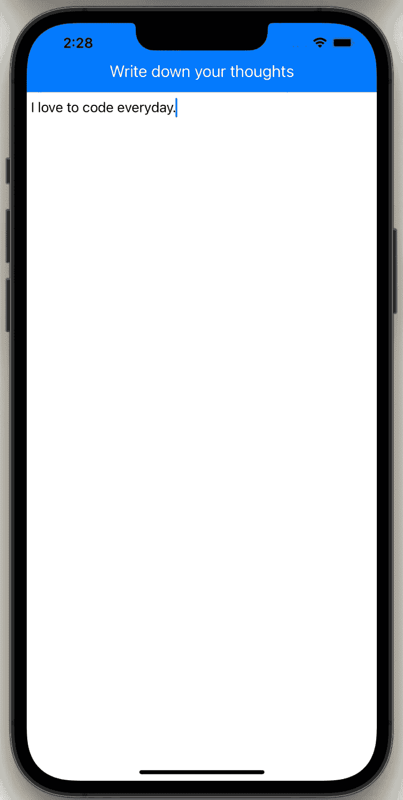
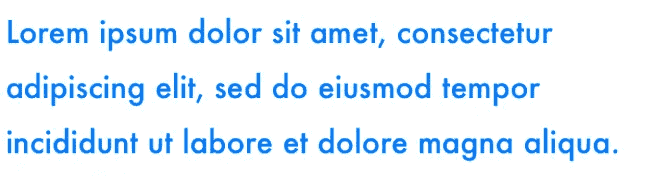
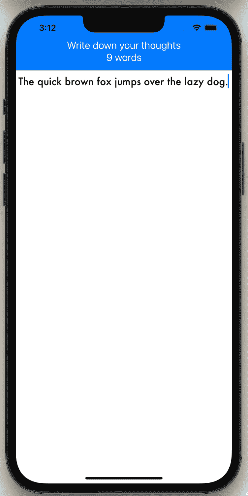
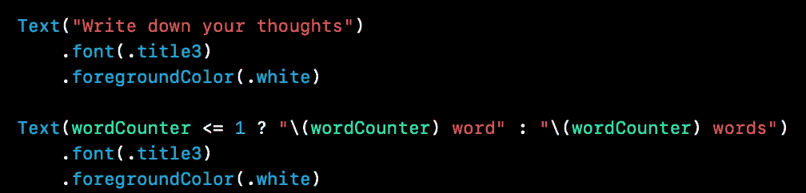
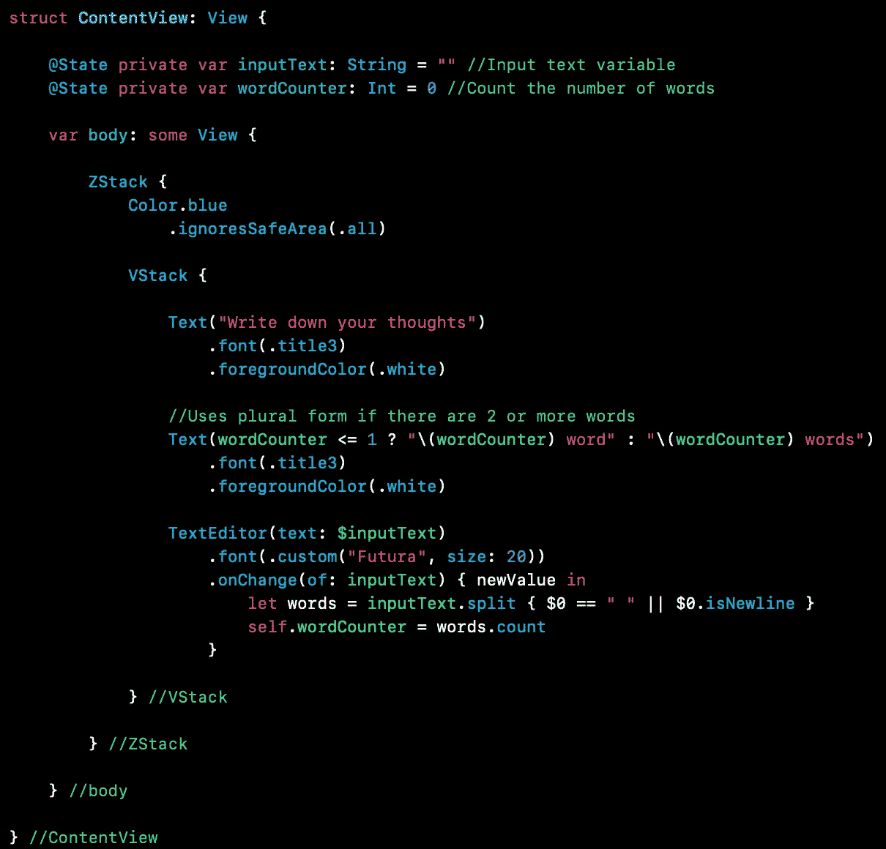

# SwiftUI 教程:使用 TextEditor

> 原文：<https://blog.devgenius.io/swiftui-tutorial-working-with-texteditor-a059eb899084?source=collection_archive---------4----------------------->

## 如何在 SwiftUI 中创建可编辑的文本字段



图一。

在 iOS 14 之前，SwiftUI 仍然需要 UIKit 的 UITextView 的支持，以便创建可编辑的文本字段。然后在 iOS 14 当苹果在 SwiftUI 框架中发布了一个名为*text editor**的新视图，生活变得更加美好。这使得开发人员可以创建一个可编辑的多行文本字段，而不用担心使用 UIViewRepresentable。*

*在本教程中，我们将讨论如何在 SwiftUI 应用程序中使用 TextEditor。在我们开始之前，确保有一个新的项目开放练习。如果你需要一步一步的过程，你可以使用这个[链接](/introduction-to-swiftui-creating-new-project-9adc502e1804)。*

> *本教程是我的 [SwiftUI 教程](https://arc-sosangyo.medium.com/list/swiftui-tutorial-03734e631240)系列的一部分。*

# *如何制作文本编辑器*

*创建文本编辑器很容易。基本上，它只需要一个[状态](https://medium.com/geekculture/swiftui-tutorial-state-and-binding-b7e80b4de622) [变量](https://medium.com/@arc-sosangyo/swift-programming-tutorial-variables-670ceea20bd1)来存储输入字符串，然后将绑定传递给*文本编辑器*。下面的代码显示了它的基本工作原理:*

```
*struct ContentView: View { [@State](http://twitter.com/State) private var inputText = "" var body: some View { TextEditor(text: $inputText) }}*
```

*运行应用程序并尝试键入大量文本。是的，我知道这个应用程序看起来很蹩脚。因此，让我们以某种方式使它看起来像这样:*

```
*struct ContentView: View {

    @State private var inputText = ""

    var body: some View {

        ZStack {
            Color.blue
                .ignoresSafeArea(.all)

            VStack {

                Text("Write down your thoughts")
                    .font(.title3)
                    .foregroundColor(.white)

                TextEditor(text: $inputText)

            } //VStack

        } //ZStack

    } //body

} //ContentView*
```

*再次运行该应用程序，它将如下所示:*

**

*图二。在文本编辑器上写下*

# *自定义字体*

*可以像定制[文本视图](https://medium.com/dev-genius/swiftui-tutorial-working-with-text-15de81494a07)一样定制文本编辑器(字体、颜色等)。在下面的例子中，我们正在改变*字体*和调整*行距*。*

```
*TextEditor(text: $inputText)
    .font(.custom("Futura", size: 20))
    .lineSpacing(10)
    .foregroundColor(.blue)* 
```

*以下是输出:*

**

*图 3。自定义字体*

# *自动资本化*

*默认情况下，自动资本化设置为。*句子*。但是你可以很容易地改变它的行为。下面是根据您希望文本编辑器如何工作的基本选择。*

*   ***无** —无自动大写。*
*   ***单词** —自动将每个单词的首字母大写。*
*   ***所有字符** —自动大写所有字符。*
*   ***句子** —自动将每个句子的首字母大写。*

*比方说，您希望键入的每个单词都自动大写。*

```
*TextEditor(text: $inputText)
    .font(.custom("Futura", size: 20))
    .autocapitalization(.words)*
```

*下面是示例输出:*

**

*图 4。自动大写每个单词*

# *禁用自动更正*

*自动修正大多数时候都很烦人。但好的一面是，你可以像这样简单地禁用它:*

```
*TextEditor(text: $inputText)
    .font(.custom("Futura", size: 20))
    .disableAutocorrection(true)*
```

# *使用触发动作。onChange 修饰符*

*在 TextEditor 上附加一个 *onChange* 修饰符可以实时检测字符串的变化。进一步讨论这个问题的最好方法是制作一个包含实时字数统计的简单笔记应用程序。下面的图 5 显示了它的样子。*

**

*图 5。带实时字数统计的笔记应用*

*在本练习中，我们将在 ContentView 中编写所有内容。从变量开始。我们需要 2 个:第一个处理文本输入，第二个处理字数。在内容视图中写下:*

```
*@State private var inputText: String = ""
@State private var wordCounter: Int = 0*
```

*在编写应用程序的功能之前。让我们先处理好 UI 和 TextEditor，避免让我们的大脑不堪重负。在 ContentView 中编写以下代码:*

```
*var body: some View {

    ZStack {
        Color.blue
            .ignoresSafeArea(.all)

        VStack {

            Text("Write down your thoughts")
                .font(.title3)
                .foregroundColor(.white)

            Text("")
                .font(.title3)
                .foregroundColor(.white)

            TextEditor(text: $inputText)
                .font(.custom("Futura", size: 20))

        } //VStack

    } //ZStack

} //body*
```

*是的，这和我们在本教程中使用的第一个例子是一样的。如画布中所示。现在是最重要的部分——功能性的时候了。编辑 VStack 中的第二个文本视图，如下所示:*

```
*Text(wordCounter <= 1 ? "\(wordCounter) word" : "\(wordCounter) words")*
```

*那么这段代码做什么呢？如果 TextEditor 中只有 1 个或更少的单词，我们希望文本视图只使用“word”。然后，如果已经有两个或更多的单词，它将变成复数形式的“单词”。为了只用一行代码就能做到这一点，我们在这里使用了一个[三元](https://medium.com/@arc-sosangyo/swift-programming-tutorial-basic-operators-72dc48116b1c)操作符，在文本视图中创建了一个简单的 [if](https://medium.com/@arc-sosangyo/swift-programming-tutorial-conditional-statement-f57aefd630ce) 语句。*

*为了便于指导，现在代码应该是这样的:*

**

*图 6。文本视图中的单词计数器源代码*

*然后让我们编写实时字数统计功能。附上。TextEditor 上的 onChange 修饰符，然后写下里面的功能。下面是代码:*

```
*TextEditor(text: $inputText)
    .font(.custom("Futura", size: 20))
    .onChange(of: inputText) { newValue in
        let words = inputText.split { $0 == " " || $0.isNewline }
        self.wordCounter = words.count
    }*
```

*我们要求 onChange 修饰符专门监控 inputText 中的变化。每当发生更改时，字符串将使用空白" "作为分隔符进行拆分。然后它将被存储在一个名为*的常量字*中。所有拆分的项目都被计数并存储在 wordCounter 变量中。*

*下面是指导用的源代码截图:*

**

*图 7。最终源代码*

*运行应用程序并尝试在 TextEditor 中键入内容。我们的应用程序现在可以实时统计所有单词。对自己出色的工作给予鼓励。*

*我在 github 上传了源代码。点击这个[链接](https://github.com/athurion/SwiftUI-Tutorial-Working-with-TextEditor/blob/main/ContentViewTextEditor.swift)就可以了。*

*愿法典与你同在，*

*-电弧*