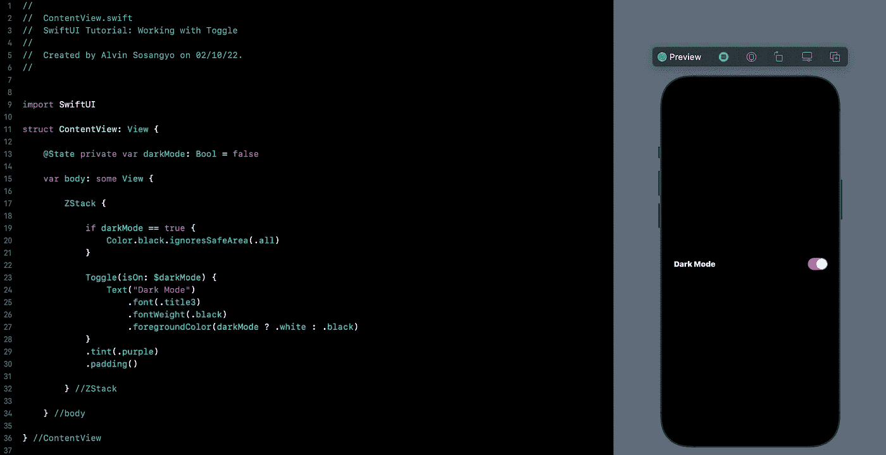
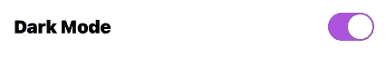
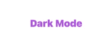
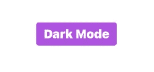
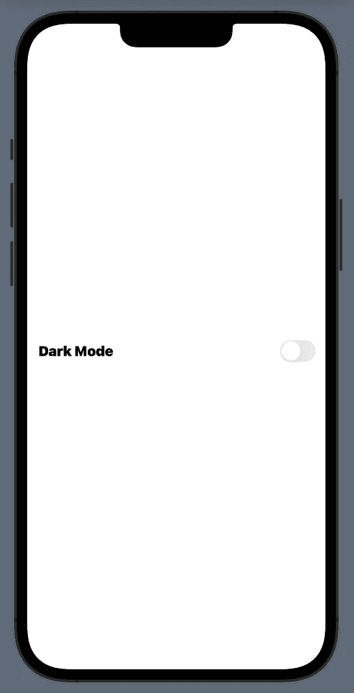
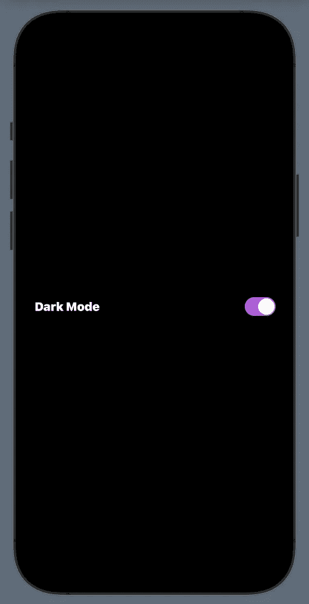
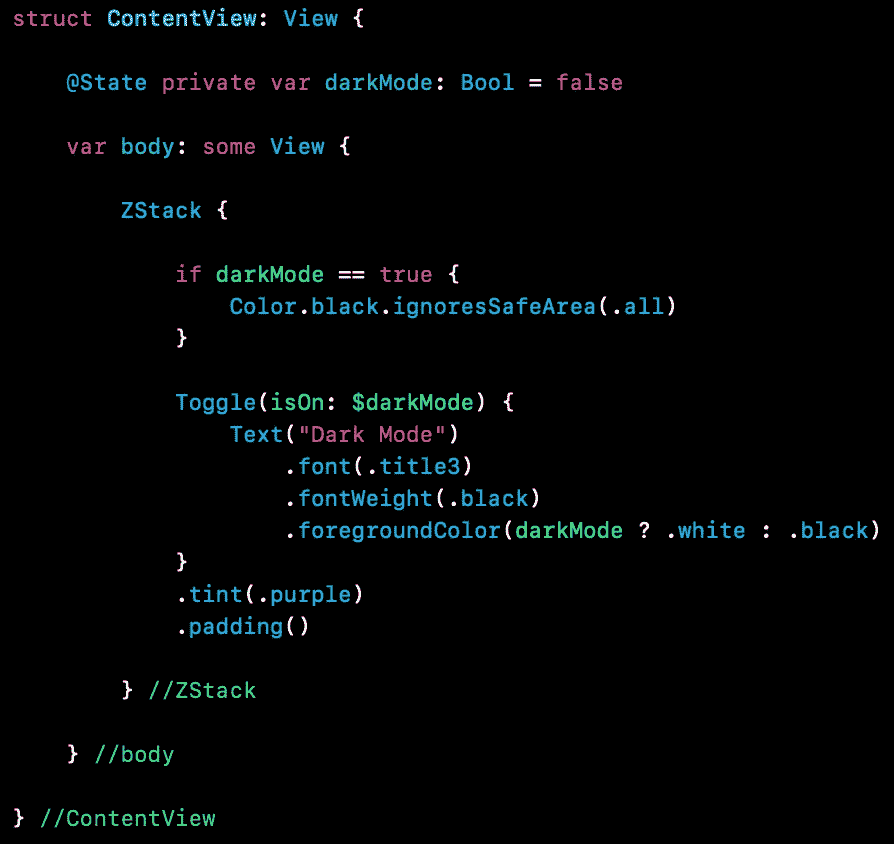

# SwiftUI 教程:使用切换

> 原文：<https://blog.devgenius.io/swiftui-tutorial-working-with-toggle-5393d8e83f0b?source=collection_archive---------5----------------------->

## 如何制作拨动开关



图一。

SwiftUI 的 Toggle 允许开发人员轻松地创建一个类似开关的控件，用于打开和关闭状态。从程序员的角度来看，这意味着真和假状态。Toggle 的工作方式与 UIKit 框架中的 UISwitch 相同。

> *本文是我的* [*SwiftUI 教程*](https://arc-sosangyo.medium.com/list/swiftui-tutorial-03734e631240) *系列的一部分。*

确保您已经有一个打开的项目来进行本练习。如果你需要一步一步的过程，你可以使用这个[链接](/introduction-to-swiftui-creating-new-project-9adc502e1804)。

由于 toggle 的工作方式类似于开关，所以它首先需要一个[状态](https://medium.com/geekculture/swiftui-tutorial-state-and-binding-b7e80b4de622)变量[来存储布尔值。在内容视图中写下:](https://medium.com/@arc-sosangyo/swift-programming-tutorial-variables-670ceea20bd1)

```
@State private var darkMode: Bool = false
```

*切换按钮*有两个强制参数:*标签*和*标签*用于绑定布尔状态变量。用以下代码修改 body 视图:

```
var body: some View {

    Toggle("Dark Mode", isOn: $darkMode)

} //body
```

如果你迷路了，这是全部代码:

```
struct ContentView: View {

    @State private var darkMode: Bool = false

    var body: some View {

        Toggle("Dark Mode", isOn: $darkMode)

    } //body

} //ContentView
```

这就是创建切换的简单之处。您可以运行应用程序并尝试按下开关。你应该看到一个开关一样的动画，每次你按下开关。

# 附加修改器

还有另一种创建 Toggle 的方法，允许您自定义标签。像这样修改切换代码:

```
Toggle(isOn: $darkMode) {
    Text("Dark Mode")
}
```

如果你熟悉 SwiftUI 中的[文本](https://medium.com/dev-genius/swiftui-tutorial-working-with-text-15de81494a07)视图是如何工作的。然后你就会知道这种格式允许你在文本下面放置修饰语。比方说，我们想改变字体，增加它的重量。作为一个额外的修改器，我们也将添加填充来切换。记下这段代码:

```
Toggle(isOn: $darkMode) {
    Text("Dark Mode")
        .font(.title3)
        .fontWeight(.black)
}
.padding()
```


图二。带修饰符的 Toggler

您还可以通过使用来更改开态颜色。*色调*修改器。假设我们想把它改成紫色。像这样修改现有代码:

```
Toggle(isOn: $darkMode) {
    Text("Dark Mode")
        .font(.title3)
        .fontWeight(.black)
}
.tint(.purple)
.padding()
```



图 3。更改色调颜色

对于 iOS 15 及更高版本，您可以使用*更改切换按钮的外观。toggleStyle(。按钮)*修饰符。下面的代码显示了它是如何工作的:

```
Toggle(isOn: $darkMode) {
    Text("Dark Mode")
        .font(.title3)
        .fontWeight(.black)
}
.tint(.purple)
.toggleStyle(.button)
.padding()
```

图 4 和图 5 显示了开和关的情况:



图 4。关闭



图 5。打开

# 运用我们所学

现在是时候使用我们练习时使用的代码库来进行一些应用了。当 toggle 打开时，我们将应用程序转换为黑暗模式。下面是该应用程序的外观:



图 6。关闭切换时应用程序的外观

打开切换会将其外观更改为:



图 7。打开时应用程序的外观

我们开始吧。使用相同的代码库，移除。toggleStyle(。按钮)。然后我们将添加一个 [if 语句](https://medium.com/@arc-sosangyo/swift-programming-tutorial-conditional-statement-f57aefd630ce)，如果 darkMode 变量为真，它将把 ZStack 的颜色改为黑色。在 ZStack 中添加以下代码:

```
if darkMode == true {
    Color.black.ignoresSafeArea(.all)
}
```

接下来，如果 darkMode 为真，文本颜色需要是白色，如果为假，文本颜色需要是黑色。这可以通过使用内部的[三元](https://medium.com/@arc-sosangyo/swift-programming-tutorial-basic-operators-72dc48116b1c)运算符来完成。*前景颜色*修饰符是这样的:

```
Toggle(isOn: $darkMode) {
    Text("Dark Mode")
        .font(.title3)
        .fontWeight(.black)
        .foregroundColor(darkMode ? .white : .black)
}
.tint(.purple)
.padding()
```

下面是源代码的截图，以防你迷路:



图 8。最终源代码

运行应用程序并尝试按下切换开关。该应用程序应该改变到黑暗模式，如果打开，如果关闭返回。干得好！

我在 github 上传了源代码。点击这个[链接](https://github.com/athurion/SwiftUI-Tutorial-Working-with-Toggle/blob/main/ContentViewToggle.swift)就可以了。

愿法典与你同在，

-电弧