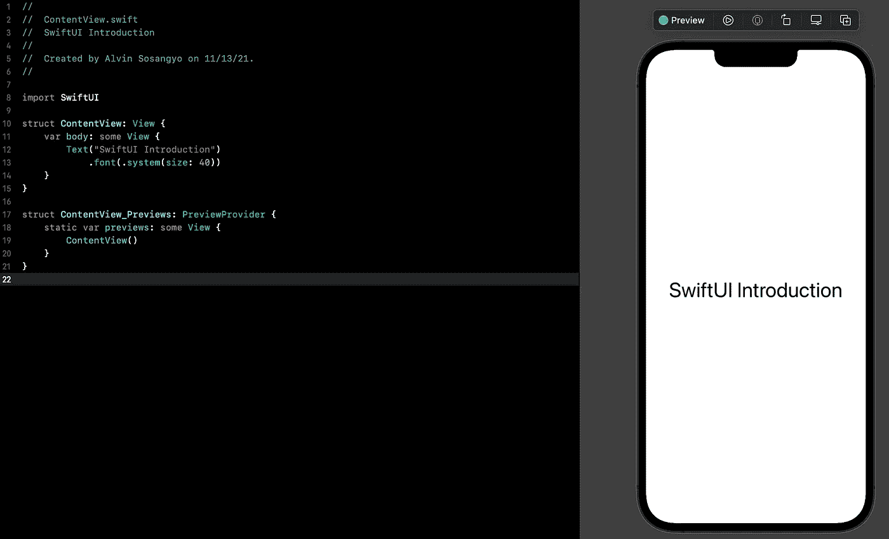

# SwiftUI 简介:声明式编程

> 原文：<https://blog.devgenius.io/swiftui-understanding-declarative-programming-360ede8f2551?source=collection_archive---------2----------------------->

多年来，iOS 开发人员一直在争论在构建用户界面、故事板和编程方面哪个更有效。答案在 2019 年 WWDC 期间揭晓，苹果通过宣布一个名为 SwiftUI 的全新框架为这一困境提供了解决方案。它完全改变了苹果生态系统中应用程序的开发方式。包括你编写应用程序的方式。

> 这篇文章是我的 [SwiftUI 教程](https://arc-sosangyo.medium.com/list/swiftui-tutorial-03734e631240)系列的一部分。

# 声明式和命令式编程

我喜欢在咖啡店闲逛和工作。我不介意把我所有的空闲时间都花在那里写代码或写作上。现在让我们想象一下，我们在一部记录当地咖啡店一天的短片中。一位老顾客走进来，点了他通常喝的新鲜热咖啡，加了香草糖和牛奶。订单一经确认，就立即被列入待办事项清单。咖啡师将水煮沸到 96 摄氏度，倒在 10 克咖啡粉上，直到咖啡滴到杯子里。然后，倒入 3 盎司蒸牛奶，并在搅拌前加入 15 毫升香草糖。

注意这里有两种视角:点咖啡的顾客和煮咖啡的咖啡师。这是声明式和命令式编程的核心区别。客户的观点就像声明式编程。他描述了他想要的咖啡。而咖啡师的视角就像命令式编程。她按照一套详细的说明来煮咖啡。

SwiftUI 框架以声明方式工作，而 Swift 编程是命令式的。声明式的编码方式会使代码可读性更强，更容易理解。这对于设计用户界面非常有用，这样开发人员可以将更多的精力放在修饰外观上，而不用花太多时间调试复杂的代码。

但是在你决定使用 SwiftUI 开发下一个应用之前，了解它的一般缺点和优点也很重要。

# SwiftUI 的缺点

*   需要注意的是，SwiftUI 只支持 iOS 13 及以上版本。这意味着如果你要使用 SwiftUI 创建应用程序，旧版本 iOS 的用户不能使用你的应用程序。对于 Xcode，只支持 11 及以上版本。
*   因为这个框架还很年轻，所以如果你遇到问题，没有太多的帮助和参考可以在网上找到。

# SwiftUI 的优势

*   简单易学。
*   代码简单明了。这导致开发过程中较少的错误。
*   发展更快。
*   有实时预览，允许您在编码时方便地查看用户界面的变化。
*   SwiftUI 不仅限于 iOS 和 ipadOS。它还可以用于开发 macOS、watchOS 和 tvOS。
*   可以在 UIKit 和 AppKit 等现有框架上工作，因此您不需要重写整个应用程序。

在我们的下一篇文章中，我们将通过处理[文本](https://arc-sosangyo.medium.com/swiftui-tutorial-working-with-text-15de81494a07)来开始探索 SwiftUI。

愿法典与你同在，

-电弧