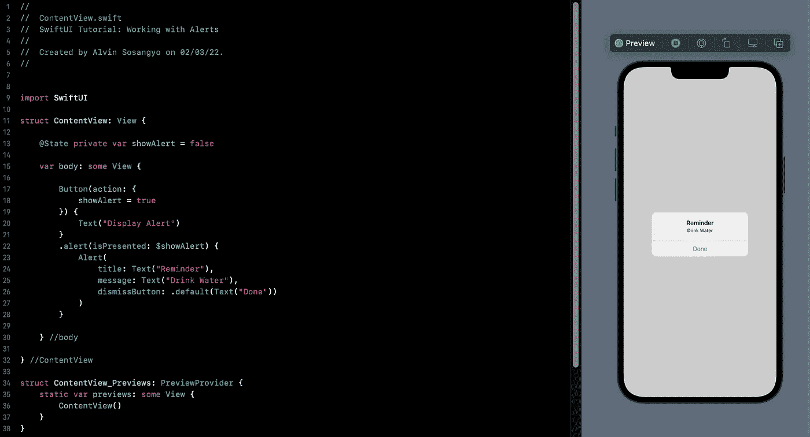
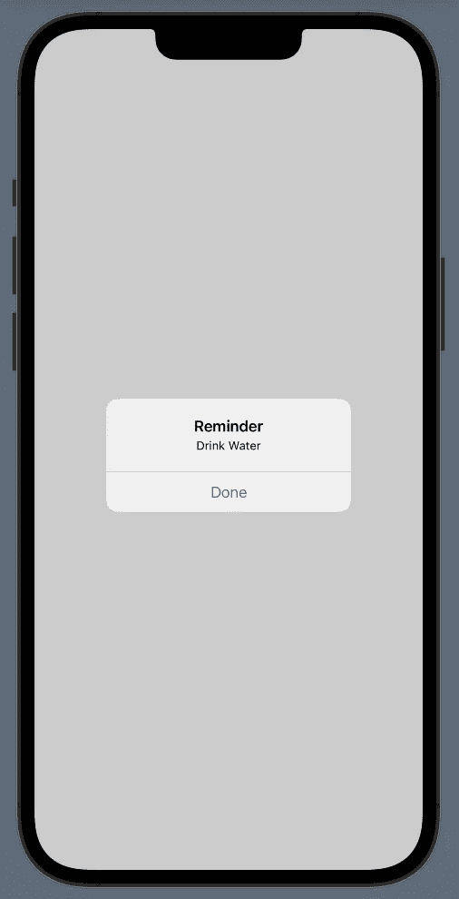
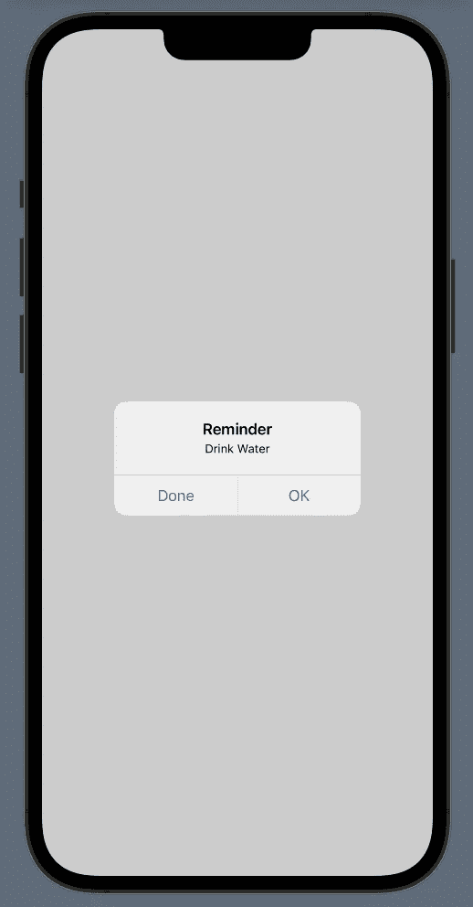
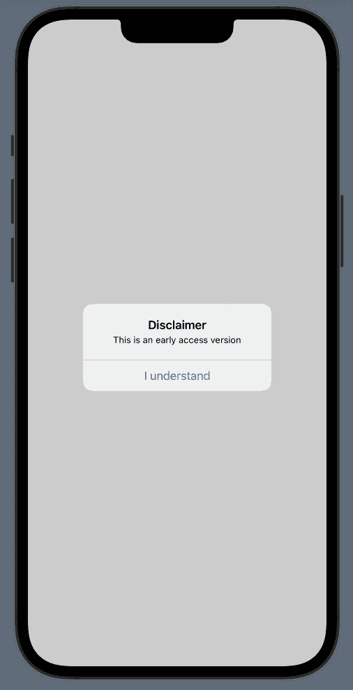
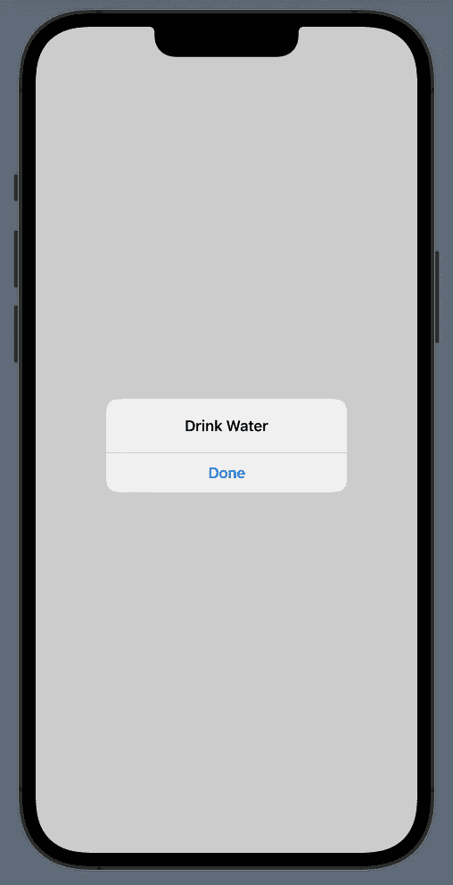
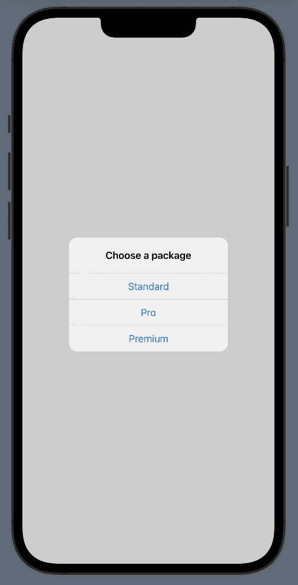

# SwiftUI 教程:使用警报

> 原文：<https://blog.devgenius.io/swiftui-working-with-alerts-fdb867c6e86d?source=collection_archive---------6----------------------->

## 如何在 iOS 中显示提醒



图一。

当您想要强制显示某些内容时，可以使用警告，这样用户除了响应之外没有其他选择。在本教程中，我们将通过提供示例来解决创建警报的不同方法。但是，在我们开始之前，请确保您已经有一个用于本练习的打开项目。如果你需要一步一步的过程，你可以使用这个[链接](/introduction-to-swiftui-creating-new-project-9adc502e1804)。

> 本教程是我的 [SwiftUI 教程](https://arc-sosangyo.medium.com/list/swiftui-tutorial-03734e631240)系列的一部分。

使警报工作的先决条件是一个布尔[状态](https://medium.com/geekculture/swiftui-tutorial-state-and-binding-b7e80b4de622) [变量](https://arc-sosangyo.medium.com/swift-programming-tutorial-variables-670ceea20bd1)来存储显示和不显示状态。然后，变量将把绑定传递给。*警报*修改器。在下面的例子中，我们创建了一个按钮，当它被按下时会显示一个警告。记下这段代码:

```
struct ContentView: View {

    @State private var showAlert = false

    var body: some View {

        Button(action: {
            showAlert = true
        }) {
            Text("Display Alert")
        }
        .alert(isPresented: $showAlert) {
            Alert(
                title: Text("Reminder"),
                message: Text("Drink Water"),
                dismissButton: .default(Text("Done"))
            )
        }

    } //body

} //ContentView
```

在里面。alert 修饰符，我们使用了一个名为 Alert 的结构来填充 3 个强制属性:标题、消息和消除按钮的类型。

现在运行应用程序并尝试按下按钮。



图二。按下按钮后显示警告

Alert struct 允许您使用主要和次要按钮为用户提供另一种选择。例如，用户可以判断动作是否已经完成，然后根据给定的答案会出现一条消息。记下这段代码。

```
struct ContentView: View {

    @State private var showAlert: Bool = false
    @State private var message: String = ""

    var body: some View {

        VStack {

            Text(message)
                .font(.title)
                .padding()

            Button(action: {
                showAlert = true
            }) {
                Text("Display Alert")
            }
            .alert(isPresented: $showAlert) {
                Alert(
                    title: Text("Reminder"),
                    message: Text("Drink Water"),
                    primaryButton: .default(Text("Done"), action: {
                        message = "Good job"
                    }),
                    secondaryButton: .default(Text("OK"), action: {
                        message = "Drink now"
                    })
                ) //Alert
            }

        } //VStack

    } //body

} //ContentView
```

这是运行代码并按下“显示警报”按钮时的输出:



图 3。具有主要和次要按钮的警报结构

选择“完成”或“确定”。将根据您的选择显示一条消息响应。

这是另一个例子。假设你想在第一次打开一个应用程序时弹出一个提示。这是代码:

```
struct ContentView: View {

    @State private var showAlert = false

    var body: some View {

        ZStack {
            Text("Hello World")
        }
        .onAppear {
            showAlert = true
        }
        .alert(isPresented: $showAlert) {
            Alert(
                title: Text("Disclaimer"),
                message: Text("This is an early access version"),
                dismissButton: .default(Text("I understand"))
            )
        }

    } //body

} //ContentView
```

它是这样工作的。的。 *onAppear* 修饰符被附加到一个[堆栈](https://medium.com/better-programming/swiftui-tutorial-working-with-stacks-vstack-hstack-and-zstack-2b0070be18d7)上，用于自动使 *showAlert* 状态为真。这将使警报弹出，应用程序打开的那一刻。

运行应用程序将产生以下输出:



图 4。首次打开应用程序时会弹出警告

# iOS 15 方法

与之前的版本(iOS 14 和 iOS 13)相比，SwiftUI 中的警报在 iOS 15 中的工作方式有所不同。为了更好地理解它，我们将创建第一个示例的 iOS 15 方法。这是代码。

```
struct ContentView: View {

    @State private var showAlert = false

    var body: some View {

        Button(action: {
            showAlert = true
        }) {
            Text("Display Alert")
        }
        .alert("Drink Water", isPresented: $showAlert) {
            Button("Done", role: .cancel) {}
        }

    } //body

} //ContentView
```

在这个例子中，我们使用了[按钮角色](/swiftui-tutorial-using-button-role-17c6e1d1924f)而不是 alert struct。按钮角色仅从 iOS 15 开始可用。单击链接查看更详细的教程。

运行应用程序并再次点击“显示提醒”。



图 5。在警报上使用按钮角色。

这是另一个带有多个按钮角色的警告弹出窗口的例子。

```
struct ContentView: View {

    @State private var showAlert = false
    @State private var package =  ""

    var body: some View {

        ZStack {
            Text(package)
        }
        .onAppear {
            showAlert = true
        }
        .alert("Choose a package", isPresented: $showAlert) {
            Button("Standard") { package = "Standard" }
            Button("Pro") { package = "Pro" }
            Button("Premium") { package = "Premium" }
        }

    } //body

} //ContentView
```

运行应用程序并尝试选择一个包。



图 6。具有多个按钮角色的警报

愿法典与你同在，

-电弧