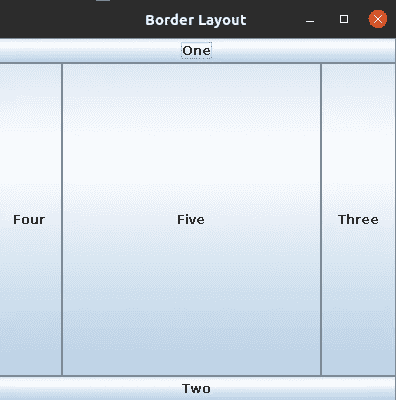

# 摇摆布局

> 原文：<https://blog.devgenius.io/swing-layouts-77c4e75d1372?source=collection_archive---------7----------------------->


卡斯帕·卡米尔·鲁宾在 [Unsplash](https://unsplash.com?utm_source=medium&utm_medium=referral) 上的照片

布局是指组件的排列，如文本字段、标签、按钮等。)在容器内。换句话说，可以说布局就是将组件放置在容器内的特定位置。

组件的布局由所使用的布局管理器决定。Java 内置了不同的布局管理器。大多数用户界面都是使用它们的某种组合构建的，通常是通过嵌套布局管理器。

不同的布局管理器:

1.  **流程布局**:用于在一条水平线上排列组件，如果没有足够的空间容纳所有组件，那么它们将移动到下一行。

流布局类中有三个构造函数。

**A) FlowLayout()** :用于创建具有默认水平和垂直间隙的居中对齐组件。

**B) FlowLayout(align)** :用于指定组件与默认水平和垂直间隙的对齐。

流布局为对齐提供了五个约束。

1.  公共静态 final int LEFT
2.  公共静态最终 int RIGHT
3.  公共静态最终国际中心
4.  公共静态 final int LEADING
5.  公共静态 final int 结尾

**C) FlowLayout(align，horizontalGap，verticalGap)** :用于指定水平间隙等于 horizontal Gap，垂直间隙等于 verticalGap 的组件对齐方式。

示例:

```
import java.awt.*;
import java.util.*;
import javax.swing.*;
class FlowLayoutExample extends JFrame
{
private JLabel l1,l2;
private JTextField t1,t2;
private JButton b1,b2;
FlowLayoutExample()
{
super("This is my first GUI Example");
l1=new JLabel("Enter First Name:");
l2=new JLabel("Enter Last Name:");
t1=new JTextField(10);
t2=new JTextField(10);
b1=new JButton("Add");
b2=new JButton("Cancel");
FlowLayout f;
f=new FlowLayout();
setLayout(f);
add(l1);
add(t1);
add(l2);add(t2);
add(b1);
add(b2);
setLocation(10,10);
setSize(400,400);
setVisible(true);
}
public static void main(String gg[])
{
FlowLayoutExample a;
a=new FlowLayoutExample();
}
}
```

这个程序的输出将是。


流程布局

2.**网格布局**:网格布局用于在矩形网格中表示组件。网格的每个矩形都包含一个组件。

Grid Layout 类中有三个构造函数。

**A) GridLayout() :** 用于创建具有默认水平和垂直间距的单行和单列。

**B) GridLayout(r，c):** 用户使用默认的水平和垂直间距创建 r 行和 c 列。

**C) GridLayout(r，C，horizontalGap，verticalGap):** 用于创建 r 行，在行和 C 列之间有一个 verticalGap，其中水平间隙等于 horizontal Gap，垂直间隙等于 verticalGap。

示例:

```
import java.awt.*;
import java.util.*;
import javax.swing.*;
class GridLayoutExample extends JFrame
{
private JLabel l1,l2;
private JTextField t1,t2;
private JButton b1,b2;
GridLayoutExample()
{
super("Grid Layout");
l1=new JLabel("Enter First Name:");
l2=new JLabel("Enter Last Name:");
t1=new JTextField(10);
t2=new JTextField(10);
b1=new JButton("Add");
b2=new JButton("Cancel");
GridLayout f;
f=new GridLayout(3,2);
setLayout(f);
add(l1);
add(t1);
add(l2);
add(t2);
add(b1);
add(b2);
setLocation(10,10);
setSize(400,400);
setVisible(true);
}
public static void main(String gg[])
{
GridLayoutExample a;
a=new GridLayoutExample();
}
}
```

这个程序的输出将是。


网格布局

3.**边框布局**:边框布局用来表示组件是五个不同的区域(北、南、东、西、中)。每个区域只包含一个组件。

BorderLayout 为每个区域提供了五个常量:

1.  公共静态最终 int NORTH
2.  公共静态最终国际南方
3.  公共静态最终国际东部
4.  公共静态最终国际西部
5.  公共静态最终国际中心

Border Layout 类中有两个构造函数。

**A) BorderLayout():** 创建无间隙的边框布局。

**B)边界布局(horizontalGap，verticalGap):** 创建边界布局，其中水平间隙等于 horizontal Gap，垂直间隙等于 verticalGap。

示例:

```
import java.awt.*;
import java.util.*;
import javax.swing.*;
class BorderLayoutExample extends JFrame
{private JButton l1,l2,l3,l4,l5;BorderLayoutExample()
{
super("Border Layout");
l1=new JButton("One");
l2=new JButton("Two");
l3=new JButton("Three");
l4=new JButton("Four");
l5=new JButton("Five");
BorderLayout f;
f=new BorderLayout();
setLayout(f);
add(l1,BorderLayout.NORTH);
add(l2,BorderLayout.SOUTH);
add(l3,BorderLayout.EAST);
add(l4,BorderLayout.WEST);
add(l5,BorderLayout.CENTER);
setLocation(10,10);
setSize(400,400);
setVisible(true);
}
public static void main(String gg[])
{
BorderLayoutExample a;
a=new BorderLayoutExample();
}
}
```

这个程序的输出将是。



边框布局

4.**Box Layout**:Box Layout 用于垂直或水平表示组件。

这用了四个常数。

1.  公共静态最终整数 X 轴
2.  公共静态最终 int Y_AXIS
3.  公共静态最终 int LINE_AXIS
4.  公共静态最终 int PAGE_AXIS

Box Layout 类中只有一个构造函数。

**BoxLayout(Container c，int axis):** 用于在给定的轴内创建盒子布局。

示例:

```
import java.awt.*;
import java.util.*;
import javax.swing.*;
class BoxLayoutExample extends sFrame
{private JButton l1,l2,l3,l4,l5;BoxLayoutExample()
{
super("Box Layout");
l1=new JButton("One");
l2=new JButton("Two");
l3=new JButton("Three");
l4=new JButton("Four");
l5=new JButton("Five");
BoxLayout f;
f=new BoxLayout(this,BoxLayout.Y_AXIS);
setLayout(f);
add(l1);
add(l2);
add(l3);
add(l4);
add(l5);
setLocation(10,10);
setSize(400,400);
setVisible(true);
}
public static void main(String gg[])
{
BoxLayoutExample a;
a=new BoxLayoutExample();
}
}
```

这个程序的输出将是。


方框布局

**结论:**在本文中，我们了解了 Swing/AWT 中不同的布局管理器及其基本实现。希望这是有帮助的，请评论任何疑问或建议。