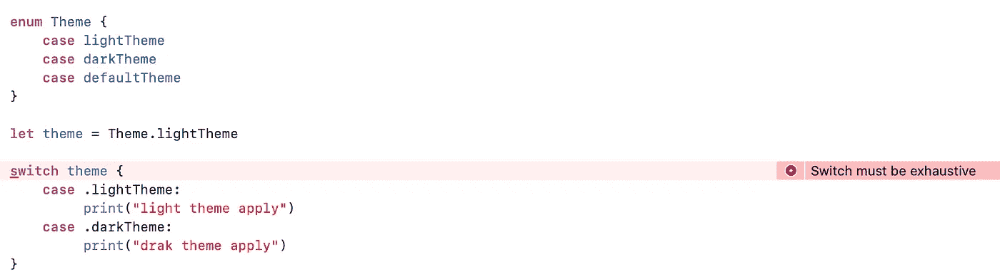

# Swift 中的 Switch 语句

> 原文：<https://blog.devgenius.io/switch-statement-in-swift-5d25cef55c86?source=collection_archive---------3----------------------->

## 带开关盒的快速控制流程


在 Swift 中，switch 语句是一种控制机制，允许程序改变控制流，并根据变量值的某些条件做出一些决定。它允许我们在许多备选方案中执行一个代码块，并在第一个匹配案例完成时立即完成执行，而不是传递到后续案例的底部。

*switch* 语句提供了对 *if* 语句的替代，用于响应多个潜在状态。

```
switch (variable/expression) {  
case value1:  
    // statements 
case value2:  
    // statements  
default:  
    // statements  
} 
```

*开关*语句对括号内的表达式求值

1.  如果表达式的结果等于 value1，则执行 case value1:的语句。
2.  如果表达式的结果等于 value2，则执行 case value2:的语句。
3.  如果不匹配，则执行**默认情况**的语句。

## Switch 语句中的事例

switch 语句中的每个 *case* 表示我们代码中的一个潜在路径。 ***事例*** 可以是 ***显式*** *事例*(包含与开关值匹配的模式的事例)或 ***默认*** 事例(没有模式，但如果前面的事例都不匹配，则匹配)。

> 默认 case 必须写成 switch 语句中的最后一个 case，并使用 default 关键字后跟一个冒号，然后是包含一个或多个语句的代码块。默认情况是一种通配符情况，如果 switch 语句中以前的所有情况都不匹配，它将自动匹配 switch 值。

## Switch 语句流程图


## 交换语句

以下是 Swift 编程中 switch 语句的示例

```
let animal = "horse"

switch animal {
case "horse":
    print("eats grass")
case "wolf":
    print("eats meat")
default:
    print("no match")
}
```

## 带故障的 Switch 语句

Swift switch cases 不会“失败”,在 case 语句中使用 fallthrough 关键字，即使 case 值与 switch 表达式不匹配，控制也会继续处理下一个 case。

```
let count = 10

switch count {
   case 100:
      print( "Value of count is 100")
      fallthrough
   case 10:
      print( "Value of count is 10")
      fallthrough
   case 5:
      print( "Value of count is 5")
   default:
      print( "default case")
}
```

## 不带默认块的开关

*默认*块在 Swift switch 语句中是可选的。对于表达式的每个可能值，我们都应该有 case 块。

```
enum Theme {
    case light
    case dark
}

let theme = Theme.light

switch theme {
    case .light:
         print("light theme apply")
    case .dark:
         print("drak theme apply")
}
```

Swift switch 语句案例必须详尽。这意味着它应该包含所有可能的值。如果包含足够的 case 语句不可行，则必须最后包含一个 default 语句来捕捉任何其他值。如果我们错过了任何可能的情况，那么我们需要添加一个默认情况，否则编译器将显示一个错误“开关必须详尽”。



## 带范围的 Switch 语句

Swift 可以对您的 case 语句进行一些评估，以匹配变量。可以检查开关情况下的值是否包含在间隔中。例如，如果您想要检查可能值的范围，您可以使用封闭范围运算符，如下所示:

```
let mark = 12

switch mark {
case 0:
    print("Bull Eye")
case 1..<10:
    print("Almost Bull Eye")
case 10..<30:
    print("Close")
default:
    print("Too Far")
}
```

## Switch 语句中的元组

我们可以使用元组在同一个 switch 语句中测试多个值。可以针对不同的值或值的区间来测试元组的每个元素。或者，使用下划线字符(`_`)，也称为通配符模式，来匹配任何可能的值。

```
let aPoint = (1, 1)

switch aPoint {
case (0, 0):
    // only catches an exact match for first and second
case (_, 0):
    // any first, exact second
case (-2...2, -2...2):
    // range for first and second
default:
    // catches anything else
}
```

> 在元组的情况下，对于要执行的任何情况，这两个值都应该匹配。

## Switch 语句中的复合情况

共享同一主体的多个开关案例可以通过在案例后写几个模式来组合，每个模式之间用逗号隔开。如果任何模式匹配，则认为该案例匹配。如果使用逗号分隔值，我们可以在一个案例中匹配多个值。这叫做**复合案**

```
let charValue = "e"

switch charValue {
case "a", "b", "c":
    print("match found for (a,b,c) value")
case "d", "e":
    print("match found for (d,e) value")
default:
    print("No match found")
}
```

## 使用 Switch 语句的值绑定

switch case 可以将它匹配的一个或多个值命名为临时常量或变量，以便在 case 的主体中使用。这种行为被称为值绑定，因为值被绑定到 case 主体中的临时常量或变量。

```
let currentPoint = (10, 0)
switch currentPoint {
case (let x, 0):
    print("on the x-axis with an x value of \(x)")
case (0, let y):
    print("on the y-axis with a y value of \(y)")
case let (x, y):
    print("somewhere else at (\(x), \(y))")
}
```

> 这个 switch 语句没有默认的大小写。因为 currentPoint 总是两个值的元组，所以这种情况匹配所有可能的剩余值，并且不需要默认情况来使 switch 语句详尽。

## Switch 语句中的 Where 子句

switch case 还可以使用 where 子句来检查附加条件。

```
var num  = 0

switch num  {
case let result where num >= 0:
     print(result)
case num where num % 5 == 0 && num % 3 == 0:
     print(" Fizz Buzz")
case num where num % 3 == 0:
     print("Fizz")
case num where num % 5 == 0:
     print("Buzz")
default:
    print(num)
}
```

## 要记住的事情

*   不需要 break 语句。您可以使用一个 *break* 语句来匹配并忽略一个特定的案例，或者在该案例完成执行之前退出一个匹配的案例。
*   案件数量不限。
*   switch 语句从上到下，获取表达式并与每个 case 值进行比较。
*   Swift switch 案例不会“失败”。如果您希望它们在下一种情况下落入代码，您必须显式地使用 **fallthrough** 关键字。
*   每个 case 都必须包含可执行代码，否则编译器将抛出错误**,“switch”中的“case”标签应该至少有一个可执行语句**。如果想忽略一个事例，可以添加一个 break 语句。
*   缺省情况是必须的，直到开关情况在一个枚举上，并且所有情况都被穷尽，否则编译器将通过错误“**开关必须穷尽”。**

感谢阅读。如果您有任何意见、问题或建议，请在下面的评论区发表！👇。请**分享**并给予**掌声**👏👏如果你喜欢这篇文章。