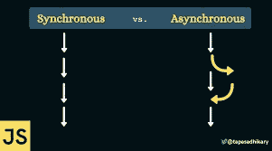

# 同步/异步编程

> 原文：<https://blog.devgenius.io/sync-async-programming-2a6bf8e99c68?source=collection_archive---------12----------------------->

## 在这篇博客中，我试图最好地解释什么是同步和异步编程。



同步/异步

如果呼叫者向接收者发送消息并等待响应，它能做别的事情吗？我说的是呼叫者/接收者，而不是服务器/客户端，因为这些呼叫在任何地方都会发生。按照设计，当我们第一次构建计算时，一切都是同步的。这可以被看作是一个正弦波，其中呼叫者和服务器是同步的或相同的节奏。异步意味着它们不同步。

> **同步 I/O**
> 调用者向接收者发送请求，然后阻塞它。这是当调用方被阻塞，不做任何事情，因此总的时间浪费。在过去，CPU 从处理器中删除进程，认为它只是被阻塞了，并添加了一个没有被阻塞的新进程(上下文切换)。所以调用者不能同时执行。最后，当接收者响应时，操作系统可以将进程放回处理器。因此呼叫者解除阻塞。这显示了客户机和服务器是如何完全同步的。

**OS 同步 I/O 的例子:**1。程序要求 CPU 从磁盘中读取一个文件。
2。程序的主线程脱离了 CPU。
3。读取完成，程序再次开始执行。

```
// A simple Js example
// Program starts
// Programs uses CPU to execute work.

SampleFunction();
// Program reads from the disk
// Program can't do anything until file loads
readfile("SyncExample.dat")

// Program resumes
```

> **异步 I/O**
> 调用者向接收者发送请求，可以一直工作到得到响应。但是现在主要的问题是如何知道它什么时候得到响应。这里有两个选择，
> a)调用者可以检查响应何时准备好。这在 Linux 中非常流行，被称为 [**epoll**](https://en.wikipedia.org/wiki/Epoll) 。这是调用者反复检查响应是否准备好的地方。完成后，接收者会回电。在 windows 中，这是 I/O 补全端口( [IOCP](https://en.wikipedia.org/wiki/Input/output_completion_port) )，或者在 Linux 中，这是 io-ouring。它工作在 completionist 队列的机制上，当事情完成时，接收方写入。

具体从 NodeJs 的角度来说，它在 Linux 中使用 epoll，在 windows 中使用 completionist 栈。nodeJs 做的另一件事是启动一个新线程，该线程在需要执行阻塞操作时阻塞。默认情况下，Nodejs 在 [*libuv*](https://libuv.org/) 库中有 4 个工作线程，用于 I/O 操作，但这是可配置的。

**操作系统异步调用示例(NodeJS)** a)程序启动辅助线程
b)辅助线程从磁盘读取数据。显然，操作系统从当前处理器中删除了
c)主程序仍然运行和执行。
d)线程结束，调用主线程。

```
// A simple Javascript example
// Program starts
// Programs uses CPU to execute work.

SampleFunction();
// Program reads from the disk
// Program hapilly moves on to the samplefunction2
readfile("SyncExample.dat", onReadFinish(console.log))
//file is not probably read yet

SampleFunction2();
//onReadFinish function called
// executing it
```

## **同步 v/s 异步 in 请求响应**

现在我们将纯粹从客户端和服务器(后端)的角度来讨论事情。
因此，同步性也可以被称为客户端属性，它可以等待或继续前进。现在没有一个客户端是同步的，大多数库都是异步的。大多数情况下，客户端发送请求，然后得到响应，每当执行响应时，就会调用一些回调。因此，在 Node.js 中，有一个检查响应的事件循环主循环。
这可能会令人困惑，因为当有人用这个美丽的现实生活中的例子解释它时，我总是觉得同步就像在会议中提出一个问题，如果演示者做出回应，会议就会继续进行。异步就像在电子邮件中提出一个问题，只要接收者有时间，就可以得到回复。

## **异步后端处理**

作为后端工程师，如果我不谈让后端异步，那就不公平了。在许多代码/存储库中，客户端主要是异步的，但是后端仍然让它等待。因此，当客户端请求推送一些数据时，比方说进行数据库调用，很多时候会被要求等待后端的响应，后端会在提交后返回状态 200 响应。现在，如果我们将镜头移到后端，前端是异步的，但后端仍然是同步的。那么，我们如何立即回复呢？
解决方案之一是使用这个漂亮的数据结构，命名为队列。如果一个客户端发送了一个请求，我们不会承诺立即执行，但是我们会将它放入队列中。原因是后端可能正在完成之前的请求，客户端不再被阻塞；我们可以发送响应说我们已经对请求进行了排队，这里有一个 promise/JobID。更多信息，可以阅读关于 ***消息队列*** 。
除此之外，还有非常流行的解决方案，具体取决于使用案例。

异步工作负载的真实例子:
a)postgres[↗](https://www.postgresql.org/docs/current/wal-async-commit.html)中的异步提交。
b)Linux 中的异步 I/O(io-uring)。
c)异步 I/O fsync (fs-cache):无论何时我们向任何文件写东西，都不是直接写到磁盘而是写到文件系统缓存。操作系统中有一个缓存，写操作进入页面。然后，操作系统一次性刷新所有页面。

我们可以将整个事情总结如下:
a)同步编程方法顺序执行任务。每个任务都是在等待前面的任务完成后执行的。当一个任务在一个异步编程模型中运行时，我们可以转移到另一个任务，而不必等待前一个任务完成。

感谢阅读；我希望它有帮助。
如有任何疑问，欢迎通过[*LinkedIn*](https://www.linkedin.com/in/manav-garg-b00963182/)/[*insta gram*](https://www.instagram.com/manav_706/)联系。