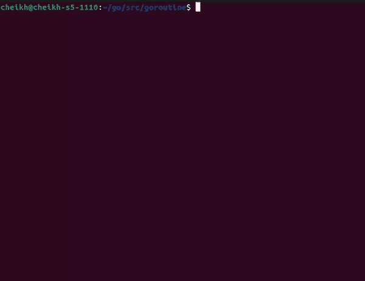

# 同步 Goroutine 执行。

> 原文：<https://blog.devgenius.io/synchronize-go-routine-execution-101eb88d10ac?source=collection_archive---------6----------------------->

## 用条件变量控制执行。


图片由 Jorge Salvador 通过 Unsplash 提供

“在编程的上下文中，并发性是指将程序分解成可以彼此独立运行的部分的能力。”我写的大部分并发操作，某种程度上都依赖于一个共享变量。例如，当我在为一个视频游戏编写服务器时，我使用了一个映射来将一个用户的 ID 与一个连接相关联。这引发了一些运行时问题。当 2 个 Goroutines 试图在地图上写/读数据时，程序会崩溃。为了解决这个问题，我在代码中引入了锁。我注意到的一件事是并发读取不会使程序崩溃。在本文中，我将尝试同时读写地图。这将通过条件变量来完成。我的计划是在写操作发生时，停止执行所有从 map 中读取的 Goroutines。一旦写操作完成，所有其他 Goroutines 将同时恢复执行。

# 同步。锁柜

为了初始化一个条件变量，我必须定义一个满足接口`sync.Locker`的类型。该类型必须有方法`Lock`和`Unlock`。下面是我的类型的定义:

```
type LockType struct {
 LockCount       *atomic.Int32
 CompleteChannel chan bool
}
```

我用附加字段定义了`LockType`,以跟踪并发操作的当前状态。目标是使用渠道作为沟通完成的手段。下面是我实现的接口`sync.Locker`:

```
func (l LockType) Lock() {
 fmt.Println("Lock")
 l.LockCount.Add(-1) if l.LockCount.Load() == 0 {
   l.CompleteChannel <- true
 }
}func (l LockType) Unlock() {
 fmt.Println("Unlock")
 l.LockCount.Add(1)
}
```

每调用一次`Unlock`，`LockCount`加 1。方法`Lock`将减少`LockCount`，当`LockCount`达到 0 时，向传递的通道发送消息。现在，实现。

# 实施

我将从实例化我的类型开始。以下是执行此操作的代码:

```
func main(){
 **waitchan** := make(chan bool)
 counter := atomic.Int32{}
 counter.Store(0) locker := LockType{
   LockCount:       &counter,
   CompleteChannel: waitchan,
 } <- waitchan fmt.Println("Done")
}
```

我将使用`waitchain`来阻止程序退出。接下来，我将调用`sync.NewCond`，我将传递变量`locker`。这将返回一个条件变量。我还将初始化我将在这篇文章中使用的地图。以下是执行这些操作的代码:

```
m := make(map[string]int)
c := sync.NewCond(locker)
```

# 使用案例

假设我有 4 个 Goroutines 需要并行执行。一个 Goroutine 负责用数据填充地图，其余 3 个将执行需要地图数据的操作。`c`在下面的代码块中引用上面定义的条件变量。下面是负责用数据填充地图的 Goroutine 的代码:

```
go func() { fmt.Println("First")
  m["foo"] = 100
  time.Sleep(10 * time.Second)
  c.**Broadcast**()
}()
```

方法`BroadCast`将唤醒所有等待信号的 Goroutines。Goroutines 将通过调用`c.Wait()`等待信号。以下是其他 3 个 Goroutines 的代码:

```
go func() { c.Wait()
  fmt.Println("Second", m["foo"])

 }()go func() { c.Wait()
  fmt.Println("third", m["foo"])}()go func() { c.Wait()
  fmt.Println("fourth", m["foo"])}()
```

下面是实际运行的代码:



如您所见，在第一个 Goroutine 完成之后，3 个 go routine 同时登录到控制台。

# 结论

条件变量是在不牺牲实际并发性的情况下控制资源访问的好方法。使用上面定义的用例，我通知其他 Goroutines 数据准备好了。我尝试用类型`sync.Mutex`这样做，这导致每个 Goroutine 一次执行一个。这就是我写“牺牲实际并发性”时所指的。根据 Go 文档，条件变量是“等待或宣布事件发生的 goroutines 的集合点。”在上面给出的例子中，在地图数据被填充之后，一个事件被宣布。这将确保在存储数据时不会读取地图，因为这会导致运行时错误。你可以在下面找到这篇文章中使用的代码的链接。

# 来源

[](https://www.techopedia.com/definition/25146/programming-concurrency) [## 什么是编程并发？-来自 Techopedia 的定义

### 并发性——在编程的上下文中——是将程序分解成可以运行的部分的能力…

www.techopedia.com](https://www.techopedia.com/definition/25146/programming-concurrency) [](https://github.com/cheikhshift/medium_examples/tree/main/goroutine) [## medium _ examples/go routine at main cheikh shift/medium _ examples

### 中型文章的代码示例。在 GitHub 上创建一个帐户，为 cheikhshift/medium_examples 开发做贡献。

github.com](https://github.com/cheikhshift/medium_examples/tree/main/goroutine)  [## 同步

### 包同步提供了基本的同步原语，如互斥锁。除了曾经和…

pkg.go.dev](https://pkg.go.dev/sync#Cond)