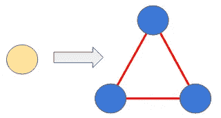
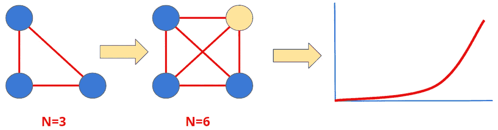

# 信息系统的综合复杂性

> 原文：<https://blog.devgenius.io/synthetic-complexity-of-information-systems-f2fc8f0eb1b4?source=collection_archive---------20----------------------->

## 如何度量系统集成的复杂性

## 一组表示集成容易程度的指标

[图片](https://unsplash.com/photos/ZiQkhI7417A)由[阿丽娜·格鲁布尼亚](https://unsplash.com/@alinnnaaaa)拍摄

当我偶然发现术语“[合成复杂性](https://pubs.rsc.org/en/content/getauthorversionpdf/C5OB00709G)”时，我正在阅读《有机化学基础》。这是一个衡量分子合成难易程度的标准。它直观上很容易理解，但量化它(找到精确的东西来测量以获得“分数”)是极其困难的，因为有太多的变量。有趣的是，化学家们正在努力解决这个问题，我们(它)可以学到一些东西。

简单来说:*我们来找一组要衡量的东西(获取一些数字)来* ***表示*** *将新组件集成到现有系统中的难度有多大*。

> 1818 年分离出马钱子碱。化学家花了 130 年才解决了分析中的复杂性。这使得 1954 年的合成分 29 步进行。最近的方法需要 6 个步骤。完成合成的工具已经改进。这意味着在化学世界中，工具提高并降低了合成的复杂性——就像集成工具和信息技术一样。例如，云服务大大简化了系统集成。

我们可以用一个类似的思路来看，为什么有些东西容易融合，有些不容易，在什么情况下。也许我们可以有更多的数据驱动的企业系统规划？让我们试试。

有两个类别:

新组件(橙色)和现有系统(蓝色)

1.  我们希望集成到系统中的**组件**的特征。例如，我们想在我们的技术领域引入一个新的 CRM 系统。
2.  我们想要集成新组件的**系统**的特征。例如，我们的技术生态系统有多复杂和稳定？

为了简单和本文的长度，让我们将这两个合并到一个列表中。

## 为什么几乎所有东西都有“指数式”增长？

“指数”是每个人都在使用的时髦词，通常不理解数字“e”代表什么。但是让我们长话短说，直奔主题: ***复杂性因集成而增长*** 。

(N —集成次数)添加组件如何影响集成的复杂性。

每个新组件**都是集成链接**的倍数。每个环节都需要努力规划、开发、测试和维护。生态系统中存在的组件越多，集成一个新的组件就越复杂。这可能不是一个交易破坏者，但这就是为什么 TCO(总拥有成本)快速上升。

这里衡量的是组件的数量。

## 任务关键性增加了复杂性

这对于任何 IT 专业人员来说都是直观明了的。任务关键型系统，如计费、银行、股票市场、电传操纵、医疗生命支持等。，需要全面的方法和规划。

这里的衡量标准是生产失败时造成的量化损失。有时这并不容易衡量(例如，法律话题中的[)。](https://www.youtube.com/watch?v=0O2Rq4HJBxw)

## 同一逻辑的多个(冗余)实现

如果一个组件包含一个已经在系统的其他部分实现的逻辑，它会增加综合的复杂性。它需要双重(多重)维护和双重配置来保证相同的结果。例如，如果您有一个在多个地方实现的数据验证组件(根据一组规则检查数据对象的东西)，集成的复杂性就会增加。总拥有成本也会上升。

如果不进行彻底的分析，这通常很难发现。例如，人们引入多个库和第三方组件来提供相同的服务——只是因为他们更喜欢其中的一种风格。

衡量这一点很棘手。有什么建议吗？

## 集成类型的数量增加了综合的复杂性

集成类型的一些示例:

*   REST API
*   数据库作为集成节点
*   CSV 文件的导出和传输
*   预定批处理
*   CORBA(谁还记得这个？)
*   事件流总线

集成的复杂性随着系统中不同集成类型的数量而增加。它触发了多个监控，记录，调试系统。跟踪众多组件上的逻辑事务是一项挑战。各种各样的集成类型大大降低了开发速度(发布时间)。异步集成变成了一场噩梦。维护这样一个系统所需的人数增长很快。

衡量标准很简单——类型的数量。

## 集成路径的数量增加了合成的复杂性

这一点很直观:越多的“端点”，越复杂。

衡量标准很简单:路径的数量。但是在大多数情况下，这并不容易计算，在层中建模可能更有意义。

## 易于部署

这是一个经常被忽视的话题。今天，由于先进的 CI/CD，事情变得更好，但这不是免费的。部署需要自动化和加速，并且不是所有的系统都容易构建和部署。部署简易性的“得分”很低，这意味着很难进行频繁的集成测试。那会减慢我们的速度，并迫使计划更倾向于“瀑布式”方法。

这种情况的一个明显(通常为时已晚)迹象是每天/每周的部署数量突然下降。这意味着系统中至少有一个组件变坏了。

这里的衡量标准是每天的部署数量。

# 摘要

让我们把这个组织起来。

*   组件数量
*   任务关键度
*   冗余实现
*   集成类型的数量
*   集成路径的数量
*   易于部署

例如，如果我们在 1-100 的范围内对这些数字进行归一化，我们会得到什么？合成复杂性的整个概念需要在如何测量每个因素上做一些改进，但是让我们看看我们是否在正确的轨道上。