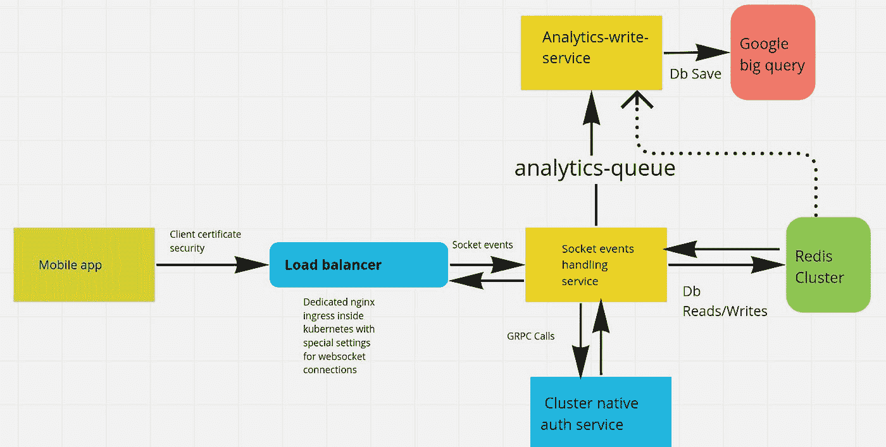

# 用于在实时音频应用程序(如 Clubhouse 和 Twitter spaces)中构建实时功能的系统设计

> 原文：<https://blog.devgenius.io/system-design-for-building-the-real-time-features-inside-live-audio-apps-like-clubhouse-and-twitter-f9c3aa45c0ff?source=collection_archive---------4----------------------->

在新冠肺炎封锁期间，Clubhouse 等现场音频应用程序的采用出现了大幅增长。这种突然的增长激发了许多其他公司推出自己的现场音频/视频产品或功能。几个月后，它不仅成为社交媒体和游戏应用程序中最受欢迎的功能之一，也成为 slack 等工作场所通信应用程序中最受欢迎的功能之一。此类应用中的直播间(或空间或游戏室)内的典型功能列表包括-

*   **现场评论:**参与用户可以在现场音频讨论中发表评论。他们还可以发表评论等。
*   **现场反应**:这些表情符号以令人眼花缭乱的速度在你的屏幕上飞舞，描绘了现场讨论中参与观众的感受。
*   **跟踪演讲者、听众、主持人等。，实时**:用户列表几乎瞬间变化。参与听众的总数和作为听众出席房间的人的名单对演讲者来说是至关重要的。
*   **立即静音/取消静音** —在这种基于现场直播房间的系统中，第一级调节是让不按顺序发言的参与者静音。
*   邀请其他人成为演讲者(或者把他们变成听众)——这必须尽可能的快速和流畅。
*   **举手** —观众可以“举手”表达自己想成为演讲者的意图。
*   **现场投票** —主持人和主持人可以发起投票，观众可以对各种选项进行投票。
*   **其他节制功能**——比如把人踢出去，屏蔽用户等。

这些功能的名称和产品术语可能会因您的应用而异。但是，如果你深入挖掘，或多或少都是相同的功能集。我敢肯定还有许多其他功能可能，但我想你得到的图片。

# 但是，有一个要求是这样一个产品成功的最关键的要求，那就是——速度。

**一切都必须超快，应该感觉即时，以取悦参与用户。除此之外，我们很擅长 skype/zoom/google meet 类型的视频会议产品。对吗？**

在我继续说下去之前，让我明确一点。这篇博文详细介绍了在现场音频(或视频)系统中构建功能的架构。本帖就不说直播音频流部分的系统设计了。有大量的教程(文字和视频)。但他们都没有谈到直播间内的其他实时功能。这通常是用户体验混乱的失败点。

# 这就给我们带来了一个问题——如何设计一个可以在直播间内提供这种超快速体验的系统？

在为[退火窑应用](https://leher.app)设计相同的系统时，我遇到了类似的挑战。这是一个基于社区的社交网络(类似于[俱乐部](https://www.clubhouse.com/)，但更古老，功能更多)。我们的主要受众是印度二线/三线城市的人们。在撰写本文档时，我们已经提供了数百万次这样的直播间体验。每天，数千个直播间同时运行，每个直播间都以超快的速度工作。让我们谈谈我在设计解决方案时的高级产品需求。

# 高级产品要求

除了上面介绍部分提到的功能列表，我还有下面的附加产品需求列表-

*   **能够同时容纳数千名听众**——我们已经为同时拥有超过 7k 并发用户的直播间供电。
*   **支持数千条评论和反应的能力** —我们已经为几个房间提供了 50k+反应和 10k+评论
*   **为未来安排房间的能力** —大多数应用程序称之为即将到来的事件，但在我们的应用程序中它们被称为“已安排的房间”。任何人都可以为未来安排一个房间，甚至在房间开始之前就邀请成千上万的人。他们都可以将房间标记为感兴趣或举手等。，甚至在房间直播之前。
*   **显示房间摘要的能力** —我们显示评论、听众、反应、房间持续时间等的总数。
*   **对直播间数据进行数据分析的能力** —从第一天起就要求做出合理的业务决策。我们需要能够对客厅数据进行不同类型的分析，并从多个维度进行查看。

这些是高层次的产品需求。现在，让我们谈谈高层次的工程需求(或者在这样的系统中要解决的工程问题)

# 要解决的工程问题

除了产品要求，我还得考虑许多工程问题。以下是其中的一些-

*   **读写方面的高可扩展性** —如前所述，该应用可在任何给定时间点为数千个公共和私人直播间供电。这些现场音频室有数百(有时数千)名听众发出数万个现场动作(反应、评论等)。)同时进行。
*   **扩展 WebSocket 连接** —维护 WebSocket 连接池的记录并按需扩展它们。
*   **成本效益**——这需要我解释吗？这是每个初创公司的每个系统的实际需求。我们需要确保我们的成本不会随着规模的扩大而呈指数级增长。
*   **可观察性和安全性** —在不影响速度的情况下保护我们的套接字通信是最大的挑战之一。我们还需要跟踪所有的数据移动。

既然你已经了解了在这样一个系统中问题陈述的复杂性，让我向你展示我的解决方案。为了使解释尽可能对初学者友好和简单，我将只解释高级架构、数据流和执行中使用的工具。我不会详细讨论每个服务的实现。但是，如果你正在开发这样一个系统并面临问题，我的 DMs 永远是开放的。请在 [LinkedIn](https://www.linkedin.com/in/theguywithideas/) 和 [Twitter](https://twitter.com/theguywithideas) 上找到我。

# 无耻的插头

你好。在提出解决方案之前，我决定做一个不要脸的塞。如果你想了解更多关于构建高性能、高性价比的分布式系统的知识，我已经为你创建了一个名为 [cloudeasy.club](http://cloudeasy.club/) 的专门学习社区。通过加入这个俱乐部，你可以学习系统设计、软件架构和分布式系统。你可以在 [Discord](https://link.cloudeasy.club/Wx31) 或者 [Whatsapp group](https://link.cloudeasy.club/kBMf) 上找到我们。此外，如果您有任何问题，请随时在 LinkedIn 或 Twitter 上联系我。

# 解决方案:客厅系统的高级设计

[点击此处打开质量更好的图片版本](https://cdn.hashnode.com/res/hashnode/image/upload/v1653211193412/YNoQiroWI.png?auto=compress,format&format=webp)

# 系统的工作——数据的流动

整个系统使用 [Redis](https://redis.io/) 作为主数据库。这使我们能够确保用户获得最快的体验。让我们来了解一下数据的一步一步的流动。

*   我们的移动应用程序(客户端)使用客户端证书和授权令牌连接到我们的 WebSocket 端点。客户端证书身份验证机制确保未经授权的客户端无法连接到此端点。点击此链接了解更多信息。
*   客户端发送和接收数据(以及创建评论、创建反应等操作)。)仅通过 WebSocket 事件。
*   套接字处理服务是一个整体，处理客厅内的所有实时功能。我们有意将所有与套接字相关的功能保留在一个服务中，以降低复杂性并获得最佳性能。它使用数据库读/写直接与我们的 Redis 集群对话。这个服务用 Node.js 编写是为了简单，也是因为用 javascript 编写了一个成熟的 WebSocket 生态系统。
*   当一个直播间结束时，我们将所有需要永久存储的数据转储到一个名为 Google Big Query 的独立数据仓库中。(后面解释)。事情是这样的——当实时音频房间的创建者结束它时，我们触发一个发布-订阅事件来标记房间的结束。该事件由一个名为分析-写入服务的服务处理。它从我们的 redis 集群中读取必要的数据，并存储在 Google Big query 中。我们使用 [Google Cloud Pub/sub](https://cloud.google.com/pubsub/docs/overview) 向这个分析-编写-服务发送消息。服务本身是用 go 编程语言编写的。
*   我们的套接字处理服务中的所有授权都是使用专用的 auth 服务来完成的。(后面解释)。auth 服务也是用 go 编程语言编写的。

上述架构和数据流使我们能够解决我前面提到的所有产品和工程问题。现在你已经理解了系统内部的基本数据流，让我们来一个接一个地讨论系统中的各个问题陈述和它们的解决方案。

# 问题 1 —维护套接字会话信息

在写这篇博客的时候，我们的 socket 事件处理服务有 50 多个 Kubernetes pods(应用程序的实例)在我们的 Kubernetes 集群中运行。为了确保会话信息不会混淆，我们使用了[套接字。IO Redis 适配器](https://socket.io/docs/v4/redis-adapter/)。它在我们的 redis 集群中存储状态信息。点击此链接，你可以了解更多关于[的信息。我实话实说。总的来说，我对 socket.io 和这个适配器的可扩展性持怀疑态度。但到目前为止，它们对我们来说非常管用。我们使用](https://socket.io/docs/v4/redis-adapter/) [Redis pub-sub](https://redis.io/docs/manual/pubsub/) 为直播间内的所有实时功能提供动力。

# 问题 2——在 Redis 中对复杂模式建模

现在是 2022 年，如果你仍然只是把 redis 作为一个缓存，你还没有发现它的真正潜力。Redis 提供了亚毫秒级的延迟，即使在高并发负载下也是如此。它具有高级的过期和索引功能，现在它通过专门的模块支持最常见的数据库用例，如 RediSearch、RedisJSON、RedisGraph、RedisTimeseries、RedisBloom 等。然而，在我们的例子中，我们决定更多地依赖 redis 默认提供的数据结构。这个想法是为了避免任何供应商锁定。因此，我们在应用程序方面做了大量工作。Redis 数据结构，如果使用得好，可以帮助你映射任何基于对象的数据库用例。我将在另一篇博文中对此进行更详细的解释。理解它需要很好地掌握所有 redis 数据结构。**请注意** —直播房间数据一结束，我们就从 redis 数据库中删除，并将所有相关信息转储到 BigQuery 中。这帮助我们节省了大量成本。此外，我们将与特定直播间相关的所有密钥的有效期设置为 72 小时。它确保即使清理由于任何原因失败，密钥也会从数据库中自动过期。

# 问题 3 —分析

在设计系统时，我非常清楚，无论我选择哪个数据库来支持这些功能，同一个数据库都无法处理我们想要大规模运行的所有分析查询。这就是我们选择谷歌大查询(https://cloud.google.com/bigquery)的原因。这是一个 Pb 级的云数据仓库解决方案，通过标准 SQL 提供高级查询功能。它还提供了许多很酷的功能，如自动可视化(电子表格、图表，你能想到的)，机器学习，可观察性等。但是选择 Google big query 的主要原因是——它没有服务器，因此非常便宜。不需要配置。你只为存储付费，你运行的查询和定价也适合我们这样的小创业公司。你可以在官方页面上了解更多关于[的信息。但是我在这里试图传达的思想是关注点的分离。分析是一个独立的业务需求，与我们向用户提供的功能没有任何关系。因此，我们决定使用不同的数据库来解决这两个问题。我的建议是始终尝试分别评估您的](https://cloud.google.com/bigquery) [OLAP 和 OLTP](https://www.geeksforgeeks.org/difference-between-olap-and-oltp-in-dbms/) 需求。根据我的经验，试图将它们混在一起通常会导致与系统架构相关的错误决策，特别是数据库。

# 问题 4 —快速授权

我们需要尽可能最快的方式来进行用户授权。我们的身份验证系统是一个集中式系统，可以满足集群中所有微服务的身份验证需求。我们这样设计不仅仅是为了客厅的功能。尽管如此，它仍然是应用程序上其他功能使用的相同系统，如创建社区、支付、网络、发现等。它非常快是因为两个原因-

*   我们使用 [gRPC](https://grpc.io/) 调用来与这个 auth 服务通信。
*   该服务是我们的 Kubernetes 集群固有的。这意味着该服务没有公共访问权限。它只能在我们的集群内部通过 Kubernetes DNS 访问。它使我们能够在不到两毫秒的时间内执行授权检查，甚至每秒执行数百万次操作。

我将单独写一篇博文解释这个认证系统的设计。但是，我希望你明白了。减少网络时间，使用快速通信协议，如 gRPC，您可以确保最快的最终用户，而不损害系统的安全性。

# 可扩展性和未来挑战

我们的规模还不错，系统没有给我们带来任何问题。根据我们的估计，需要调整的架构部分将是

*   socket 连接的会话管理——就像 WhatsApp 和 Discord 大规模面临这个问题一样；我敢肯定，当我们需要处理数百万个并发连接时，这将成为一个麻烦。
*   Pub-sub:尽管 Redis pub-sub 为我们做了很好的扩展，但我不确定它是否经过了非常高并发性的测试。所以，我不确定它能为我们服务多久。我的希望是“**永远**，因为它简单直观。

但是，非常诚实地说，我们并不期待 WhatsApp 或 Discord 的并发水平会很快达到，我相信大多数企业永远也不会达到那个水平。因此，如果您没有达到这个规模，这个系统架构将确实满足您的需求，并且可以轻松放在您的口袋里。

# 有问题吗？

我希望上面的系统设计能够帮助您在当前组织中构建应用程序。你可以找到问题的解决方案，并在不同的环境中应用它们。如果您正在开发一个现场音频应用程序，您可能会不假思索地复制并粘贴整个架构。如果你有任何问题，请随时在 Twitter 或 LinkedIn 上联系我。在 [Discord](https://link.cloudeasy.club/Wx31) 或 [Whatsapp group](https://link.cloudeasy.club/kBMf) 上加入我的社区，了解更多内容。