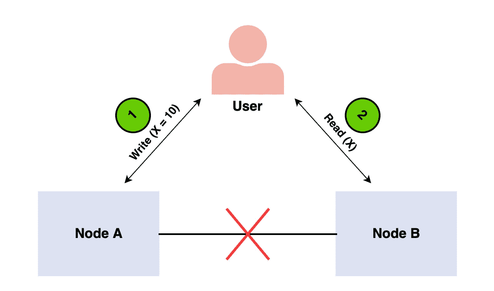
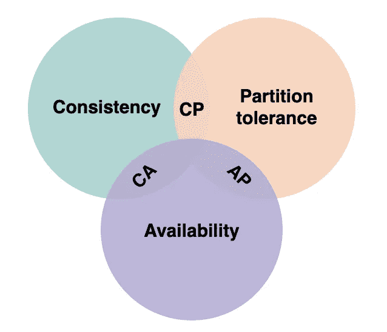

# 系统设计基础:什么是上限定理？

> 原文：<https://blog.devgenius.io/system-design-fundamentals-what-is-the-cap-theorem-90b6e50e6723?source=collection_archive---------0----------------------->

随着开发人员职业生涯的进展，您将需要越来越多地考虑软件架构和系统设计。能够设计高效的系统并进行大规模权衡是非常重要的。系统设计是一个包含许多重要概念的广阔领域。系统设计中的一个基本概念是上限定理。理解 CAP 定理是理解如何设计强大的分布式系统的关键。今天，我们将深入探讨 CAP 定理，解释它的含义、组成部分等等。

我们开始吧！

**我们将讲述**:

*   什么是 CAP 定理？
*   一致性、可用性和分区容差
*   CAP 定理 NoSQL 数据库
*   CAP 定理和微服务
*   总结和后续步骤

# 什么是 CAP 定理？

CAP 定理或 Brewer 定理是系统设计领域中的一个基本定理。它是由加州大学伯克利分校的计算机科学教授 Eric Brewer 在 2000 年一次关于分布式计算原理的演讲中首次提出的。2002 年，麻省理工学院教授南希·林奇和塞斯·吉尔伯特发表了布鲁尔猜想的证明。CAP 定理指出，分布式系统只能同时提供三个属性中的两个:**一致性**、**可用性**和**分区容差**。当存在分区时，该定理形式化了一致性和可用性之间的权衡。

分布式系统是多台计算机的集合，它们共同工作，为最终用户形成一台计算机。所有的分布式机器都有一个共享状态，并同时运行。对于分布式系统，用户必须能够与任何一台分布式机器通信，而不必知道只有一台机器。分布式系统网络将数据存储在多个节点上，同时使用多个物理机或虚拟机。

# CAP 定理证明

我们来看一个 CAP 定理的简单证明。想象一个由两个节点组成的分布式系统:

分布式系统充当一个普通寄存器，其值为变量 *X* 。存在网络故障，导致系统中两个节点之间的网络分区。终端用户先执行写请求，然后执行读请求。让我们研究一种情况，其中系统的不同节点处理每个请求。在这种情况下，我们的系统有两种选择:

*   它可能在其中一个请求上失败，破坏系统的可用性
*   它可以执行这两个请求，从读取请求返回一个陈旧值，并破坏系统的*一致性*

系统无法在成功处理两个请求的同时确保读取操作返回写入操作写入的最新值。这是因为由于网络分区的原因，写操作的结果不能从节点 A 传播到节点 B。

# 解释了一致性、可用性和分区容差

现在我们对 CAP 定理有了基本的了解，让我们分解这个缩写，讨论一致性、可用性和分区容差的含义。

# 一致性

在一致的系统中，所有的**节点同时看到相同的数据**。如果我们在一致的系统上执行读操作，它应该返回最近一次写操作的值。读取应该导致所有节点返回相同的数据。所有用户同时看到相同的数据，无论他们连接到哪个节点。当数据写入单个节点时，它会在系统中的其他节点之间复制。

# 有效性

当分布式系统中存在可用性时，这意味着**系统在所有时间**都保持运行。无论节点的状态如何，每个请求都会得到响应。这意味着，即使有多个节点关闭，系统也能运行。与一致的系统不同，**不能保证响应将是最近的写操作**。

# 分区容差

当一个分布式系统遇到一个分区时，这意味着节点之间的通信有一个**中断。如果系统是分区容忍的，则无论系统内节点之间的消息是否被丢弃或延迟，系统都不会失败。为了具有分区容差，系统必须跨节点和网络的组合复制记录。**

# CAP 定理 NoSQL 数据库

NoSQL 数据库非常适合分布式网络。它们支持**水平扩展**，并且可以跨多个节点快速扩展。当决定使用哪个 NoSQL 数据库时，记住 CAP 定理是很重要的。NoSQL 数据库可以根据它们支持的两个 CAP 功能进行分类:

# CA 数据库

CA 数据库支持所有节点的一致性和可用性。不幸的是，CA 数据库**不能提供容错**。在任何分布式系统中，分区是不可避免的，这意味着这种类型的数据库不是一个非常实用的选择。也就是说，如果你需要的话，你仍然可以找到一个 CA 数据库。一些**关系数据库**，比如 PostgreSQL，考虑到了一致性和可用性。您可以使用复制将它们部署到节点。

# CP 数据库

CP 数据库支持一致性和分区容差，但不支持可用性。当一个分区出现时，系统必须**关闭不一致的节点，直到该分区被修复**。MongoDB 是 CP 数据库的一个例子。这是一个 NoSQL 数据库管理系统(DBMS ),使用文档进行数据存储。它被认为是无模式的，这意味着它不需要定义数据库模式。它通常用于在不同位置运行的大数据和应用程序。CP 系统的结构使得只有一个主节点接收给定副本集中的所有写请求。辅助节点复制主节点中的数据，因此如果主节点出现故障，辅助节点可以替代主节点。

# AP 数据库

AP 数据库支持可用性和分区容差，但不支持一致性。在分区的情况下，所有节点都是可用的，但是它们并没有全部更新。例如，如果用户试图从坏节点访问数据，他们**将不会收到最新版本的数据**。当分区最终被解析时，大多数 AP 数据库将同步节点以确保它们之间的一致性。Apache Cassandra 是 AP 数据库的一个例子。这是一个没有主节点的 NoSQL 数据库，这意味着所有节点仍然可用。Cassandra 允许最终的一致性，因为用户可以在解析分区后立即重新同步他们的数据。

# CAP 定理和微服务

微服务被定义为可以独立开发、部署和维护的松散耦合的服务。它们包括自己的栈、数据库和数据库模型，并通过网络相互通信。微服务已经成为**在混合云和多云环境中特别受欢迎的**，它们也广泛应用于内部数据中心。如果您想创建一个微服务应用程序，可以使用 CAP 定理来帮助您确定最适合您需求的数据库。

# 总结和后续步骤

祝贺你迈出了 CAP 定理和分布式系统的第一步！分布式系统允许更低的延迟、可伸缩性、增加的互连性等等。上限定理在分布式系统和整个系统设计中非常重要。虽然我们今天已经讨论了很多，但是关于分布式系统还有很多东西需要学习。接下来推荐学习的主题包括:

*   分布式数据存储
*   分布式系统算法
*   原子数

*快乐学习！*