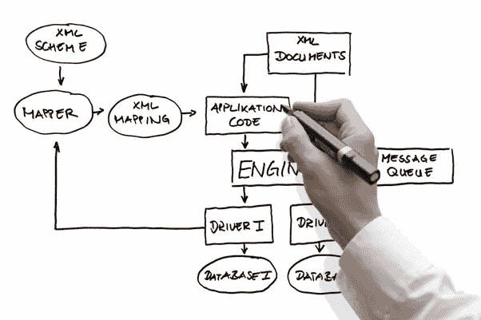

# 系统设计面试技巧

> 原文：<https://blog.devgenius.io/system-design-interview-tips-e42936c44841?source=collection_archive---------9----------------------->

系统设计面试提供了区分技术领导和程序员的关键信号。这里有一些提示可以帮助你战胜它。

图片来自 [Quora](https://www.quora.com)

# 面试前准备

准备的时候，思考如何设计一个顶级科技公司都有的系统(谷歌、推特、亚马逊、优步等)。

主动挑选一些经典问题，如 Twitter Feeds、Snapchat 消息、Dropbox 文件系统，进行练习。过度准备，确保您熟悉这些主要场景。

> “从一开始就推动讨论。”

# 探索束缚

面试官抛出问题后，比如“为 Twitter 设计一个负载均衡器”。

**不要急于解决。**

你需要做的第一件事是弄清楚系统的需求和约束:

*   **我们在谈论多少用户？**
*   每秒发送多少条推文？
*   **延迟要求是什么？**
*   **我们将如何存储数据？**
*   **客户端是移动还是桌面？**
*   **客户是推模式还是拉模式？**
*   **我们在谈论多少个数据中心？**

实际上，这些探索性问题的质量反映了候选人的经验水平。

# 完成您的解决方案

现在你已经清楚了系统的需求，继续推动讨论。

下一步是写下完整解决方案的第一个版本。

在高层次上，合理的解决方案应该包括接收、处理和存储数据的所有组件。具体来说，我们需要写下:

*   **所有组件的关键职责(E2E)**
*   **关键数据模式**
*   **处理数据的关键算法，如负载均衡算法**
*   **系统如何监控和处理错误/异常**

然后与面试官一起验证该解决方案，确保它满足关键业务需求。有时候，说服面试官也需要一点小心思。

# 使最优化

确定第一版解决方案后，面试通常会进入“深入探讨”部分。面试官会提出一个特殊的要求，并要求候选人调整他们的设计，以确保其系统在这种情况下生存。

例如:

*   QPS 非常高
*   **读是写的 10 倍**
*   **延迟优先于准确性**
*   **确保数据安全**

在这个阶段，没有放之四海而皆准的答案。面试官真的需要利用他/她的经验来解决这个问题。

然而，有一件事每个候选人都应该记住。

> “在权衡中思考”。

无论你提出什么解决方案，都要写下它的利弊。是什么让它起作用，以及为了达到这个目标要牺牲什么。那是一个有经验的工程师的关键信号。

# 结局

与编码面试不同，系统设计面试有数百种方式。但是不管你处于什么情况，我希望上面提到的建议能帮助你到达理想的目的地。