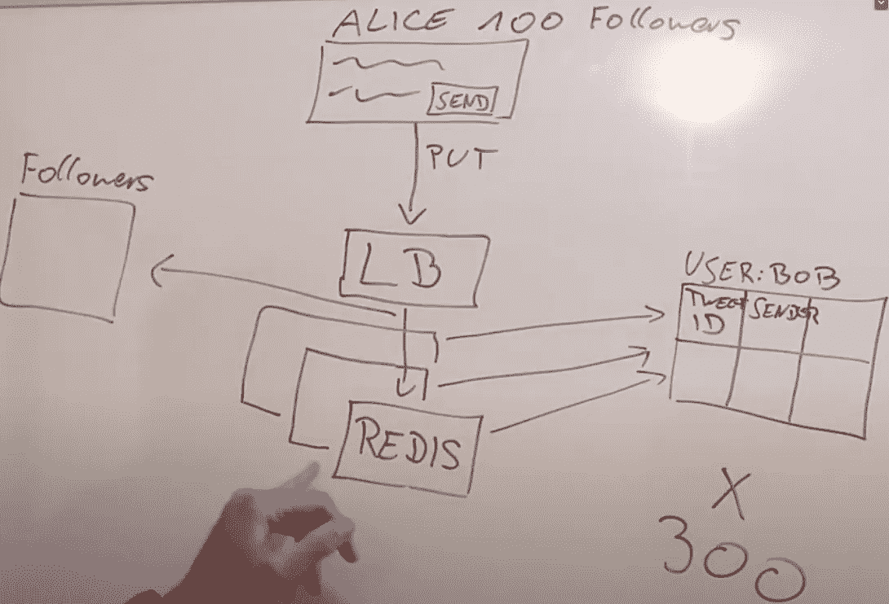

# 系统设计面试:Twitter

> 原文：<https://blog.devgenius.io/system-design-interview-twitter-5e683498b5ad?source=collection_archive---------6----------------------->

在前注: [**系统设计面试小技巧**](https://medium.com/dev-genius/system-design-interview-tips-e42936c44841) 中，我提到了如何从候选人的角度在一次系统设计面试中表现得更好。在本笔记中，我们将以“ **Twitter** ”为例，带您完成一次完整的系统设计面试。

# 问题陈述

在一些介绍之后，面试官将从 Twitter 能够实现的一些关键功能的定义开始面试:

*   发布少于 280 个 ASCII 字符的推文
*   关注/取消关注其他用户，无需批准
*   显示用户时间线(UT):一个用户可以看到另一个用户的所有推文。
*   Show Home Timeline(HT):一个用户可以看到他/她关注的所有用户的推文。

然后，面试官会让候选人(TC)去**推动**整个设计讨论。

# 问题探索

这个阶段经常被缺乏经验的候选人忽略。但是，在此阶段收集的信息通常会对体系结构产生重大影响。

为了获得清晰的答案，候选人需要提醒自己围绕**尺度&用户行为**提问。以 Twitter 为例:

*   **用户总数**:约 1 亿
*   **%的日活跃用户** : ~10%
*   **%的用户是只读的** : 95%
*   **%**
*   **关注者的平均数量** : ~100
*   **系统延迟容限**:尽可能快
*   **系统一致性要求**:最终一致

这些数据指向了一个明确的方向: ***读取延迟优化对用户体验的影响最大。***

# 处理数据

在大多数情况下，绘制 DB 表模式是解决方案的第一步。

在这里，TC 需要设计至少 3 个表:用户、Tweet 和 Home Timeline。用户和 Tweet 表显而易见，SQL 或者 NoSQL 都可以。

但是，HT 表的设计区分了候选人的设计能力，并为整个解决方案奠定了基础。

理想情况下，在 10 米 DAU 的规模上最小化读取延迟。TC 提出的系统应包括:

*   HT 中为每个用户预先填充的推文
*   提供最快读取速度的内存数据存储
*   不同机器上的多个副本(冗余)，以避免读取时出现单点故障

如果我们试图将这些需求与市场上现有的解决方案相匹配，那么像 [**Redis**](https://redis.io) 这样的非 SQL 内存数据库就很突出。

# 组件责任

完成数据库表设计后，TC 应继续勾画整个架构，并引导访问者完成读/写过程。

假设我们使用 Redis 存储 HT & UT，候选路径应该是这样的:

## 写

客户端→负载均衡器→写入 permeant DB 中的 Tweet 表→扇出更新 HT & UT Redis 表

## 阅读

客户端→负载平衡器→从相应的 Redis 表中读取

图片来自[坐](https://www.youtube.com/watch?v=KmAyPUv9gOY&t=1393s)

# 权衡取舍

上面提到的设计在表面上起作用。然而，一个有经验的候选人应该主动指出一个明显的缺点，并提供解决办法。

> 当一个**名人用户**发微博时，会有大量的 Redis 写操作。

为了抵消这种副作用，一个典型的修复方法如下:

1.  排除名人更新用户的 HT
2.  在处理读取请求时，从 DB 查询名人的推文

因此，读取路径将更新为:

**客户端→负载均衡器(并行)**

*   **→检查是否关注名人→查询名人微博数据库**
*   **→从 HT Redis 表中读取**

**→插入响应**

当然，这只是 TC 做出的众多取舍之一。在准备时，TC 应该练习如何清楚地表达每个决定的所有利弊。

# 深潜

如果还有时间，面试官会用其他问题来测试你对某个领域的理解程度:

*   如何处理多媒体内容？
*   如何提高用户的感知性能？
*   如何基于当前架构构建趋势#服务？
*   等等..