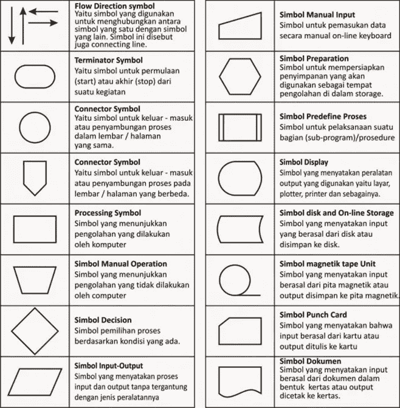
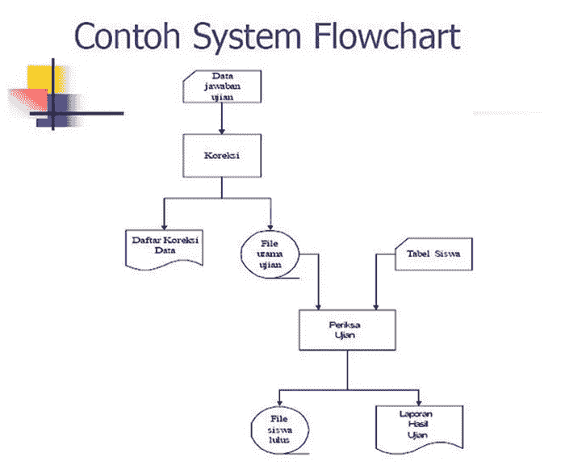
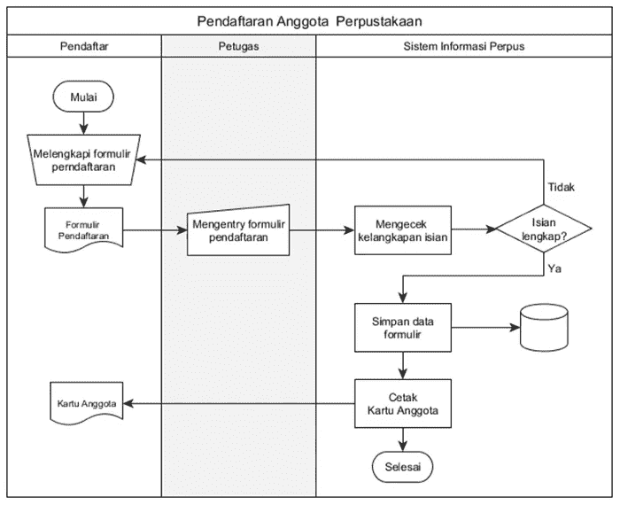
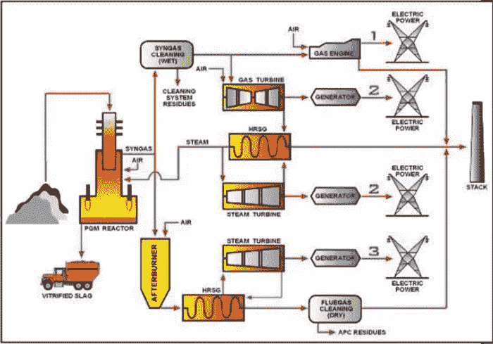
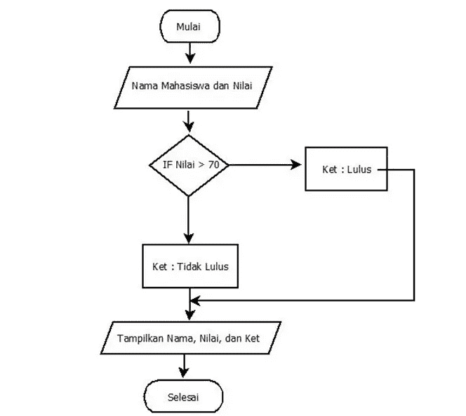
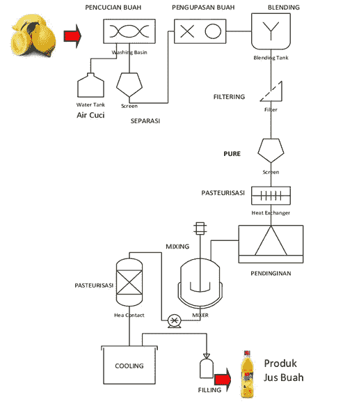
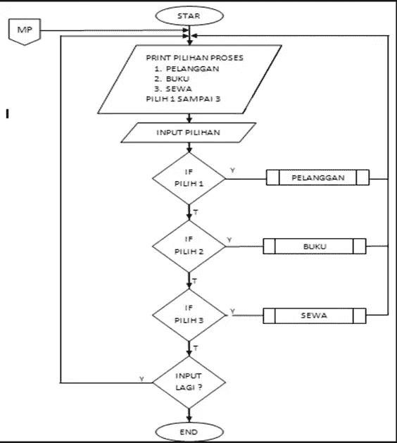
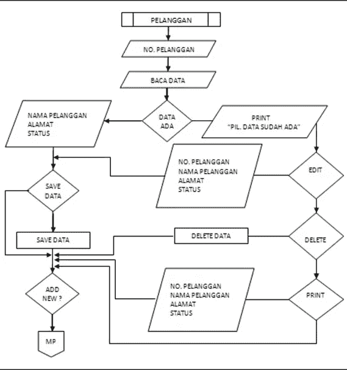
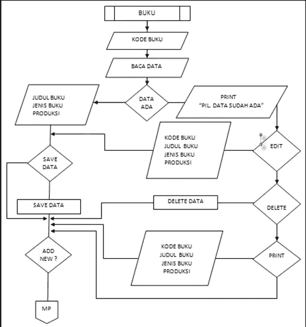
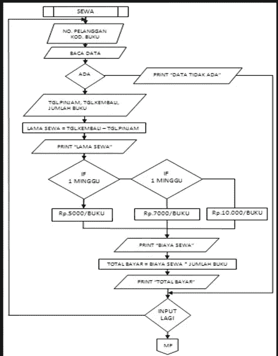

# 流程图形式的系统建模

> 原文：<https://blog.devgenius.io/system-modeling-into-flowchart-form-f498f54217ca?source=collection_archive---------6----------------------->

来源:https://www.ekrut.com/media/cara-membuat-flowchart

# 流程图

流程图是一个程序的步骤和过程序列的图形描述。流程图有助于分析师和程序员将问题分解成更小的部分，并有助于分析运行中的其他选择。流程图通常使解决一个问题更容易，尤其是需要进一步研究和评估的问题。

# 为什么流程图很重要

*   关系

流程图可以为程序中的逻辑过程提供简短、清晰、详细和有效的描述。系统中组件之间的关系可以通过流程图来描述或可视化，这使得它非常容易理解。

*   分析

以流程图的形式解释和展示，使得任何人只分析一个部分都更容易

*   沟通

流程图中使用的符号不一定是理所当然的。然而，它已经有了标准和一系列的研究，所以目前流程图被普遍认可和使用。

# 制作流程图的指南

*   流程图从**顶部**到**底部**，从**左侧**到**右侧**绘制。
*   所描述的活动必须仔细定义，这些定义应该是读者可以理解的。
*   活动开始和结束的时间应该明确定义。
*   必须使用动词描述来描述活动的每个步骤，例如，计算销售税。
*   活动的每一步都必须按正确的顺序进行。
*   使用标准流程图符号。

# 流程图中的符号

流程图中的符号

## 流程图的类型

*   系统流程图
*   文书流程图/文件流程图
*   示意流程图
*   流程图程序
*   进程流图

# 系统流程图

系统流程图是一个图表，它显示工作流程或系统中正在做的事情，并解释系统中存在的程序序列。换句话说，这个流程图是对组成一个系统的组合程序序列的图形化描述。

系统流程图示例

# 文档流程图

文档流程图也称为表格流程图，有些人甚至称之为文书流程图。这是什么类型的图表？虽然术语很多，但不要担心，因为识别它们并不难。文档流程图本身离不开前面的流程图，即系统流程图。然而，区别这种流程图的是更具体地描述一个组织或公司的管理和报告。

文件流程图示例

# 示意流程图

该示意流程图与系统流程图有相似之处，系统流程图描述了系统中包含的所有程序。示意性流程图的区别在于它不使用流程图符号，而示意性流程图更详细地描述了它。使用这种类型的流程图通常是为了向那些不了解和不理解流程图符号的人传达系统的流程。

示意流程图示例

# 程序流程图

从流程图系统生成的流程图程序。程序流程图更详细地描述了程序或过程的每个步骤是如何实际执行的。该流程图按照程序或过程发生的确切顺序显示了每一步。程序员用程序流程图来说明计算机程序的指令序列。系统分析员使用程序流程图来描述程序或操作中工作任务的顺序。

程序流程图示例

# 进程流图

工艺流程图是对解决问题和分析系统或程序中的后续步骤的工业过程的描述。该流程图通常用于工业环境和系统分析。

流程图示例

# 流程图示例程序

## 第一个菜单流程图

## 计划子菜单—客户

## 程序子菜单—书籍

## 程序子菜单—租赁

本文已在印尼文[这里](https://agungprabowo8800.medium.com/pemodelam-sistem-kedalam-bentuk-flowchart-2ee7377c3e9f)发表

谢谢你