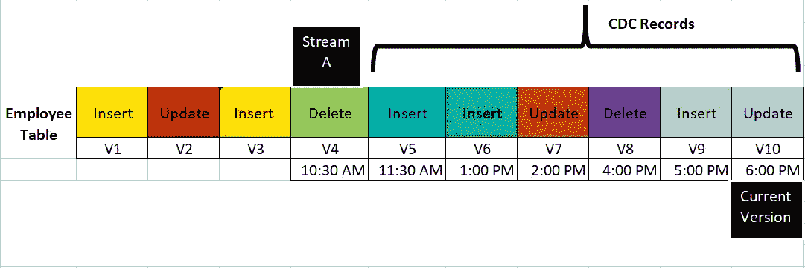

# 雪花中的表流

> 原文：<https://blog.devgenius.io/table-stream-in-snowflake-48c050b38e10?source=collection_archive---------1----------------------->


在 [Unsplash](https://unsplash.com?utm_source=medium&utm_medium=referral) 上由 [Bernd Klutsch](https://unsplash.com/@bk71?utm_source=medium&utm_medium=referral) 拍摄的照片

在这个博客中，我们将讨论**雪花表流。**假设你正在看一本书，很有趣，但是来不及完成。你会怎么做？显然，你会在今天读完的最后一页放一个书签，这样你就可以在第二天跟踪你的学习情况，这样你会一直看到你读完为止。我们都有保存书签的习惯。表流就像书签一样，它们跟踪自第一个书签以来发生的变化，但它不包含任何表数据，只跟踪引用。

一个书签可能会被扔掉，而其他书签会被插在书的不同地方。同样，一个流可能会被删除，而其他流会在相同或不同的时间点创建，以在相同或不同的偏移量处消耗表的更改记录。

**什么是表流？**

流对象记录/捕获对表进行的数据操作语言(DML)更改，包括插入、更新和删除，以及关于每个更改的元数据，以便可以使用更改的数据(行和字段)采取行动。这个过程称为变更数据捕获(CDC)。单个表流跟踪对源表中的行所做的更改。表流(也简称为“流”)使“更改表”可以在行级别上了解表中两个事务时间点之间的更改内容。流还允许以事务方式查询和使用一系列变更记录。

当在表上创建流时，它通过将一个时间点(称为*偏移量*)初始化为表的当前事务版本，来获取源表中每一行的初始快照。流本身不存储任何表数据。Stream 只存储表数据的偏移量，并通过使用源表的版本历史返回增量数据。

**在 Table Stream 上快速演示一下怎么样？**

**stream 如何跟踪表版本？**

当我们在任何表上创建一个流时，该表版本控制将开始跟踪所有的 DML 操作。每一个 DML 操作后面跟着 commit 为一个表创建一个新版本。如果你看到下图，我们当前的**流 A** 偏移是在 V4(上午 10:30)。直到 V4，我们已经消耗了所有偏移。现在，我们经历了从 V5(Insert)到 V6(Insert)、V7(Update)…V10(Update)对 Employee 表的一系列 DML 操作。现在，我们在 V10(下午 6:00)的流 A &当前更改之间有了 6 个版本的增量，如果有人查询流表，他们将会看到从 V5…V10 开始的一系列 DML 操作。



只有当有任何 DML 操作后跟隐式或显式提交时，表的偏移量才会增加。即使在显式事务中，单独查询流也不会提高其偏移量；流内容必须在 DML 语句中使用。

当我们在任何表上创建流时，它会获取表的快照，并开始存储源表的偏移量，而不是任何实际的表列或数据。当我们查询流表时，它返回带有 3 个附加元数据列的偏移数据(与源表形状相同)。这些列有助于我们理解对表执行了什么操作，是插入、更新还是删除，以及行的惟一且不可变的 ID，这可用于跟踪特定行随时间的变化。

**METADATA$ACTION :** 跟踪 DML 操作，无论是插入还是删除。更新未被记录为元数据$ACTION **的一部分。**

**METADATA $ I UPDATE:**跟踪该操作是否是 UPDATE 语句的一部分。当我们更新源表中的任何记录时，它将被记录为流中的一对删除和插入记录，其中元数据列 METADATA $ ISUPDATE 值设置为 TRUE。请注意，流记录了两个偏移量之间的差异。如果添加了一行，然后在当前偏移量中更新，则增量变化是一个新行。元数据$ ISUPDATE 行记录了一个错误值。

**METADATA$ROW_ID :** 该列记录了行的唯一且不可变的 ID，可用于跟踪特定行随时间的变化。

**流的类型有哪些？**

雪花支持三种类型的流。

*   **标准流:**标准流跟踪源表上的所有 DML 操作，即插入或删除或更新，包括截断表。
*   **仅附加流:**仅附加流仅跟踪插入操作。仅附加流不跟踪删除&更新操作。当我们对任何更新或删除操作不感兴趣，而我们的重点是 insert 语句时，这非常有用。因为我们只跟踪插入，这些类型的流比标准的流更有性能。
*   **仅插入流:**该流与仅追加流做相同的工作，唯一的区别是它们仅适用于**外部表，而不适用于普通表。**

让我们看看同样的操作…

**我们如何识别流是否陈旧？**

要确定流是否已经过时，请执行[描述流](https://docs.snowflake.com/en/sql-reference/sql/desc-stream.html)或[显示流](https://docs.snowflake.com/en/sql-reference/sql/show-streams.html)命令。在命令输出中，当 STALE 列值为 TRUE 时，流可能是陈旧的。

**如何设置流数据扩展阈值？**

雪花可以延长数据保持期的最大天数由[MAX _ DATA _ EXTENSION _ TIME _ IN _ DAYS](https://docs.snowflake.com/en/sql-reference/parameters.html#label-max-data-extension-time-in-days)参数值决定。当流被消耗时，延长的数据保持期将减少到表的默认保持期。

以下是您可以为**MAX _ DATA _ EXTENSION _ TIME _ IN _ DAYS**参数设置的可能值

**值:** 0 到 90(即 90 天)—值 0 禁用数据保留期的自动延长。要增加您帐户中表格的最大值，请联系雪花支持。

**默认:** 14 天

**雪花中有没有流的替代品？**

对于 stream 有一个只读的替代方法。您可以使用 select 语句中的****changes**子句实现相同的流状特性。要使用这个特性，您必须使用下面的 alter 命令来启用它。**

> **`**Alter table <Table_Name> set change_tracking = true;**`**

**使 c**Changes**子句与 **stream** 不同的一点是，Changes 子句做 ***而不是*** 提前偏移(即消耗记录)。多个查询可以检索不同事务起点和终点之间的变更跟踪元数据。此选项要求使用 [AT | BEFORE](https://docs.snowflake.com/en/sql-reference/constructs/at-before.html) 子句指定元数据的事务起始点；可以使用可选的 end 子句设置更改跟踪间隔的终点。有关变更条款使用说明的更多详情，请随意查看[此处](https://docs.snowflake.com/en/sql-reference/constructs/changes.html#usage-notes)。**

**一旦表被更改，Snowflake 向表中添加 3 个元数据隐藏列，并开始存储更改跟踪元数据。这些列消耗少量存储空间。您可以使用下面的示例查询来查询源表的偏移量。这里，信息可以是**默认(DML 操作)或** **APPEND_ONLY(仅插入操作)。**此功能不支持外部表格。**

```
Select *
 from <Table_Name>
 changes(information => default)
 at(timestamp => <Timestamp_value>);
```

**让我们通过一些实践来更好地理解这个特性。**

**考虑到雪花表流的 CDC 能力，当调度使用任务时，它可以潜在地用于审计。我们将会看到一个关于 TASK 的独立博客，但是现在它已经足够用来在一个约定的时间间隔内调度任何 SQL 执行。**

**让我们看看如何使用下面的动手实践中的流和任务来实现审计。**

****需要记住的事情:****

*   **流本身 ***不*** 包含任何表数据。**
*   **目前，流不能跟踪物化视图中的变化。**
*   **请注意，流记录了两个偏移量之间的差异。如果添加了一行，然后在当前偏移量中更新，则增量变化是一个新行。**
*   **如果流在数据保留时间内没有被使用，它就会变得陈旧。当流变得陈旧时，源表的历史数据将不再可访问，包括任何未使用的更改记录。**
*   **如果任何源表的数据保留期**小于 14 天**并且流偏移没有被消耗，则无论雪花版本如何，雪花临时将保留期延长到 14 天，以确保偏移不会过期。**
*   **重新创建源表(使用 CREATE 或 REPLACE TABLE 语法)会删除它的历史记录，这也会使表上的任何流失效。**
*   **目前，当克隆包含源表和流的数据库或模式时，流克隆中任何未使用的记录都是不可访问的。这种行为与表的[时间旅行](https://docs.snowflake.com/en/user-guide/data-time-travel.html)一致。如果克隆了一个表，则表克隆的历史数据从创建克隆的时间/点开始。**
*   **重命名源表不会中断流或导致流失效。此外，如果删除一个表并创建一个同名的新表，则链接到原始表的任何流都是链接到新表的 ***而不是*** 。**
*   **雪花建议用户为一个表的每个变更记录的消费者创建一个单独的流。“消费者”是指使用 DML 事务来消费表更改记录的任务、脚本或其他机制。**
*   **在共享表上创建流使数据消费者能够跟踪这些表中的数据操作语言(DML)更改。这个功能类似于在“本地”表上创建和使用流。**
*   **对于所有流 DDL 支持，查看[文档](https://docs.snowflake.com/en/user-guide/streams.html#stream-ddl)。**

**希望这篇博客和 YouTube 视频能帮助你深入了解**雪花表格流特性**。如果你有兴趣了解更多关于**雪花表流**的细节，可以参考[雪花文档](https://docs.snowflake.com/en/user-guide/streams.html)。如果你对此有任何疑问，欢迎在评论区提问。如果你喜欢这个博客，请鼓掌。保持联系，看到更多这样的酷东西。谢谢你的支持。**

****你可以找我:****

****跟我上媒:**[https://rajivgupta780184.medium.com/](https://rajivgupta780184.medium.com/)**

****在推特上关注我:【https://twitter.com/RAJIVGUPTA780】T22****

****在 LinkedIn 跟我连线:**[https://www.linkedin.com/in/rajiv-gupta-618b0228/](https://www.linkedin.com/in/rajiv-gupta-618b0228/)**

****订阅我的 YouTube 频道:**[https://www.youtube.com/c/RajivGuptaEverydayLearning](https://www.youtube.com/c/RajivGuptaEverydayLearning)**

****

**#坚持学习#坚持分享#每天学习。**

# **参考资料:-**

*   **[https://www.snowflake.com/](https://www.snowflake.com/)**