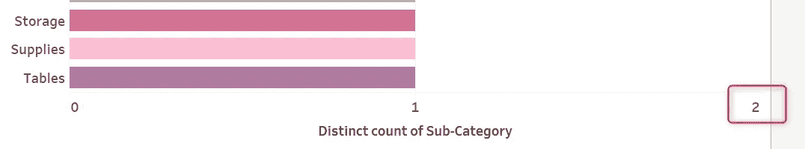

# Tableau 桌面快速提示:饼图和图例的问题

> 原文：<https://blog.devgenius.io/tableau-desktop-quick-tip-the-problem-with-pie-chart-legend-df13705b2d3c?source=collection_archive---------12----------------------->

数据分析师总是认为饼图和图例是理所当然的，尤其是在一个领域有许多类别的情况下。当谈到把事情分成几个部分时，我们首先想到的是创建一个饼图，显示每个部分的百分比。

虽然这对我们所有人来说都很常见，但当字段有许多唯一值时，这可能不是显示数据的好方法。

**例如:**

# 问题是:

1.  这些数据中有太多的子类别，我们很难猜测饼图中的哪一片代表哪一个子类别。

2.让我们放大一点，你能告诉我是粉色还是蓝色的馅饼更大吗？

3.传说一点帮助都没有！想象一下，如果你在比较配件、电器和标签的价值！

# 解决方案是:

在我告诉你怎么做之前，让我们先下结论。我们将使用条形图作为图例。

1.  我认为这里的条形图是图例的放大版本，条形图显示每个子类别的颜色。
2.  在大多数可视化工具中(以正确的方式完成)，当您突出显示条形图时，您应该能够突出显示饼图的各个部分。因此，通过这种方式，条形图可以作为饼图的高亮显示。

# 步骤:

1.  **创建条形图**

我们正在创建一个水平条形图来显示每个子类别的不同计数。请注意，条形图中字段的 Count Distinct 始终为 1，这将确保所有条形的长度相同。

**2。用作颜色**

还记得这个柱状图是图例的放大版吗？每个条形的颜色应该根据子类别而变化。

**3。展开酒吧**

如果您还没有切换到整个视图，请切换到它。即使这样，你也会意识到条形图不会占据整个画布。请注意，这是因为 x 轴自动延伸到 2。因此，我们需要将轴的长度限制为 1。

右键单击轴->编辑轴…

将轴的末端固定为 1。

**4。隐藏轴**

因为我们没有用它作为条形图(我们用它作为图例)，所以我们不需要轴。

右键单击轴->取消选中**显示标题**

**5。将它们放在仪表板上**

确保它们在您的仪表板中占据最大空间，并根据需要增加仪表板的大小。

**6。隐藏字段标签和图表标题**

**7。高亮显示时显示标签**

当你的领域有太多独特的价值时，你的画布或屏幕有多大都没关系。因此，与其一次显示所有标签，为什么不在高亮显示时只显示值呢？

**8。使用条形图作为荧光笔**

我们将使用一个突出显示操作来帮助我们实现这一点。

**来源工作表:**你的荧光笔

**目标表单:**要突出显示的视觉效果

**目标突出显示:**将要受到影响的列

# 最终结果:

这是我们想要的结果。查看我的 Youtube 视频，获得一步一步的指导。

如果你认为这篇文章对你的同事/朋友有帮助，请与他们分享！