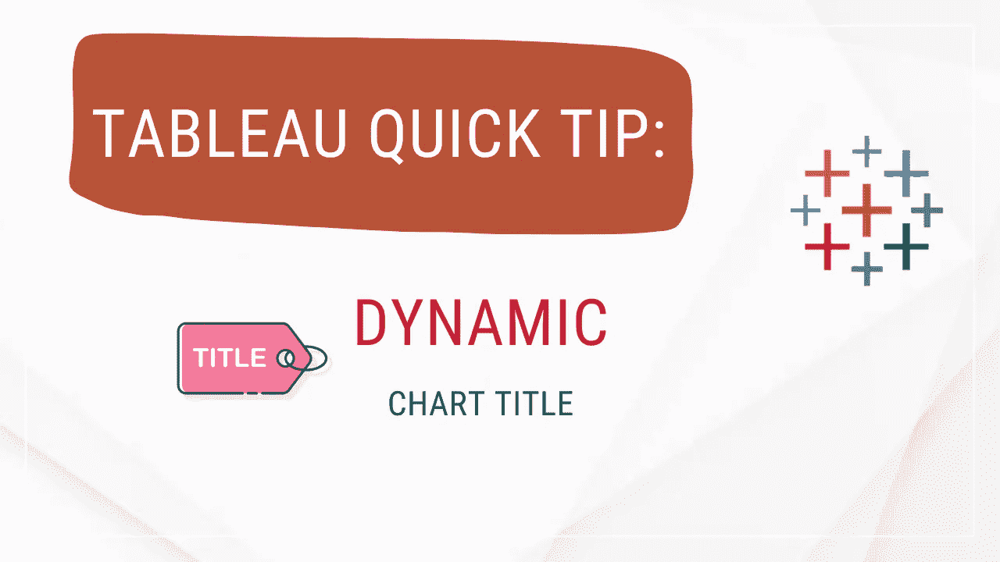
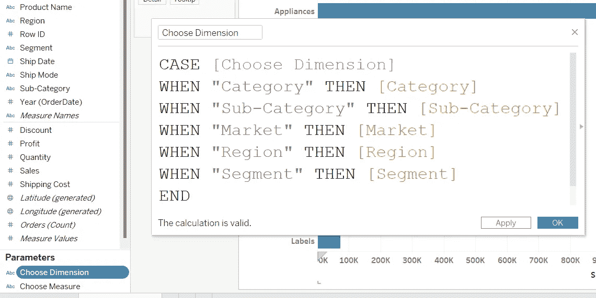

# Tableau 快速提示:动态图表标题

> 原文：<https://blog.devgenius.io/tableau-quick-tip-dynamic-chart-title-b86a1585df81?source=collection_archive---------7----------------------->

创建一个下拉菜单来更改 x 轴和 y 轴。根据选择更改图表标题。

# 目录

> [简介](#3cb4)
> [数据&工作簿](#89c7)
> [创建条形图](#c104)
> [创建参数](#d614)
> [创建计算字段](#324a)
> [设计图表](#0019)
> [最终结果](#cb37)
> [视频教程](#d5d6)
> [最终文字](#1561)

# 介绍

Data Analyst 有时会为不知道如何使用 Tableau Desktop 的人(查看者)创建一个仪表板。我们希望允许用户使用下拉菜单来切换 x 和 y 轴，以提供便利。

除此之外，我们希望图表标题说明用户选择了哪个维度或度量。

# 数据和工作簿

数据:[g 驱动链接](https://docs.google.com/spreadsheets/d/1o-KaA43TD6Q_w_vnyEOIzaR6xMTmR9nd/edit?usp=sharing&ouid=105166131516527752739&rtpof=true&sd=true)

工作簿: [Tableau 公共链接](https://public.tableau.com/app/profile/foo.chee.chuan/viz/DynamicChartTitle/DynamicChartTitle)

Youtube: [车志川](https://www.youtube.com/channel/UC73tyElpkCE_6cbZxMLKnkw)

# 创建条形图

创建条形图

# 创建参数

参数用于在 Tableau 中创建下拉列表。因此，我们需要创建两个参数，一个用于尺寸，另一个用于测量。

下拉列表选择尺寸和测量

创建参数

**参数 1:选择尺寸**

参数 1:选择维度

**参数 2:选择测量**

参数 2:选择衡量标准

"显示参数"创建下拉菜单

# 创建计算字段

创建计算字段

当用户在“**选择维度**”下拉菜单中选择“**类别**”时，该计算字段将等同于“**类别**字段。也就是说，我们需要在下拉列表中列出所有值，以便当用户选择这些字段中的任何一个时，图表可以根据选择而改变。同样的逻辑也适用于“**选择度量**”。

创建计算字段:选择维度

创建计算字段:选择度量

> *注意，每个聚合需要单独指定为**选择度量**

# 设计图表

将尺寸和测量替换为“**选择尺寸**”和“**选择测量**

拖到行和列架上

尝试在下拉列表中选择不同的值。图表应该根据您的选择动态变化。

我们希望通过使图表标题、字段标签和轴标题动态化来改善用户体验。

动态特征

**动态图表标题**

1.  双击图表标题
2.  移除默认
3.  使用如下所示的“插入”按钮插入参数
4.  改变参数的颜色。改变颜色前，记得突出显示参数

动态图表标题

**动态字段标签**

1.  隐藏字段标签

2.将“选择维度”参数拖到行中。** *将其置于“选择尺寸”字段之前。*

右键单击要格式化的字段标签

居中对齐

**动态轴标题**

1.  删除轴标题

右键单击->编辑轴

删除轴标题

2.将“选择度量”添加到列

将“选择度量”添加到列

3.隐藏字段标签

右键单击->隐藏列的字段标签

# 最后结局

此时，你已经创建了一个动态视觉它的特性会根据用户的选择而改变。

动态项目以红色方框突出显示

# 视频教程

Youtube 上的视频教程

# 最后的话

谢谢你把这篇文章读到最后。如果你想收到类似的内容，请关注并订阅我的媒体账户。直到下一个，再见:)

照片由[封泥](https://unsplash.com/@milestogobeforeisleep?utm_source=unsplash&utm_medium=referral&utm_content=creditCopyText)在 [Unsplash](https://unsplash.com/s/photos/farewell?utm_source=unsplash&utm_medium=referral&utm_content=creditCopyText) 上