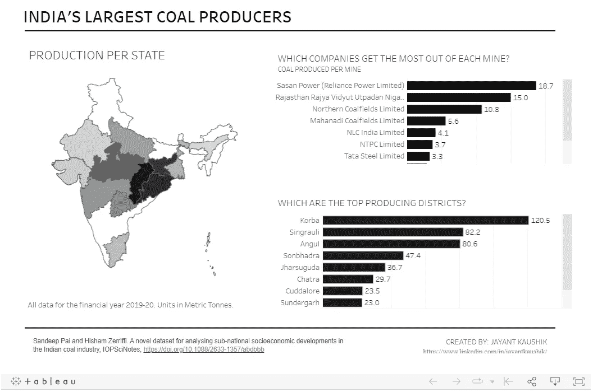
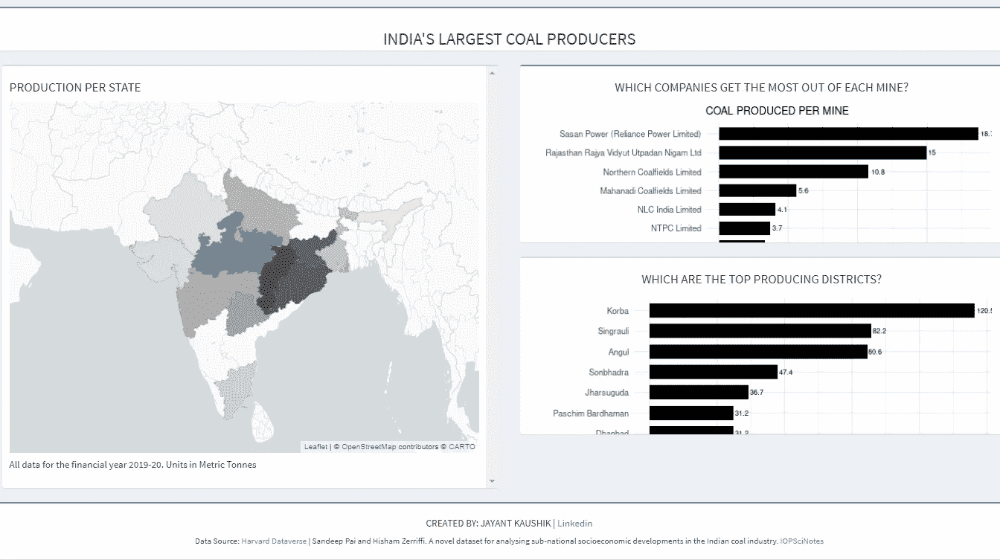
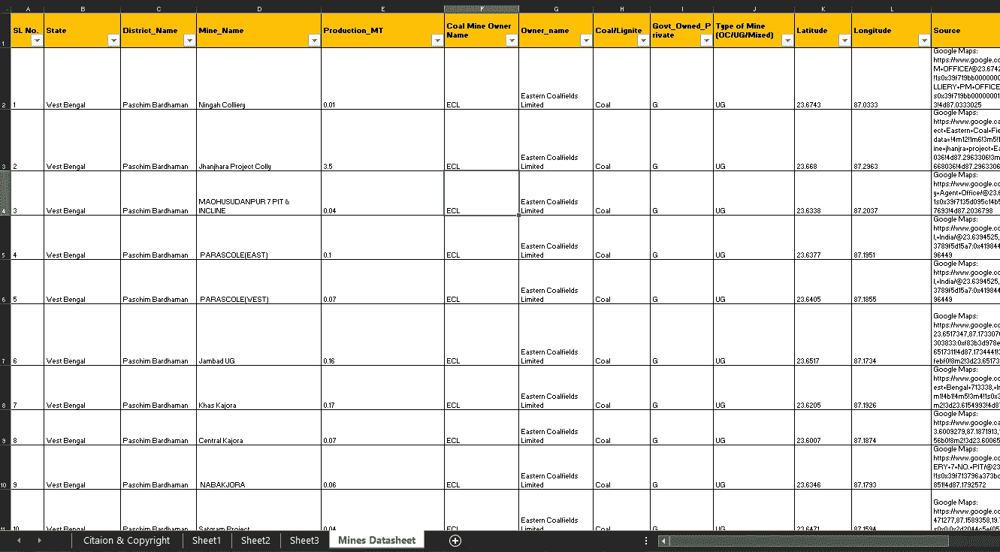

# 使用 R Shiny 重新创建 Tableau 仪表板

> 原文：<https://blog.devgenius.io/tableau-v-s-r-shiny-for-dashboards-86ae04d3611e?source=collection_archive---------13----------------------->

我刚刚试着用 [R Shiny](https://shiny.rstudio.com/) 重新制作了一个 Tableau 仪表盘，这是我的结果和想法。

# （舞台上由人扮的）静态画面

一年前，我用 Tableau 绘制了印度煤矿开采状况的数据，看起来是这样的:



[印度煤矿| Tableau 公共](https://public.tableau.com/app/profile/jayantkaushik/viz/IndiaCoalMines_16287026155770/Dashboard1)

链接到 Tableau 仪表盘:[印度煤矿| Tableau 公共](https://public.tableau.com/app/profile/jayantkaushik/viz/IndiaCoalMines_16287026155770/Dashboard1)

这个仪表板还有一个向下钻取功能，当您在地图上单击印度的每个邦时，就可以看到它们的数据。

过程:除了一些数据清理和创建计算字段之外，它主要是一个拖放过程

# r 闪亮

上周，我学会了 R Shiny 的细微差别(从零开始)，并能够轻松地重新创建上面的仪表板。看看..

链接到 R 闪亮仪表板:[煤炭生产—印度(shinyapps.io)](https://t95zpt-jayant-kaushik.shinyapps.io/Coal_Mines_India/) (第一次加载时给它几秒钟时间)

如果您希望 [**查看代码**](https://medium.com/@jayant_kaushik/tableau-v-s-r-shiny-for-dashboards-86ae04d3611e#2367) ，请跳到本页的最后一部分。



[煤炭产量—印度(shinyapps.io)](https://t95zpt-jayant-kaushik.shinyapps.io/Coal_Mines_India/)

**流程:**获取数据>清理>转换>汇总数据以创建地块>在印度地图上绘制 GIS 数据。

此外，品味良好的用户界面。我不得不谷歌了很多东西来润色这个应用程序，让它看起来像现在这样。例如，最初我无法找到印度及其各州的坐标/多边形信息。我确实找到了一些来源，比如印度媒体提供的 geojson [shape 文件](https://github.com/HindustanTimesLabs/shapefiles)，我本可以使用这些文件，但是必须有更好的解决方案。那是我发现 [**GADM**](https://gadm.org/) 的时候，他们为世界上几乎每一个国家提供最细粒度的形状文件！锦上添花的是，您可以通过简单的一行代码将 GIS 数据直接导入 R 中(data < - getData("GADM "，country= "IND "，level=1))。

继续，用于创建地图的**传单**库是一个非常强大的工具集合，可以创建任何你想要的基于地图的可视化。

## **闪亮的画面:我的想法:**

当您希望可视化只使用一次/很少使用，或者数据集很小(在 Excel 中易于管理)并且最终用户不需要太多交互时，Tableau 非常适合快速创建令人印象深刻的可视化

其他的都用 R 闪亮。它是快速分析大型数据集的强大工具，并允许您在仪表板上添加许多交互性，这将使您的仪表板不仅仅是第一眼看上去有用。

**数据:** [**一个数据文件**](https://dataverse.harvard.edu/dataset.xhtml?persistentId=doi:10.7910/DVN/TDEK8O) **+** [**文章由研究者发表**](https://iopscience.iop.org/article/10.1088/2633-1357/abdbbb/pdf)

下面是原始数据文件的样子:



Excel 中的原始数据文件

## **代码:**

每个 R Shiny 应用程序大致有 4 个部分——静态部分、UI 脚本、服务器脚本和 shinyApp(ui，服务器)函数

这一切是如何运作的:

**静态部分首先加载**所有应该在应用程序启动时只加载一次的东西都应该放在这个部分。例如数据和所有的库！如果你将数据放入任何其他部分，它会降低你的应用程序的速度，因为每当有人与你的应用程序的元素交互时(如按下按钮)，应用程序都会重新加载数据。

UI 脚本:这是你告诉 R Shiny 把你设计的各种元素放到页面上的地方。基本上是版面设计。

服务器脚本:这是你设计的所有 ggplots、地图和其他东西的代码所在的地方。

**shinyApp 功能:**只是告诉 shiny 请使用 UI 脚本和服务器脚本，创造魔法的一种方式！

现在让我们看看代码..

**静态部分:**

```
library(shiny)# life is dull without this
library(tidyverse)# makes things tidy
library(readxl) # to read source data file
library(shinydashboard) # for layout
library(leaflet) # for map
library(leaflet.providers) # to load OpenStreet Map
library(raster) # for map
library(sf) # for map# **READING RAW DATA**
data <- read_excel("data/coal_data.xlsx")# **DATA TRANSFORMATIONS** (**data for the Bar Charts**):owner_avg <- data %>% group_by(Owner_name) %>% summarise(production_permine = round(mean(Production_MT),1)) %>% arrange(desc(production_permine)) %>% slice(1:10)dist_avg <- data %>% group_by(District_Name) %>% summarise(production_perdistrict = round(sum(Production_MT),1)) %>% arrange(desc(production_perdistrict)) %>% slice(1:10)# **DATA FOR THE MAP:**
data2 <- data %>% select_("State", "District_Name", "Production_MT") %>% group_by(State) %>% summarise(production_perstate = round(sum(Production_MT),1))# The map wasn't showing **data for Orissa**, turns out the name of the state was changed to Odisha by the Govt of India, so let's change it in our dataset:data2[7, "State"] <- "Odisha"# **DOWNLOAD MAP COORDINATES FROM GADM**:
IND_3 <- getData("GADM", country= "IND", level=1) # Level 1 means States, Level 2 would be DistrictsIND_1 <- merge(IND_3, data2,
               by.x = c("NAME_1"), by.y = c("State"),
               all.x = TRUE) 
ind_2 <- IND_1[IND_1$NAME_1 %in% data2$State, ]# **DEFINING COLOR PALETTE FOR MAP TILES**. Using Black/grey color palette which correlates with color of coalpal <- colorNumeric(
  palette = c("#e0e0e0", "#000000"),
  domain = ind_2$production_perstate) #Tiles would be colored based on production_perstate values
```

**用户界面脚本:**

```
# **Defining the layout of the objects**. We use a 'mixed row & column' layoutbody <- dashboardBody(fluidRow(box(div(class = "my-class", h3("INDIA'S LARGEST COAL PRODUCERS"), style="text-align:center;"), width = NULL, height = 62, status = "primary"
),
# **Placing the Map:**
  column(width = 6, height = 14,
         box(div(class = "my-class", h4("PRODUCTION PER STATE"), style="text-align:left"), style='height:600px;overflow-y: scroll;',
             leafletOutput('myMap', height="500px"), div(class = "my-class", h5("All data for the financial year 2019-20\. Units in Metric Tonnes"), style="text-align:left"),width = NULL)),# **Placing the Bar Charts:**              
  column(width=6,
         box(div(class = "my-class", h4("WHICH COMPANIES GET THE MOST OUT OF EACH MINE?"), style="text-align:center") ,style='height:250px;overflow-y: scroll;',
         plotOutput("bar1", height="350px"), width = NULL, status = "primary"
         ),

         box(div(class = "my-class", h4("WHICH ARE THE TOP PRODUCING DISTRICTS?"), style="text-align:center") ,style='height:250px;overflow-y: scroll;',
         plotOutput("bar2", height="350px"), width = NULL
         )
         )
),
# **Placing the Citations and Creator Info:**
            fluidRow(box(div(class = "my-class", h5("CREATED BY: JAYANT KAUSHIK | " ,tags$a(href="[https://www.linkedin.com/in/jayantkaushik/](https://www.linkedin.com/in/jayantkaushik/)", "Linkedin")), style="text-align:center"),div(class = "my-class", h6("Data Source: ", tags$a(href="[https://dataverse.harvard.edu/dataset.xhtml?persistentId=doi:10.7910/DVN/TDEK8O](https://dataverse.harvard.edu/dataset.xhtml?persistentId=doi:10.7910/DVN/TDEK8O)", "Harvard Dataverse")," | Sandeep Pai and Hisham Zerriffi. A novel dataset for analysing sub-national socioeconomic developments in the Indian coal industry. ", tags$a(href="[https://iopscience.iop.org/article/10.1088/2633-1357/abdbbb](https://iopscience.iop.org/article/10.1088/2633-1357/abdbbb)", "IOPSciNotes")), style="text-align:center"), width = NULL, status = "primary"
))
)# **Giving all the above to the UI function:**ui <- dashboardPage(title="Coal Production - India",
  dashboardHeader(disable= TRUE),
  dashboardSidebar(disable = TRUE),
  body
)
```

**服务器脚本:**

```
server <- function(input, output, session) # **Creating the Map:**
{
  map = ind_2  %>%
    leaflet(options = leafletOptions(minZoom = 4.4, maxZoom = 4.4, zoomControl = FALSE)) %>%
    addProviderTiles(providers$CartoDB.PositronNoLabels) %>% setView( lat = 21.1458
                                                                      , lng = 79.0882
                                                                      , zoom = 4.4 )%>%
    addPolygons(weight = 1,
                stroke = TRUE,
                color = "grey",
                fillColor = ~pal(production_perstate),
                fillOpacity = 0.7,
                dashArray = "0.5",
                #popup = ~NAME_0,
                label = ~paste(NAME_1,
                               "<br/>",
                               "Coal Produced:", production_perstate, "MT")%>% lapply(htmltools::HTML),
                highlight = highlightOptions(
                  weight = 2,
                  dashArray = "",
                  color = "black",
                  bringToFront = TRUE
                ))
    #setView(-93.65, 42.0285, zoom = 17)
  output$myMap = renderLeaflet(map) # **Creating Bar Charts:**
 output$bar1<-renderPlot(
    ggplot(owner_avg, aes(x = production_permine, y = reorder(Owner_name, production_permine) ), )+geom_bar(stat = "identity", width = 0.7, fill ="black")+ geom_text(aes(label=production_permine), hjust=-0.20, size=3.5)+ theme_minimal(base_size = 15)+ labs(x = " ", y = "")+ labs(subtitle = "COAL PRODUCED PER MINE")

    )
  output$bar2<-renderPlot(

    ggplot(dist_avg, aes(x = production_perdistrict, y = reorder(District_Name, production_perdistrict) ), )+geom_bar(stat = "identity", width = 0.7, fill ="black", name="District_Name")+ geom_text(aes(label=production_perdistrict), hjust=-0.1, size=3.5)+ theme_minimal(base_size = 15)+ labs(x = " ", y = "")

    )

}
```

shinyApp 函数:

```
shinyApp(ui, server)
```

最后，你可以将以上四个部分组合起来，放入一个名为“app”的脚本中。你的仪表板已经准备好了！

在我工作的下一部分，我将在地图上添加交互性，这样我们就可以深入每个州的数据，并根据用户输入查看条形图的变化！

快乐学习！