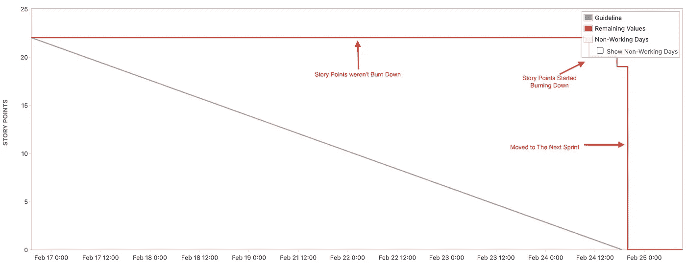

# 在 Sprint“0”中处理初始架构设计

> 原文：<https://blog.devgenius.io/tackle-initial-architecture-design-in-sprint-0-82e291c4df56?source=collection_archive---------10----------------------->

# 故事点在冲刺阶段保持不变

燃尽图

在最近的 sprint 回顾中，我们发现所选的积压工作大部分都没有完成，所以烧毁图用一条直线反映了这一现象，直到最后，如上所示。嗯，我不能断言团队没有做任何关于 sprint 的事情，因为图表旨在反映现实，同时也是 Scrum 团队适应环境的关键因素。

因此，我决定在所选的故事中多挖掘一些隐藏的信息。在 sprint 评审中，我们发现有一项前期工作，它占据了**最多的故事点(6)** ，关于建立一个包含 DB 过渡、插件/框架评估、API 评估和系统设计的后端系统。而其他的故事都依赖于前期工作，否则就无法进行。

# 盖房子前先加固地基

理论上，我们期望一个 sprint 接一个 sprint 地交付商业价值。然而，依赖有时很难与故事分开，所以我们必须在一开始就直接面对它，以免它的影响蔓延到整个故事。

我认为，我们可以成立一个解决类似“**冲刺 0”**问题的研讨会，以完成相关任务，防止依赖工作影响后续故事的进行，然后启动冲刺 1。在研讨会中，Scrum 团队应该尽可能多地列出准备工作，以减轻他们将要遭受的痛苦。

尽管 Scrum 管理是一个迭代和增量的开发过程， [Scrum 指南](https://scrumguides.org/docs/scrumguide/v2020/2020-Scrum-Guide-US.pdf)本身并没有指出我们是否应该举行**“Sprint 0”**来构建基础设施。相反，它本质上期望所有的项目，包括前期工作，都在迭代冲刺中实现。

> 召开“冲刺 0”会议，处理前期工作，为后续冲刺奠定基础

# 延长短跑的障碍

正如您所想象的，有许多因素，不仅仅局限于最初的架构设计，可能会延长一个 sprint。例如，我可以尽可能多地列出我经历过的更多经历的原因:

*   初始架构设计
*   配置依赖性
*   跨部门等待
*   外包
*   隐藏任务

我敢打赌，读者会比我有更多的例子来说话。而且这一集还指出了一个确凿的事实:**故事点与所花费的时间没有关联；它们纯粹反映了一个项目在现实中包含了多少工作。在我们的例子中，前期工作占 6 分，用了一个多冲刺才把它烧完。直觉上，人们更喜欢将故事点与工作时间联系起来，但实际上后者主要取决于其他因素。**

例如，有一个故事描述了需要将 300 块砖从地点“A”移动到地点“B”。显然，砖块的数量指的是反映它涉及多少工作的故事点。我们假设有两个人，我们说一个强壮的男人和一个虚弱的男人，试图选择故事。我们可以预测那个强壮的人会更早完成工作。如果在这个过程中没有任何干扰，我们的预测可能是真的:强的比弱的花费更少的时间。然而，我已经提到工作时间在很大程度上受到其他因素的影响。

试着想象一下这种可能性:弱者开卡车搬砖，这样他比强者用的时间少，这和我们最初的猜测相反，对吗？无论如何，要移动的砖块数量保持不变，但是每个人花费的时间取决于他们选择什么样的策略。

> 故事点反映了它包含了多少工作，而不是花费了多长时间，这取决于其他因素

# 蔻驰杂音

理想情况下，我们期望在 sprint 结束时看到潜在的可释放的增量。但是我们仍然不能避免当一个 sprint 开始的时候，必要的依赖被暴露出来，我们可以采取的行动是设计一个“sprint 0”来尽可能早地处理前期工作。

此外，当产品负责人注意到故事点没有随着时间的推移而消失时，他可以咨询成员在这个过程中发生了什么。一些隐藏的细节可能会暴露出来，这样他就可以尽快调整故事的范围。

在我的团队中，我们更喜欢在烧毁图表上反映现实，这样我们就可以回顾故事点没有烧毁的原因；制定相应的策略来解决之后的问题。我们的产品负责人也应该通过解释图表上发生的事情来管理利益相关者的期望。最重要的是 DoD(完成的定义)还是要遵守的。

—

如果你认可我与你分享的价值，请做如下:
1。**鼓掌**文章
2。**订阅**我最新内容
3。**在其他平台关注**我了解更多信息
-IG:[@ ur _ Agile _ coach](https://www.instagram.com/ur_agile_coach/)
-播客(中文):[敏捷火箭](https://player.soundon.fm/p/7f7dc3df-d738-405c-8cf9-02157a92ec61)
- Youtube: [你的敏捷蔻驰](https://www.youtube.com/channel/UCzD0wQmD1n4MuTKk-JocACA)
- LinkedIn: [吴宗祥](https://www.linkedin.com/in/tsung-hsiang-wu-8542409b/)

如果您需要咨询或其他形式的合作，请发送邮件至:【urscrummaster@gmail.com】