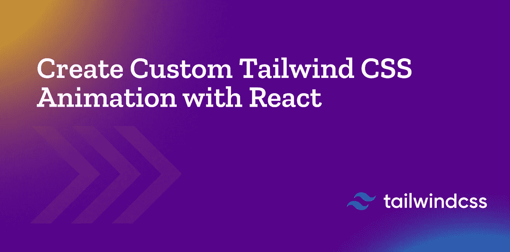

# 如何用 React 创建自定义的顺风 CSS 动画

> 原文：<https://blog.devgenius.io/tailwind-animation-how-to-create-custom-tailwind-css-animation-with-react-d46c02406c0c?source=collection_archive---------4----------------------->



[Tailwind CSS](https://tailwindcss.com/) 是一个实用优先的 CSS 框架，它的采用显示了巨大的增长，使它成为满足您所有风格需求的流行选择。虽然它允许你不用写一行 CSS 就能建立现代网站，但是设计网站只是提供积极用户体验的一部分。

通过动画制作有意义的互动在吸引访问者的注意力方面也起着重要的作用，它们可以让你的网站更上一层楼。在这篇文章中，你将学习如何在 Tailwind CSS 中使用 CSS 动画，探索它自带的内置动画，并为额外的天赋创建自定义动画。

# 将内置 CSS 动画与 Tailwind CSS 一起使用

[CSS 动画](https://developer.mozilla.org/en-US/docs/Web/CSS/animation)是一个 CSS 模块，让你[通过关键帧动画化 CSS 属性](https://blog.logrocket.com/guide-to-css-animation-for-javascript-developers/)的值。这些关键帧动画的性质可以通过调整其属性来改变，如持续时间、缓动功能、方向、延迟等。

就像其他 CSS 属性和模块一样，Tailwind CSS 也附带了一些用于 CSS 动画的实用程序类。默认情况下，它带有四个基本动画:旋转，脉冲，ping 和反弹。

这些实用程序类以关键字`animate`为前缀，比如`animate-spin`或`animate-pulse`。我们用来定义动画的顺风动画类:

*   `animate-spin`，这给你的元素一个线性旋转动画。
*   `animate-ping`，这使得元素缩放并淡出。
*   `animate-bounce`，这给了你的元素弹跳的错觉。
*   `animate-pulse`，这让你的元素轻轻地淡入淡出。

下面的代码片段向您展示了如何向 SVG 添加无限旋转的动画。

```
<button type="button" class="bg-indigo-500 ..." disabled>
<svg class="animate-spin h-5 w-5 mr-3 ..." viewBox="0 0 24 24">
<!-- ... -->
</svg>
Processing...
</button>
```

# 在顺风 CSS 中创建自定义动画

虽然四个内置的 CSS 动画对于一些一般的用例来说可能已经足够了，但是您可能不希望仅限于这些。动画是高度特定于项目的，也许您想使用自定义动画来代替。

有了顺风 CSS，你可以定制你的动画来更好地满足你的需求。您可以添加、删除、更改`tailwind.config.js`文件中的动画。我们在`module.exports`对象的`animation`部分定义动画行为。

```
//taiwind.config.jsmodule.exports = {
  theme: {
    extend: {
      animation: {
        'spin-slow': 'spin 3s linear infinite',
      }
    }
  }
}
```

# 向顺风 CSS 配置文件添加关键帧

关键帧用于定义动画行为，让我们完全控制 CSS 动画的一个周期。这比 [t](https://developer.mozilla.org/en-US/docs/Web/CSS/CSS_Transitions) 变换对动画序列的中间步骤有更多的控制。

要创建摆动动画，您可以在`tailwind.config.js`文件中添加关键帧。

```
//tailwing.config.js module.exports = {
theme: {
extend: {
keyframes: {
wiggle: {
'0%, 100%': { transform: 'rotate(-3deg)' },
'50%': { transform: 'rotate(3deg)' },
				}
			}
    }
  }
}
```

使用`@keyframes`,我们定义顺风动画，当它完成 0%和 100%时，我们想要向左旋转元素 3 度，当它完成 50%时，我们想要向右旋转元素 3 度。

创建关键帧后，您可以在`tailwind.config.js`文件的`**animation**`部分通过名称引用这些关键帧。使用 animation 属性可以控制动画的计时、持续时间和其他细节:

```
💡 animation: animation-name, animation-duration, animation-timing-function, animation-iteration-count
```

*   `**animation-name**`:定义你的动画名字，在我这里是`**wiggle**`。
*   `**animation-duration**`:配置动画完成一个循环所需的时间长度。
*   `**animation-timing-function**`:定义动画如何在每个循环的持续时间内进行。
*   `**animation-iteration-count**`:告诉你想要你的动画循环播放多少次才停止。

```
//tailwind.config.jsmodule.exports = {
theme: {
extend: {
animation: {
wiggle: 'wiggle 1s ease-in-out infinite',
}
    }
  }
}
```

# 在 Tailwind CSS 中为一次性自定义动画使用任意值

如果您需要使用一次性的`**animation**`值，而这个值在您的主题中没有意义，那么使用方括号来动态地生成一个使用任意值的属性。

```
<div class="animate-[wiggle_1s_ease-in-out_infinite]">
<!-- ... -->
</div>
```

这里是最终的`tailwind.config.js`

```
module.exports = {
content: ["./src/**/*.{js,jsx,ts,tsx}"],
theme: {
extend: {
keyframes: {
wiggle: {
"0%, 100%": { transform: "rotate(-3deg)" },
"50%": { transform: "rotate(3deg)" },
       },
     },
animation: {
wiggle: "wiggle 1s ease-in-out infinite",
          },
  },
},
plugins: [],
};
```

# 输出:

[https://drive . Google . com/file/d/1 arwtztf 92 bl _ mly 2yk-5 rrgmeuyze7c y/view？usp =共享](https://drive.google.com/file/d/1aRWtZtf92Bl_mLY2Yk-5RRgMeuyZe7cY/view?usp=sharing)

此代码的工作示例可在以下位置找到:

[](https://github.com/mohammad-aaqib-sudo/Custom-Tailwind-css-Animation) [## GitHub-Mohammad-aaqib-sudo/Custom-tail wind-CSS-Animation

### 这个项目是用 Create React App 引导的。在项目目录中，您可以运行:在…中运行应用程序

github.com](https://github.com/mohammad-aaqib-sudo/Custom-Tailwind-css-Animation) 

# 结论

我们可以将任何类型的动画应用于顺风，并且我们可以通过将任何响应或悬停状态与我们的动画一起使用来获益。