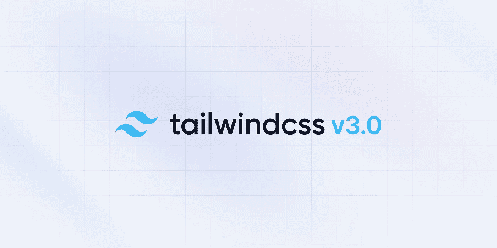
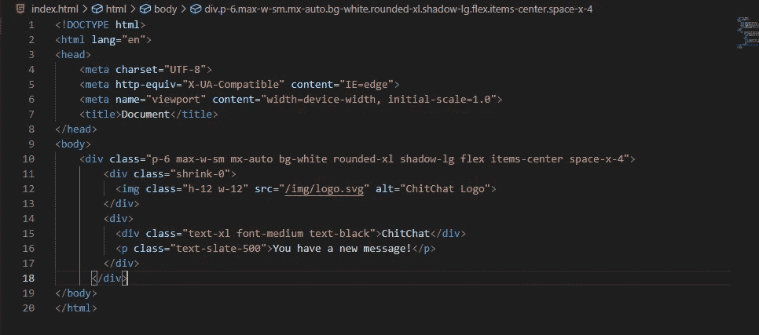
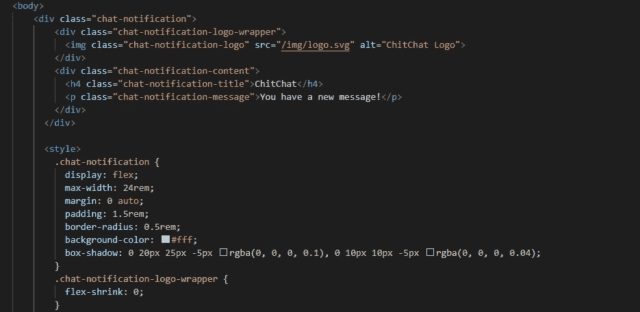
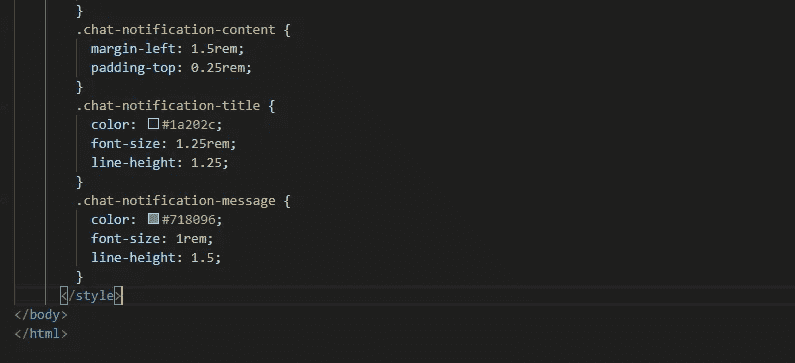
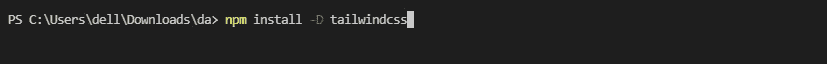
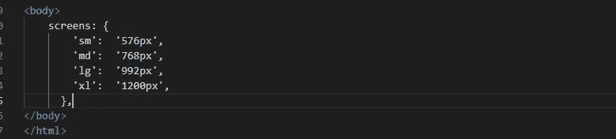
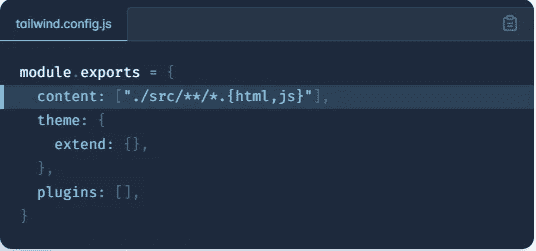
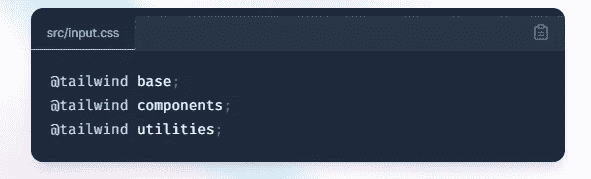

# 顺风 CSS 3.0

> 原文：<https://blog.devgenius.io/tailwind-css-3-0-c48243e58893?source=collection_archive---------7----------------------->

Tailwind CSS 基本上是一个实用优先的 CSS 框架，用于快速构建定制用户界面。它是一个高度可定制的低级 CSS 框架，为您提供了构建定制设计所需的所有构件，而没有任何您必须努力克服的恼人的固执己见的风格。

# 什么是实用程序类？

Tailwind 为各种需求提供了实用程序类。这允许你构建一个响应迅速的定制 UI，而不需要编写任何新的 CSS。

例如，`.text-lg`默认为基本字体大小的 1.5 雷姆。`.bg-dark-red`将根据配置文件中的设置应用暗红色背景。

规则中设置的值可通过配置文件进行配置。这意味着如果你想让`.text-lg`的大小是你基本字体的两倍，你可以自定义它。

您可以像应用响应样式一样应用状态变量，如悬停或焦点。`.hover:bg-blue`将鼠标悬停在所需元素上时，背景会变成蓝色。

要同时组合响应变量和状态变量，请确保首先为响应变量加上前缀。`.xl:hover:bg-blue`将意味着背景仅在悬停于 xl 断点时为蓝色。

**使用实用程序类构建定制设计，无需编写 CSS**

在上面的例子中，我们使用了:

*   尾翼的[柔性盒](https://tailwindcss.com/docs/display#flex)和[填充](https://tailwindcss.com/docs/padding)工具(`flex`、`shrink-0`和`p-6`)控制整个卡片布局
*   [最大宽度](https://tailwindcss.com/docs/max-width)和[边缘](https://tailwindcss.com/docs/margin)实用程序(`max-w-sm`和`mx-auto`)限制卡片宽度并将其水平居中
*   [背景颜色](https://tailwindcss.com/docs/background-color)、[边框半径](https://tailwindcss.com/docs/border-radius)和[框阴影](https://tailwindcss.com/docs/box-shadow)实用程序(`bg-white`、`rounded-xl`和`shadow-lg`)来设计卡片的外观
*   用于调整徽标图像大小的[宽度](https://tailwindcss.com/docs/width)和[高度](https://tailwindcss.com/docs/height)实用程序(`w-12`和`h-12`
*   [space-between](https://tailwindcss.com/docs/space) 实用程序(`space-x-4`)用于处理徽标和文本之间的间距
*   [字体大小](https://tailwindcss.com/docs/font-size)、[文字颜色](https://tailwindcss.com/docs/text-color)、[字体粗细](https://tailwindcss.com/docs/font-weight)实用程序(`text-xl`、`text-black`、`font-medium`等)。)来设计卡片文本的样式

这种方法允许我们实现完全自定义的组件设计，而无需编写一行自定义 CSS。

**使用传统方法，定制设计需要定制 CSS**

传统上，无论何时你需要在网络上设计一些样式，你都要写 CSS。

# 设置

尽管可以从 CDN 直接使用 Tailwind，但建议从 [npm](https://www.npmjs.com/package/tailwindcss) 安装它。这让你可以充分利用 Tailwind 提供的可定制性。

## 安装顺风 CSS

首先，安装 Tailwind 作为开发依赖；通过 npm 安装`tailwindcss`，并创建您的`tailwind.config.js`文件。

安装后，你需要初始化顺风的配置设置；

该命令生成一个名为`tailwind.js`的配置文件(或提供的自定义文件名)。这个文件包含所有预定义的颜色、断点、字体、边距等规则。这个想法是，您删除了许多样板文件，只留下构建 UI 所需的配置。该文件包含每个规则概述的注释。

顺风提供的默认响应断点有:

这些是用于生成 CSS 媒体查询的最小宽度。

## 配置您的模板路径

在`tailwind.config.js`文件中添加所有模板文件的路径。

## 将顺风指令添加到 CSS 中

指令是定制的顺风特定的 at 规则，你可以在你的 CSS 中使用，为顺风 CSS 项目提供特殊的功能。

# @顺风

使用`@tailwind`指令将 Tailwind 的`base`、`components`、`utilities`样式插入到 CSS 中。

# @层

使用`@layer`指令告诉 Tailwind 一组定制样式属于哪个“桶”。有效层为`base`、`components`和`utilities`。

## 启动顺风 CLI 构建过程

运行 CLI 工具扫描模板文件中的类并构建 CSS。

## 开始在你的 HTML 中使用顺风

将编译好的 CSS 文件添加到`<head>`中，开始使用 Tailwind 的工具类来设计你的内容。