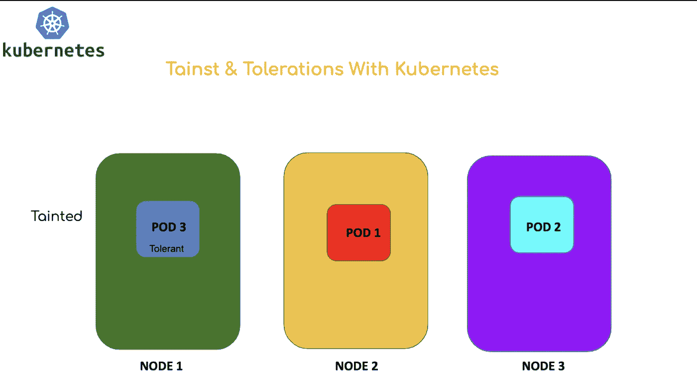
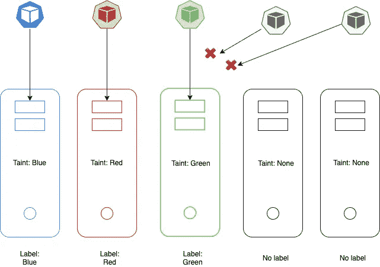

# 库伯内特家族的污点、容忍和节点亲和力

> 原文：<https://blog.devgenius.io/taints-tolerations-and-node-affinity-in-kubernetes-41d063157852?source=collection_archive---------5----------------------->



可能会有这样的用例，我们需要将某些 pod 仅放置在某些节点上。

举个例子，

*   有 3 个节点(2 个低资源节点和 1 个高资源节点)。
*   我们希望将运行高处理应用程序的 pod 放在具有更高资源的节点中。

默认设置基于负载平衡和资源可用性策略将 pod 放置在节点中。

此外，通过污染和容忍，我们可以保证节点接受某些 pod，但不能保证将 pod 放在某些节点上。

***节点选择器***

实现这一点的简单方法是使用**节点选择器**。

使用节点选择器的 Pod 配置示例

```
apiVersion: v1
kind: Pod
metadata:
    name: myapp-pod
spec:
    containers:
        - name: data-processor
          image: data-processor
    nodeSelector:
        size: Large
```

键值对(size: Large)实际上是分配给节点的标签。调度程序使用这些来将 pod 分配给特定的节点。

标记节点的命令:

```
kubectl label nodes <node-name> <key>:<value>
```

**节点选择器**的局限性是不能满足复杂的需求。例如:

*   如果我们想将 pod 放在一个大的或中等的标记节点上。
*   或者如果我们不想将 pod 放在小标签节点中。

***节点亲缘***

复杂的需求可以在节点关联中执行。

节点选择器中使用的示例可以重新定义如下:

```
apiVersion: v1
kind: Pod
metadata:
    name: myapp-pod
spec:
    containers:
        - name: data-processor
          image: data-processor
    affinity:
        nodeAffinity:
            requiredDuringSchedulingIgnoredDuringExecution:
                nodeSelectorsTerms:
                - matchExpressions:
                  - key: size
                    operator: In #NotIn, Exists,...
                    values:
                    - Large
```

让我们看一下**节点亲缘关系类型**:

1.  **requiredduringschedulingignoredduringeexecution**:如果规则不匹配，将不会调度 Pod(Pod 仍处于待定状态)，但已运行的 Pod 将被忽略(与规则无关)。
2.  **preferred during schedulingignoredduringeexecution**:如果规则不匹配，Pod 将在可用节点中调度，并且忽略已经运行的 Pod(与规则无关)。
3.  **requiredduringschedulingrequiredduringeexecution**:如果规则不匹配，则 Pod 不会被调度(Pod 保持挂起状态)，如果规则不匹配，则已经运行的 Pod 会被驱逐。

***结缘 vs 玷污与宽容***



让我们来看一个用例

1.  有 3 个节点:红色、蓝色和绿色。还有其他节点。
2.  有 3 个豆荚:红色，蓝色和绿色。还有其他的豆荚。
3.  我们的目的是把红 pod 放在红节点，绿 pod 放在绿节点，蓝 pod 放在蓝节点。
4.  我们也不希望任何其他豆荚被放置在我们的(红色、绿色和蓝色)节点中。
5.  我们也不希望我们的吊舱被放置在其他节点上。

让我们先试试**污点和容忍**:

1.  我们将红色、蓝色和绿色的污点应用于节点。
2.  然后我们对豆荚应用红色、蓝色和绿色的容忍。
3.  这将有助于将具有适当容差的 pod 放置在相应的污染节点中，但是这不能保证 pod 在没有污染的节点中结束。

现在让我们试试**节点关联**:

1.  我们在节点上应用键值对标签。
2.  然后，我们用适当的亲缘关系配置节点。
3.  这将有助于我们在适当的节点放置豆荚，但其他豆荚也可能在我们的节点结束。

因此使用了污染、容忍和节点亲和性的组合。

1.  我们将红色、蓝色和绿色的污点应用于节点，以防止不需要的 pod 被放置在被污染的节点中。
2.  我们在节点上应用键-值对标签，然后用适当的亲和力配置节点，这将让 pod 选择节点。