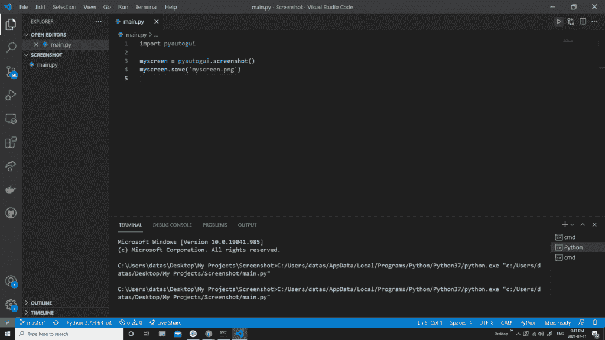

# 使用 Python-Python 编程截取屏幕截图

> 原文：<https://blog.devgenius.io/take-screenshot-using-python-python-programming-pyshark-48251e7f5767?source=collection_archive---------2----------------------->

## 在本教程中，我们将探索如何使用 Python 截图的多种方法。


作者图片

**目录**

*   介绍
*   和 **pyautogui** 一起截图
*   和 **PIL** 一起截图
*   用 **mss** 截图多台显示器
*   结论。

# 介绍

我们经常在用电脑的时候截图。Windows 和 Mac 都有可以轻松做到这一点的功能。

但是让我们假设你想自动化这个过程，也许每 5 分钟或每小时自动抓图。手动操作会花费你大量的时间，并且要求你在每个时间间隔都在电脑前。

使用 Python 我们可以很容易地自动化这项任务，并且有几个库支持这项功能。

要继续学习本教程，请打开“命令提示符”(在 Windows 上)并安装以下库

```
pip install pyautogui
pip install pillow
pip install mss
```

# 用 Python 中的 pyauogui 截图

如果您使用单个显示器，并且想要获取全屏的屏幕截图，此选项可能是最快和最方便的。或者，如果您知道要截图的“框”的坐标，这也是一个不错的选择。

从导入 [pyautogui](https://pyautogui.readthedocs.io/en/latest/index.html) 库开始:

然后调用**。screen down()**方法，该方法将返回和 Image 对象。只需使用任何适合您的文件名保存即可:

您应该在 Python 代码所在的目录中获得一个. png 文件。

下面是我截图的一个例子:



作者图片

运行代码几秒钟后。png 文件将出现在目录中:


作者图片

# 用 Python 和 PIL 截图

PIL 是最著名的处理图像的 Python 库之一，广泛用于图像处理。

期待它也包含截屏功能并不奇怪。与 pyautogui 解决方案类似，PIL 也允许用 Python 截取三行代码。

从从 [PIL](https://pillow.readthedocs.io/en/stable/index.html) 库导入 [ImageGrab](https://pillow.readthedocs.io/en/stable/reference/ImageGrab.html) 模块开始:

然后调用**。grab()** 方法，该方法将返回图像对象。只需使用任何适合您的文件名保存即可:


作者图片

运行代码几秒钟后。png 文件将出现在目录中:


作者图片

# 用 Python 中的 mss 截取多个监视器的截图

在前面的章节中，我们考虑了单个屏幕的截图。现在，如果你有两个显示器，你想截图呢？

Python 有一个令人惊叹的库 [mss](https://python-mss.readthedocs.io/index.html) ，它让你只需几个步骤就能轻松完成。

从导入库开始:

现在，要获取当前工作屏幕的截图，您只需使用:

在多屏幕的情况下，你需要做的就是将上述代码放入一个循环中，并添加一个 **mon** 参数:


作者图片

和


作者图片

运行代码几秒钟后，这两个。png 文件将出现在目录中:


作者图片

# 结论

在本文中，我们讨论了如何使用 Python 中的几个库来自动化截图。

如果你有任何问题或对编辑有任何建议，请随时在下面留下评论，并查看我的更多 [Python 编程](https://pyshark.com/category/python-programming/)文章。

*原载于 2021 年 7 月 22 日 https://pyshark.com**[*。*](https://pyshark.com/take-screenshot-using-python/)*