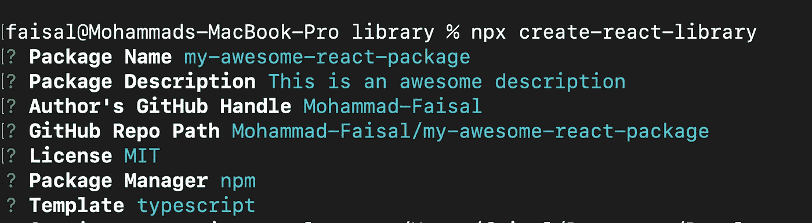

# 升级你的反应游戏

> 原文：<https://blog.devgenius.io/take-your-react-skills-to-the-next-level-in-4-minutes-d9d5bab492f4?source=collection_archive---------1----------------------->

剧透:构建库


照片由[阿尔方斯·莫拉莱斯](https://unsplash.com/@alfonsmc10?utm_source=unsplash&utm_medium=referral&utm_content=creditCopyText)在 [Unsplash](https://unsplash.com/s/photos/library?utm_source=unsplash&utm_medium=referral&utm_content=creditCopyText) 拍摄

为了成为一个更好的 React 程序员，我有一些建议给你…

1.  编写干净的小功能组件
2.  干(不重复)
3.  将逻辑与视图分离
4.  减少组件之间的依赖性
5.  整理您的文件和文件夹
6.  对重复的任务使用自定义挂钩
7.  向他人寻求建议，或者查看您的代码

一个很好的方法是同时实现这一切，并把你的技能提升到一个新的水平，你可以做的是

> **构建并发布 npm 包**

这几乎适用于任何技术。首先，对于初级或中级开发人员来说，这似乎是一项艰巨的任务。在我们的日常工作中，我们看到了许多很棒的库，但是我们并不经常觉得我们可以自己构建这样的东西。所以…

## 从非常简单的事情开始:

从非常小而简单的事情开始。也许在您的 react 项目中，您有一个简单的钩子，用于日志记录或某种验证。或者您可能有自己的定制组件。如果你在多个项目上工作，那会是一件非常痛苦的事情。因为每次你更新一些风格或逻辑时，你必须进入每个项目并进行更新。所以你只能用这一个功能发布一个库。

## 编写库/ npm 包的好处

*   帮助您了解其他库是如何工作的
*   向您介绍开放源代码惯例。
*   了解最佳实践
*   从其他程序员那里获得评论
*   为下一份工作改进你的简历

最重要的是，如果你能写一些对别人真正有帮助的东西，它可能会变成更大的东西。每一个大项目都是由一个小开发者的一些小创意开始的。就像你一样。

# 所以让我们建造一个

今天，作为开始，我们将为自己构建一个简单的 npm 包

我们将使用一个名为 [crate-react-library](https://www.npmjs.com/package/create-react-library) 的简单库。它将为我们搭建一个基本的库样板。打开您的终端，从

```
npm install -g create-react-library
```

然后为您的库想一个名称，并在 npm 中搜索它，看看是否已经有一个同名的库。如果您的名称是唯一的，则运行以下命令

```
npx create-react-library
```

然后像这样填写选项。



运行创建-反应-库的示例

请记住，您不需要指定许可证或 Github Repo 路径，但最好将它包含在您的软件包中，因为它将出现在您的 npm 软件包页面中。

我这里用的是 Typescript，但是你可以选择 vanila javascript。

所以运行这个命令将搭建一个新的项目。用你最喜欢的编辑器打开它。最初它看起来会像这样。


初始外观

现在进入你的 src 文件夹为你写一个定制的钩子/组件。我正在创建一个自定义记录器，它将控制台记录我传递给它的任何内容


我的牛逼伐木工

然后进入您的`index.tsx`文件，用下面的代码替换所有内容


输出你的钩子

仅此而已。现在，您可以通过运行

```
npm run build
```

看看是否一切都好。

现在去 [npm 网站](https://www.npmjs.com/)开个账户(如果你还没有的话)。

然后回到你的终端运行

```
npm login
```

它将询问您的 npm 句柄、密码和电子邮件地址。

现在是关键时刻了。运行以下命令将其发布到 npm

```
npm publish
```

如果你看到成功的信息，那么你可以去查看你在[https://www.npmjs.com/package/y](https://www.npmjs.com/package/my-awesome-react-package)的图书馆


你的包裹

现在，为了在您的任何项目中使用它，您只需安装它即可

```
yarn add my-awesome-react-package
```

然后将挂钩导入到您的任何组件中并使用它。


所以恭喜你！现在，您是 npm 包的所有者。但是记住这只是开始。现在你可以和全世界分享你的作品了。现在出去开始构建一些令人敬畏的包。

如果你是初学者，不要害怕。尝试提出新的有用的想法。你总是可以在以后改进它。你总是可以把你的一滴水放进浩瀚的知识海洋中。或者至少你的简历会看起来更酷:P

编码快乐！:D

**通过**[**LinkedIn**](https://www.linkedin.com/in/56faisal/)**或我的** [**个人网站**](https://www.mohammadfaisal.dev/) **与我取得联系。**