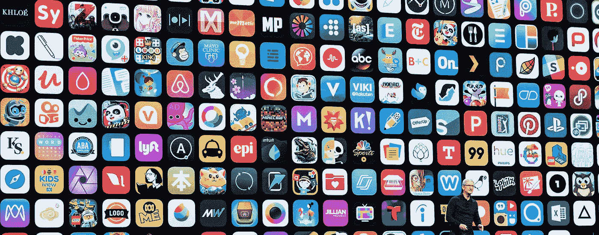
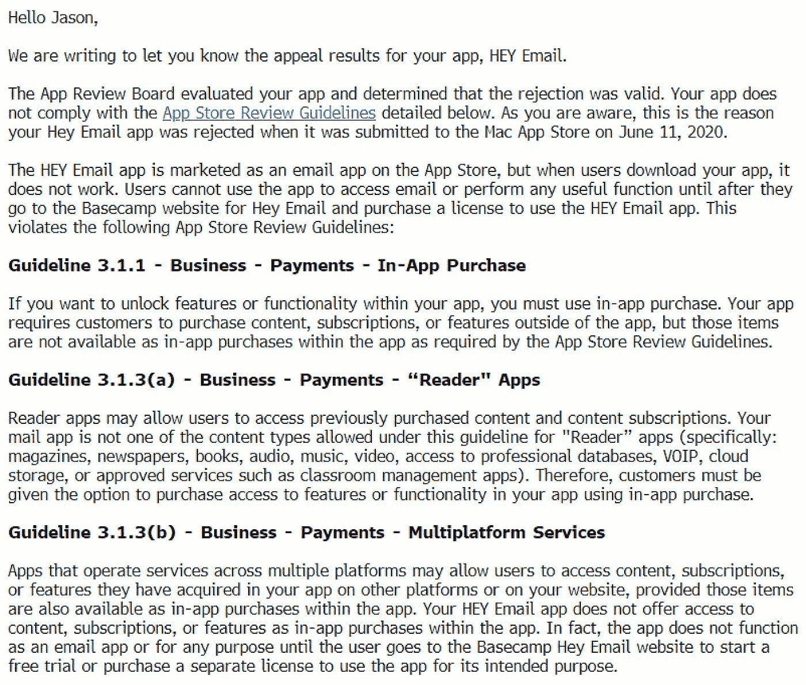
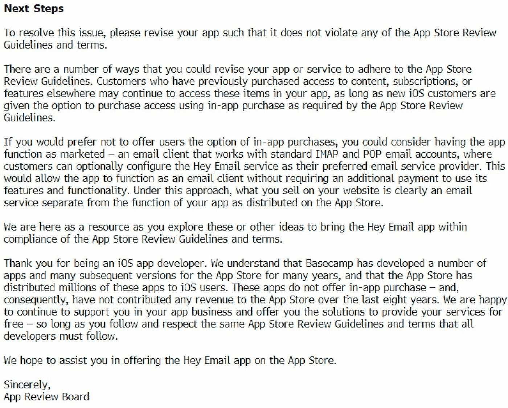
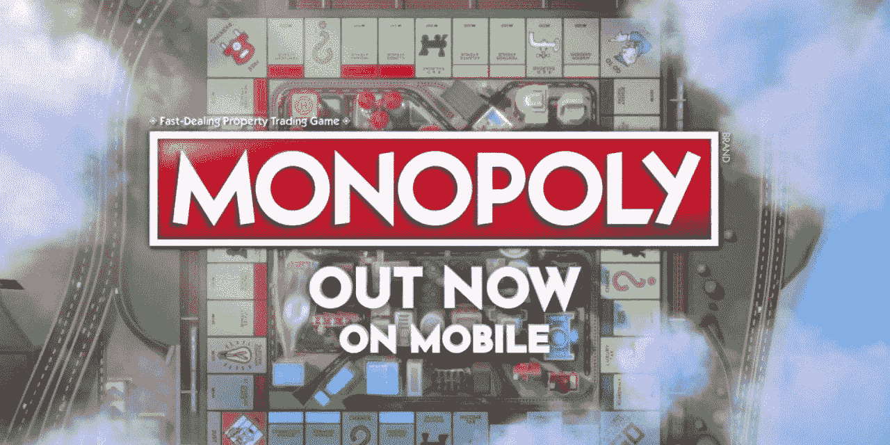

# 拆开苹果给 Basecamp 的拒绝信

> 原文：<https://blog.devgenius.io/taking-apart-apples-rejection-letter-to-basecamp-f9d83cc1688d?source=collection_archive---------12----------------------->

## 是时候该吹了

项目管理软件 [Basecamp](https://basecamp.com/) 背后的团队最近在名为 Hey 的电子邮件上发布了他们的自旋。这项服务有一些新鲜的想法，[看起来不错](https://twitter.com/ysamjo/status/1272806246370992129)，我可以谈谈如何在 Mail 之上建立一个社交网络[，但这不是你来这里的原因。](https://medium.com/@ysamjo/give-me-one-year-product-ownership-of-google-contacts-and-i-make-google-social-622e84a01cdf)

这个故事爆发了，因为苹果首先批准了这个应用程序，然后拒绝了下面的 Bugfix 更新，声明他们必须使用苹果的支付机制(包括 30%的 App Store 提成)。

Ruby on Rails 的创始人 DHH 在推特上公开了:

然而，苹果“双倍下注”。这是他们的完整答复:

让我们把它拆开，好吗？

> 你好杰森，
> 
> 我们写信让你知道你的应用程序的上诉结果，嘿电子邮件。

这封信是写给 Basecamp 的首席执行官杰森·弗里德的。但显然是苹果故意在 之前向新闻界 [**泄露的。是的，他们想控制叙事。这不是关于这个具体的事件，而是关于向整个开发者群体表明一个观点。**](https://twitter.com/dankim/status/1273752084689694721)

> 你的应用不符合下面详述的 App Store 审核指南。如你所知，这就是你的 Hey Email 应用在 2020 年 6 月 11 日提交到 Mac App Store 时被拒绝的原因。

嘿也被苹果应用商店拒绝了。为什么这本身不是一个大故事？因为用户可以直接从开放网站安装 Mac 应用。获取软件的默认方法。Mac App Store 没有真正流行起来的原因是。(这让我想知道 iOS 应用商店的成功是因为它对用户友好——的确如此——还是因为没有其他选择。)

使用直接安装的阀门(在移动设备上称为[侧装](https://www.androidcentral.com/what-sideloading-android-z))来释放一些压力是值得的。iOS 应用商店缺少这个阀门。

> HEY Email 应用程序在 App Store 上被宣传为电子邮件应用程序，但当用户下载你的应用程序时，它并不工作。用户无法使用该应用程序访问电子邮件或执行任何有用的功能，直到他们前往 Basecamp 网站购买 HEY Email 并购买使用 Hey Email 应用程序的许可证。

那是因为 Hey 是有偿服务。当然它不提供功能，以防你还没有付款。

我敢肯定，如果苹果允许的话，Hey 团队会在第一次发布时就把这个事实说清楚，包括支付指令和入职流程。正如[拉塞尔·伊万诺维奇](https://medium.com/u/31f3b5eceea7?source=post_page-----f9d83cc1688d--------------------------------) [证实](https://twitter.com/rustyshelf/status/1273039025117343744)，*“旧”规则是“如果你想在外部处理支付，没问题，但不要在你的应用中提及”。*

保罗·席勒(Paul Schiller)所说的新规则(T8)称，甚至这也不再可能。

我不得不链接到说明规则的推特，这本身就表明了这个错误。第一版的[审查指南](https://developer.apple.com/app-store/review/guidelines/#introduction)只不过是有人([也许是史蒂夫·乔布斯本人](https://twitter.com/drwave/status/24014716480))记下一些[失去的基石](https://www.iphoneincanada.ca/news/app-store-review-guidelines-revised-from-the-mouth-of-steve-jobs/)比如:*如果你的应用没有做一些有用的事情或提供某种形式的持久娱乐，它可能不会被接受。*

想一想。一个[、5000 亿美元](https://www.apple.com/newsroom/2020/06/apples-app-store-ecosystem-facilitated-over-half-a-trillion-dollars-in-commerce-in-2019/)的生意(大约是比利时[的 GDP](https://www.wikiwand.com/en/List_of_countries_by_GDP_(nominal)))没有明确的规则，只有[不同的](https://www.wikiwand.com/en/IOS_app_approvals#/Notable_rejected_apps)解释(你认为什么是“持久的娱乐”？)作者肯定不是薪酬最高的苹果员工。德国苹果播客 [Bits und so](http://www.bitsundso.de/bus584/770/) 将 App Store 审查过程戏称为“Bergwerk”(采矿厂)。似乎很合适。

我的意思是，我明白为什么这些规则没有以司法精确性写下来:苹果希望保留一些回旋余地和选择性。但是苹果怎么能指望别人把他们的整个生活建立在这样一个不稳定的基础上呢？

> 这违反了以下 App Store 审查准则:
> 
> 如果您想要解锁应用中的特性或功能，您必须使用应用内购买。您的应用程序要求客户在应用程序之外购买内容、订阅或功能，但根据 App Store 审查指南的要求，这些项目不能作为应用程序内购买。

至少这个规则是明确的。然而，不均衡的执行也于事无补。有几十个例子证明它不成立，甚至其他电子邮件应用程序也是如此。

面对这种情况，苹果[采取了](https://twitter.com/dhh/status/1272977734998745089)简单的方法:*“我们不会谈论其他应用”*。你可以称之为[虚伪](https://twitter.com/blader/status/1273949259478360064)。

> 阅读器应用程序可能允许用户访问以前购买的内容和内容订阅。您的邮件应用程序不属于本指南允许的“阅读器”应用程序的内容类型(具体而言:杂志、报纸、书籍、音频、音乐、视频、专业数据库访问、VOIP、云存储或教室管理应用程序等经批准的服务)。因此，客户必须能够选择使用应用内购买来购买您的应用中的特性或功能。

这是豁免某些部门的相对较新的尝试。“阅读器”这个词非常容易误导人，也容易出错，因为云存储应用程序不仅仅是消费型的——你可以上传东西。VOIP 或专业数据库也是如此。“以前购买的内容”在这里也不起作用。

苹果对商业应用和消费者应用做了另一个看似武断的区分。同样，这是一个没有正式记录下来的区别——我们不得不[依靠二手资料来源](https://www.protocol.com/hey-email-app-store-rejection)。约翰·格鲁伯[称](https://daringfireball.net/2020/06/hey_app_store_rejection_flimsiness#fn1-2020-06-16)试图区分消费者和企业是“可笑的”。*“我不是在故作害羞，但 iPhone 本身是什么？商业设备还是消费产品？”*

我猜这里发生的事情是，在网飞[于 2018 年](https://venturebeat.com/2018/12/28/netflix-permanently-pulls-itunes-billing-for-new-users/)退出 IAP 后，苹果不得不为他们以及 [Spotify](https://www.nytimes.com/2020/06/16/business/apple-app-store-european-union-antitrust.html) 找到一个漏洞，以保持他们至少有点快乐。又是格鲁伯:

> 你可以考虑让这款应用具备市场上的功能——一个可以与标准 IMAP 和 POP 电子邮件账户配合使用的电子邮件客户端，客户可以选择将 Hey 电子邮件服务配置为他们首选的电子邮件服务提供商。这将允许该应用程序作为一个电子邮件客户端，而不需要额外付费来使用其特性和功能。

一切都是一种权衡，Hey 团队优先考虑隐私和控制，而不是可移植性和向后兼容性。我们可以批评这个决定，但最终是他们的决定。销售用于运行应用程序的硬件的苹果公司认为，它可以告诉开发者应该如何设计他们的产品。

对我来说最大的讽刺是:每当苹果不得不在一方面更多的隐私和控制，或者另一方面开放标准和向后兼容性之间做出选择时，它总是选择和 Hey 一样的道路。

就像苹果新闻对 RSS 所做的一样:苹果新闻可以抓取和阅读 RSS 源(不像第三方 RSS 阅读器)，但是新闻不能添加其他 RSS 源。我想你可以看到双重标准。

> 感谢您成为 iOS 应用开发者。我们了解到，Basecamp 已经为 App Store 开发了许多应用程序和许多后续版本，App Store 已经向 iOS 用户分发了数百万个这样的应用程序。这些应用不提供应用内购买，因此，在过去的八年里，没有给应用商店带来任何收入。我们很高兴继续支持您的应用业务，并为您提供免费服务的解决方案，只要您遵守并尊重所有开发人员都必须遵守的应用商店审查指南和条款。

来自阴开发者[的](https://medium.com/u/b263e50a8bd7?source=post_page-----f9d83cc1688d--------------------------------)[回应](https://twitter.com/marcoarment/status/1273792094050684928)Marco Arment:*“让我们明确一点，苹果:除了每年 100 美元的开发者费用和我们购买的任何搜索广告，我们为你的高利润硬件增加的价值远远超过 30%。”*

最让我不爽的是[消极进取的](https://twitter.com/stroughtonsmith/status/1273720667540787200)语气。很明显，他们不在乎一个没有网飞大的小开发团队。他们知道他们拥有所有的优势。iPhone 生态系统需要它的应用程序(复数)——但它不在乎缺少一个邮件客户端(单数)。

其他人[也感觉到同样的音调](https://twitter.com/wilshipley/status/1273769355583451137)。对我来说，这听起来有点太接近威胁了。“如果你在我们商店里的那些免费应用程序出了什么事，那将是一种耻辱……也许你应该支付保护费？”

一些技术人员可能会感到愤怒，但终端消费者并不在乎。即使是那些支持 Basecamp 的人也会在下一代 iPhone 上市的当天购买它。大卫对战歌利亚。

不要搞错，Basecamp 不是唯一被攻击的人——只是其他人保持沉默。他们(可以理解)不会拿他们的开发者关系冒险。对苹果的恐惧可以追溯到几年前。直到今天，马可确保他的负面评论发生在他的播客一小时后。

我想补充几点:

1.  应用内支付并不是唯一的问题。例如，苹果[试图强迫](https://twitter.com/davidfrafael/status/1273880019971031045)应用采用它们的 [*与苹果*](https://medium.com/@ysamjo/reasons-i-wont-signing-in-with-apple-aa71cc6e0c46) 一起登录。
2.  只降低 30%的费用**不会有太大的好处。当然，这在短期内对 T9 有所帮助。但这更多的是关于苹果作为一个结构性的看门人和审查员，而不是钱。**
3.  我知道 Basecamp 的人有一些尖锐的观点——至少对于硅谷标准来说。但是，认为 Basecamp 这样做是公关噱头的想法只有在你没有调查事实的情况下才有意义:如果你的服务不能提供给一个愿意为邮件客户端付费的人群，这怎么会是好的营销呢？它需要一个怪异的天才来计时，以便苹果允许 1.0 版，并且在苹果改变规则不允许 1.01 版之后
4.  Basecamp 本可以走超人之路:形式上实现 IAPs。从技术上来说，你可以用苹果支付为超人付款，但标准流程包括一个入职视频电话，上面有注册 Superhuman 的指示。这意味着普通用户从未见过这个选项。应该只有少数超人用户以苹果的方式付费。判断取决于你:聪明还是狡猾？

我已经写过关于平台、聚合者和他们的寻租行为的文章。苹果是突出的特色。这是一个容易的目标，因为他们有围墙的花园接近 T21 的一切。

是的，苹果对其开发者的态度[并没有太大的改变](https://twitter.com/benedictevans/status/1273897794336706560)。但是规模扩大了:更多的用户，更多的应用，更多的开发者，更多的钱，更多的痛苦。

我已经敲了一段时间的鼓了:微软仍然(理所当然地)有一个坏的形象，因为他们当时如何使用他们的平台领导地位。现在苹果有了平台领导地位，他们表现得更差了。

这是迄今为止最令人震惊的例子。苹果是世界上最富有的公司。他们如此急切地寻求服务收入吗？有[更聪明的方法](https://medium.com/swlh/apple-services-bundle-economics-101-cb93a81caa9a)来实现这一点。

为什么需要[平台中立](https://medium.com/@ysamjo/platform-economies-need-more-platform-neutrality-less-break-up-a5e3d074c357#90f9:~:text=I%20call%20it%20Platform%20Neutrality.)规则的完美案例。