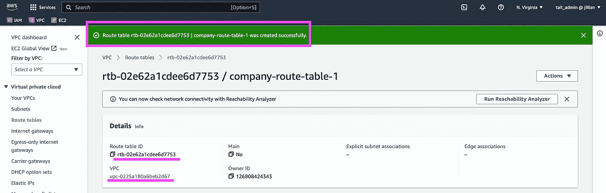
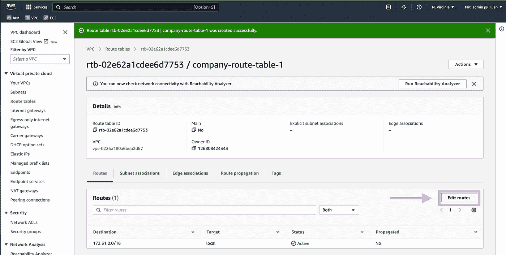
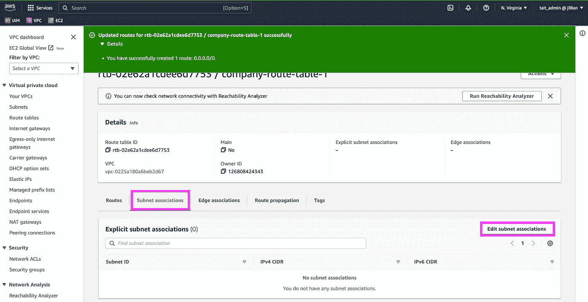

# 借助 AWS 将您的业务带入云

> 原文：<https://blog.devgenius.io/taking-your-business-to-cloud-9-bdc940192746?source=collection_archive---------4----------------------->

*如何通过六个简单的步骤为企业 Web 服务应用程序启动一个安全的 AWS EC2 实例*


将应用程序迁移到云中有很多原因。可达性。成本。可扩展性。安全。协作。冗余。你明白了。一旦你认为云对你的业务有意义，你该如何实现呢？如何从使用本地服务器迁移到使用云中的服务器？


没你想的那么复杂。

我将把这个过程分为六个简单的步骤，让您的组织开始进行云迁移。这是我们架构的概述:


下面是一个通过 EC2 实例构建在 AWS 云上的基本安全 Web 服务器的架构结构示例。来源:ACloudGuru.com

# **先决条件**

*   亚马逊网络服务账户([https://aws.amazon.com/](https://aws.amazon.com/))
*   了解关键网络术语及其工作原理(实例、虚拟私有云(VPC)、子网和网关)
*   互联网接入、网络浏览器、电子邮件帐户和计算机

# 步骤 1:登录您的 AWS 帐户，配置您的 VPC

虚拟私有云在 AWS 平台上为您的企业创建私有云。VPC 允许我们选择允许哪些流量进出我们的 Web 服务器。

因为我们要启动一个 Web 服务器，所以一些员工和数据需要是私有的，不能被公众访问，而其他文件需要被公众访问。

VPC 允许我们根据自己的需要设置这些参数，所以在部署文件之前，我们先设置和定义 VPC 的设置。


登录您的 AWS 帐户


使用搜索，找到并点击 VPC


单击创建 VPC

当你点击“创建 VPC”，你将被要求配置其设置。我根据下面一些典型的默认值配置了我的设置。根据您的独特需求，您的设置可能会略有不同。


如果一切都成功地创建了您的 VPC，您应该会得到类似这样的确认。点击“查看 VPC”


转眼间。

# 步骤 2:创建公共子网

子网是一个隔离的本地网络，我们最终将在其上启动 EC2 实例。这个实例是我们的 Web 服务器在 VPC 中的位置。

导航到 VPC 选项卡左侧菜单中的“子网”页面:


现在，单击“创建子网”:


在下拉菜单中，选择您刚刚在步骤 1 中创建的 VPC，并为您的子网配置设置。

命名您的子网

将您的子网与可用性区域相关联。*注意:美国东弗吉尼亚州往往是 AWS 服务最强大的地区，但是您可以选择任何您认为符合您需求的 AZ。*

设置您的 IPv4 CIDR 地址块— 10.0.0.0/24。保留默认标记，除非您希望为您的子网创建自定义标记。

然后点击“创建子网”:


单击“创建子网”后，您应该会被重定向回您的子网菜单，其中包含您为 VPC 新创建的子网:


# 步骤 3:配置子网网关，将公共流量路由到我们的子网

我们的子网还没有公开。为了使它可以访问互联网，我们需要配置我们的子网设置:


从我们的子网 AWS 菜单中选择子网，然后在“操作”下拉列表中选择“编辑子网设置”

在“编辑子网设置”菜单中，选择“启用自动分配公共 IPv4 地址”。因为我们将在这个子网中启动 EC2 实例，所以我们希望它自动为我们的实例分配 IP 地址。


如果成功，您将再次返回到您的子网菜单，并发出以下横幅通知:


现在我们将配置我们的互联网网关。互联网网关支持通过互联网进行通信。


单击“创建互联网网关:


为您的网关创建一个独特的标签。单击“创建互联网网关”。


如果成功，您将返回到您的 internet gateway 仪表板，并收到以下通知:


请注意通知是如何告诉我们新创建的网关没有连接到 VPC 的。让我们现在做那件事。单击“附加到 VPC”。


如果您关闭了通知横幅，也可以单击“操作”下拉菜单，然后单击“附加到 VPC”

选择您的 VPC 并点击“连接互联网网关”


同样，如果我们成功了，我们将被重定向到我们的 Internet Gateways 控制面板，并显示一个绿色通知，告诉我们我们成功了:


我们现在已经习惯了那种成功的感觉，不是吗？

# 步骤 4:配置路由

这告诉我们的公共子网中的流量如何到达互联网。为此，在左侧的 VPC 菜单中，我们单击“路由表”:


在路由表菜单中，单击“创建路由表”:


命名您的路由表。将路由表与您的 VPC 相关联，然后单击“创建路由表”:


如果成功，您将返回路由表菜单，并显示绿色的“成功”通知。从此页面向下滚动到“路线”子面板，然后单击“编辑路线”:



从“编辑路线”菜单中，单击“添加路线”。把 0.0.0.0/0 作为目的地(又名公网)。

对于目标选择“互联网网关”，这应该会自动填充到您的网关的 ID。选择它。

最后，单击“保存更改”


将通过以下通知来确认您的成功:


现在，我们必须将这个公共路由表关联起来，它向我们的 VPC 显示了如何通过我们的公共子网访问互联网。我们从路由表子菜单中执行此操作:



向下滚动找到并单击“子网关联”。在子菜单中，单击“编辑子网关联”


选择正确的子网，然后单击“保存关联”

太好了！现在，我们的公共子网将允许其内部的流量访问公共互联网。

# 步骤 5:将 EC2 实例启动到我们的公共子网中

以下是创建 EC2 实例的方法，您将使用该实例将 web 文件迁移到:


通过浏览器窗口顶部附近的搜索栏导航到 EC2


在 EC2 菜单中，单击橙色的“创建实例”


命名您的实例。选择你的操作系统&亚马逊机器映像。

选择一个密钥对名称。*注意:当您最初启动实例时，* ***这是您创建密钥对的唯一时间&参见下载私钥。*** *如果您要从本地机器 SSH 到 EC2 实例，您将需要它。*点击“创建密钥对”,一个. cvs 文件将被下载到您的机器上，其中包含您的私钥。把它放在安全的地方。

或者，您也可以重用您已经拥有的密钥对。

在网络设置部分，您可以定义允许哪些流量到达您的实例。默认情况下，它将创建一个启动向导安全组，允许来自任何来源的 SSH 流量。*注意:对于完全安全的 EC2 实例来说，这不是最佳实践。*

如果需要，您可以在“存储设置”部分添加更多卷或更改根卷的大小。

配置好所有设置后，单击“启动实例”


配置完所有实例设置后，单击“启动实例”

您应该会看到一个类似如下的确认屏幕:


这可能需要一分钟的时间，但是当您单击“查看所有实例”时，您应该会看到实例仪表板，其实例状态为“正在运行”。

# 步骤 6:通过 SSH 连接到 EC2 实例并安装 Apache

从技术上讲，您不需要通过 SSH 连接，因为 AWS 在浏览器中内置了“EC2 实例连接”功能，但是，我将快速向您展示如何从 CLI 连接。

首先，打开 CLI 并在浏览器中导航，以获取 SSH 所需的公共 DNS 信息


```
ssh -i "my-key-pair.pem" ec2-user@ec2-3-94-98-3.compute-1.amazonaws.com
```

如果成功，您应该会看到以下登录屏幕:


AWS 会立即提示您更新软件包。让我们现在就做吧

现在我们已经准备好安装 Apache 服务器软件了。在之前的[文章](https://medium.com/@tait.hoglund/installing-a-web-server-in-4-simple-steps-ubuntu-18-04-apache-2-4-63a386fa6626)中，我向您展示了如何创建 BASH 脚本来自动化这个过程。我们将在这里使用相同的脚本来自动化 Apache 安装过程。如果您对这个脚本是如何工作的感到好奇，我鼓励您阅读那篇文章。

出于我们今天的目的，我将只导入该脚本并从我的 CLI 运行:

```
nano serverspinup.sh
```

```
#!/bin/bash

yum -y update

yum -y upgrade

yum install -y httpd

systemctl start httpd

systemctl status httpd
```

```
chmod u-x serverspinup.sh
```

```
./serverspinup.sh
```

如果成功，您应该在 CLI 中看到以下内容:


Apache web 服务器已成功安装

通过访问 Web 服务器的公共 IP 地址来验证您的结果。


你做到了！您已经成功设置了云 VPC 来托管您的新云 web 服务器。

如果您对如何高效地将 web 服务器文件迁移到新的云 VPC 感兴趣。[参见我之前的文章](https://medium.com/@tait.hoglund/installing-a-web-server-in-4-simple-steps-ubuntu-18-04-apache-2-4-63a386fa6626)关于使用一个名为 MobaXTerm 的免费工具在几分钟内为您的新 AWS web 服务器迁移文件。

如果你觉得这些内容有帮助，请给我留下“掌声”和评论。我该如何改进这次安装？