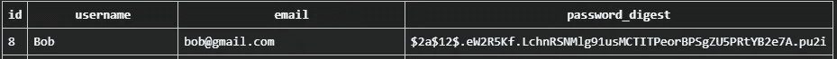

# 加密的故事

> 原文：<https://blog.devgenius.io/tales-from-the-encrypt-eb8538133f4a?source=collection_archive---------8----------------------->

# 在 Sinatra 中创建简单的用户认证

blogtrepreneur.com/tech

*密码加密*。*用户认证*。你可能一点也不知道它们是如何工作的，但它们听起来肯定是有益的，对吗？即使是那些一生中从未见过代码块的人，也可能会从一系列术语中挑选出那些术语，作为他们在任何 web 应用程序上注册帐户时想要使用的东西。

当我在 Flatiron 进行第三阶段项目时，我陷入了处理这些概念的兔子洞，一心想要拥有这些功能。通过 Sinatra 做到这一点是有挑战性的，因为我发现解决这个问题的文档中更好的部分是关于使用 Rails 实现相同的结果。此外，我通过 React 单独管理我的前端，这增加了学习如何完成这一切的另一层难度，因为我遇到的大多数情况都是在后端使用[*【ERB】*](https://docs.ruby-lang.org/en/2.3.0/ERB.html)*来生成前端。*

*有许多方法可以完成认证，我非常鼓励研究不同的方法。当我上周走上这条路时，我有非常具体的约束，虽然 Sinatra 可能不像 Rails 那样被大量使用，但我觉得仍然值得分解步骤，因为有许多相似之处，你永远不知道什么会澄清你所坚持的概念，即使只是通过不同的解释或例子。我还想指出的是，我将在这篇文章中详细描述的东西，绝不像你日常可能接触到的东西那样广泛或安全。这将是一个简单的解释，以提供对如何完成一个非常基本的用户认证类型的概念性理解。*

*在线创建帐户时，通常会要求您输入自己选择的密码，作为登录凭证的一部分。该密码*应该*被加密并存储在数据库中。我们可以创建一个不执行这一步的 web 应用程序吗？当然，但这就好比搬到市区，然后大开着门去睡觉。你保证会有人进你家吗？没有。但是你愿意冒这个险吗？大概不会。不幸的是，即使有这些类型的预防措施，帐户仍然会一直被黑客攻击。我们尽力而为，即使是最优秀的工程师也必须从基础做起，才能达到今天的成就。*

*在我们做任何事情之前，我们需要做一些改变，从我们的*应用控制器*开始。您需要在此处启用会话，在 Sinatra 中默认情况下是禁用的。 [*会话*](http://sinatrarb.com/faq.html) 帮助存储来自一个请求的数据，您可以从另一个请求访问这些数据，例如登录用户帐户，然后支付账单或编辑您的个人资料。*

*接下来，我选择创建一个*sessions _ controller . Rb*文件来处理登录/注销方法，但是您也可以通过 application_controller.rb 或 users_controller.rb 文件看到这一点。无论您是在前端还是后端工作，您通常不会在一个文件中看到所有的方法，根据职责组织它们是非常宝贵的。*

*上面的方法处理用户帐户的登录和注销，同时将会话设置为传入的相关数据或全部清除。值得注意的是，我在第 8 行编写的错误是针对我决定如何处理应用程序前端显示的错误消息的。不过，这可以用多种不同的方式来编码。*

*每当你在 Sinatra 中添加任何类型的控制器文件到你的应用程序时，一定要把它也添加到你的 *config.ru* 文件中。这是所有控制器正常运行所必需的。*

*我选择使用一个名为[*bcrypt*](https://rubygems.org/gems/bcrypt/versions/3.1.11)*的 Ruby 宝石来处理密码加密。确保安装它，将其添加到您的 gem 文件中(参考链接的 gem 页面中指定的 gem 文件和安装代码)，并在您的终端中运行`bundle install`。完成之后，使用`rake db:create_migration NAME=create_users`创建您的迁移。然后，当在您的迁移文件中创建表时，您*必须*包括一个*密码摘要*列。**

**它与 *bcrypt* 一起工作，对用户创建的任何密码进行加密，这样它们在数据库中看起来就像这样:**

****

**通过在终端运行你的`rake db:migrate`命令来完成这个。**

**接下来，在您的 *models* 目录中创建适当的文件，在本例中是 *user.rb，*我们向其中添加:**

**这里唯一需要的一行是[*has _ secure _ password*](https://api.rubyonrails.org/classes/ActiveModel/SecurePassword/ClassMethods.html#method-i-has_secure_password)，这有助于设置和验证前面详述的加密密码。其他两行完全是可选的验证，我选择添加到我的应用程序中，我认为在这里添加一个 [*链接*](https://guides.rubyonrails.org/active_record_validations.html) 会很有用，如果感兴趣的话，可以进一步阅读。**

**现在，创建一个 *user_controller.rb* 文件。这里我们有必要的代码，让我们的用户能够创建一个新帐户，以及登录到一个现有的帐户(最终，与我们前面创建的 sessions_controller.rb 文件一起工作)。**

**在我的例子中，我用 React 创建和管理我的前端，所以所有的请求、html 元素和路由都通过一个单独的 repo 来处理。如果你通过后端呈现前端元素，你需要在这里添加必要的代码，这取决于你是如何处理的。**

**确保更新您的 *config.ru* 文件，以包含我们刚刚创建的 *users_controller.rb* 文件。我之前将它包含在代码块中，但是也想在这里记下来。**

**同样，剩下的完全取决于您选择如何设置您的前端。因为我使用了 React，所以我在那个存储库中设置了所有的 html 元素和组件，并根据期望的结果将请求提取到后端。**

**我挣扎着面对这一切，虽然我不愿承认，但我不后悔追求它。尽管我不会马上被雇佣来执行这些类型的任务，但我确实认为我学到的东西非常有价值，不管我最终是否会专业地使用它。如果没有别的，这无疑是我在这个项目中迄今为止最大的努力，如果我能设法度过这几天而没有精神崩溃，我认为我在未来处理挑战性努力方面有很大的胜算。**