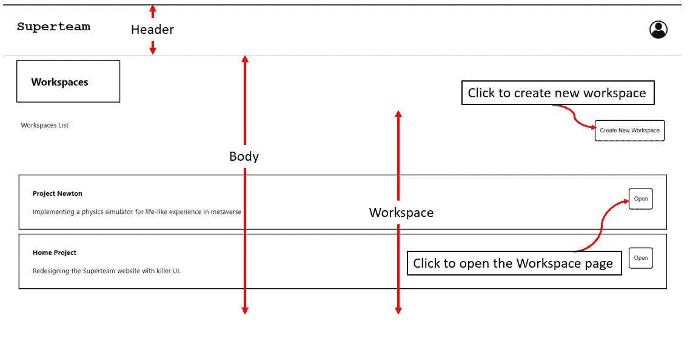

# 带有 React、Socket.io 和 Redis 的任务管理应用程序

> 原文：<https://blog.devgenius.io/task-management-app-with-react-socket-io-and-redis-ebffc4d0fde6?source=collection_archive---------5----------------------->


在这篇博客中，我将试着解释我在**超级团队**领导的《潜伏者达人》中的一个任务的实现。我非常兴奋地开发这个，直到我意识到最后期限是一天。我来得太晚了。我几乎想过放弃这个机会，但决定用我有限的时间和知识试一试。对我来说，15 天的比赛变成了 24 小时的黑客马拉松。

实时任务管理应用程序是每个组织维护其工作流程的重要组成部分。每个项目及其团队成员通过任务管理应用程序进行同步。一些著名的有吉拉，阿萨纳。在这里，我试图实现这样一个应用程序的一个非常基本的版本。

我将从基础开始，尝试给出实现的概述。这里有一个小视频解释了该应用程序是如何工作的。

[https://youtu.be/J15uPQTQUf8](https://youtu.be/J15uPQTQUf8)

代码链接:[crazylazylife/super team-task-manager](https://github.com/crazylazylife/superteam-task-manager)

## 先决条件

在我们开始实施之前，应该具备以下先决条件:

1.  Node.js、Express、ReactJS、Socket.io 的工作知识
2.  关于 [Redis](https://redis.io/) 的基本思路
3.  在您的系统中预装了 [Node.js](https://nodejs.org/en/) 和 [Redis-Server](https://redis.io/download) 。

## 这一切是如何运作的

既然你对基础知识很有信心，我们就可以深入了解这个应用了。您可以按照步骤将应用程序安装到您的系统中，并开始在其上进行开发。

首先，您可以将存储库分支到您的帐户，并在您的系统中克隆它。如果仔细观察，文件结构分为两部分:

1.  后端
2.  前端

在我们继续之前，让我们通过在终端中执行`redis-server`命令来启动 Redis 服务器。

## 后端

该文件夹包含托管服务器所需的所有文件。要启动服务器，我们需要执行以下命令。

`cd backend` —移动到后端文件夹

`npm i` —安装服务器的所有依赖项

`npm start` —启动服务器

首先，定义快递服务器，

```
// Importing the required dependencies
const app = require("express")();
const http = require("http").createServer(app);// Starting the server at port 4000
http.listen(4000, function (){  
    console.log("listening on port 4000");
});
```

服务器启动后，我们现在必须为 socket.io 设置我们的服务器。

```
// Importing the dependencies
const { Socket } = require("socket.io");
const io = require("socket.io")(http,
               {  cors: {    
                           origin: "*",    
                           methods: ["GET", "POST"],  
                  },
                }
           );// Initializing the socket io connection
io.on("connection", (socket) => { 

    // A sample endpoint for users to login
    socket.on("login", () => {    
        console.log("new login");
        // Returns list of all workspaces within    
        io.emit("allWorkspaces", getWorkspaces());  
    });   

    socket.on("openWorkspace", (workspace) => {
         console.log(workspace.name);
         // Create a new room with the workspace name
         socket.join(workspace.name);
         // All subsequest emmision happen in the room.
         io.in(workspace.name).emit("allTasks", getTasks(workspace.name));  });   

    // Endpoint for adding new Task
    socket.on("addTask", (task) => {    
        console.log(task);    
        addTask(task);    
        io.in(task.workspaceName).emit("newTask", { task });    
    }); // Endpoint for adding new Workspace
    socket.on("addWorkspace", (workspace) => {    
        console.log(getWorkspaces());   
        addWorkspace(workspace);    
        io.emit("newWorkspace", { workspace });    
    });   

    socket.on("disconnect", () => {    
        console.log("User disconnected");  
    });
});
```

最后，我们需要实现 redis-client 来将信息存储在数据库中。

```
// Importing the dependencies
const redis = require("redis");//Connect to redis server running in localhost at port 6379
let redisClient = redis.createClient({});
redisClient.connect();redisClient.on("connect", () => {  
    console.log("Redis client Connected");
});var workspaceList = [];
var taskList = [];// Get all the workspace details that are stored in DB
redisClient.get("workspaces", (error, workspaces) => {  
    if (error) console.log(error);  
    // console.log(workspaces); 
    workspaceList = workspaces;
});
setWorkspaces(workspaceList);
console.log("Workspaces updated... ");// Get all the task details that are stored in DB
redisClient.get("tasks", (error, tasks) => { 
    if (error) console.log(error);  
    taskList = task;
}); 
setTasks(taskList); 
console.log("Tasks updated... ");// To update the data in DB
socket.on("addTask", (task) => {    
        .
        .
        . 
        redisClient.set("tasks", getAllTasks());
});socket.on("addWorkspace", (task) => {    
        .
        .
        . 
        redisClient.set("workspaces", getWorkspaces());
});
```

有几个类似`getAllTasks()`或者`getWorkspaces()`的功能。这些是分别在`tasks.js`和`workspace.js`文件中定义的自解释函数。

## 前端

保存应用程序客户端开发代码的前端文件夹是使用`create-react-app`创建的。它遵循 ReactJS 项目的基本结构。应用程序的所有基本组件都在`src`文件夹中定义。

要启动前端，请执行以下命令，

`cd frontend` —移动到前端文件夹

`npm i` —安装依赖项

`npm start` —启动应用程序

然后，打开你最喜欢的浏览器，访问`http://localhost:3000`

代码非常简单，分为多个部分。下图简要说明了这些部分是如何划分的，



用户访问网站后进入的主页。

此页面包含用户可用的所有工作区的列表。**注意:这个实现还不处理用户认证。**


与牛顿项目相关的任务列表

此页面包含与从上一页面选择的特定工作区相对应的任务列表。

最后，


创建新任务的弹出表单

每当我们点击**添加新任务**或**添加新工作区**按钮时，我们会呈现一个弹出的空表单，要求我们填写必要的细节。下面是模式实现的示例代码，

```
**// Located in frontend/src/components/Tasks.js**// Importing dependencies
import { Modal } from "react-responsive-modal";const [open, setOpen] = useState(false);  
const onOpenModal = () => setOpen(true);  
const onCloseModal = () => setOpen(false);<Modal open={open} onClose={onCloseModal} center>
    <div className="modal-body">
        <h2>Create New Task</h2>
        <form className="contact-form" noValidate="noValidate">
            <div className="form-group">
              <input
                className="form-control"
                type="text"
                name="name"
                id="name"
                placeholder="Task Name"
                required=""
              />
            </div>
            <div className="form-group">
              <textarea
                className="form-control"
                name="desc"
                id="desc"
                placeholder="Task Details"
                required=""
              />
            </div>
            <input
              className="new-btn"
              id="add_task"
              type="button"
              value="Add Task"
              onClick={addNewTask}
            />
        </form>
    <div>
</Modal>
```

让我们也来看看 socket.io-client 实现。

```
**// Located in frontend/src/components/Body.js**// Importing dependencies
import io from "socket.io-client";const socket = io.connect("http://localhost:4000");
```

然后，我们将这个 socket 对象作为道具传递给它的子组件，用于所有的服务器交互。

比方说，我们必须持续监听正在创建的新工作空间。我们在一个 useEffect 钩子中定义了必要条件，

```
**// Located in frontend/src/components/Workspaces.js**useEffect(() => {    
    const wplistener = ({ workspace }) => {      
        setWorkspaceList((oldList) => [...oldList, workspace]);    
    };    
    // Listening at the endpoint for new broadcasts from the server
    props.socket.on("newWorkspace", wplistener);
    // Clean the listener to avoid duplicates
    return () => props.socket.off("newWorkspace", wplistener); 
}, []);
```

## 结论

总的来说，上述应用程序的实现非常简单，并且在某种程度上是不完整的，具有巨大的特性和功能空间。我试图在很短的时间内尽可能多地实施。

尽管这个项目在很大程度上是不完整的，但我能从中学到很多东西。我希望继续进一步迭代实现，并更新代码和博客。但如果有任何错误，请随时在这里或在存储库问题上发表您的疑问，或在 himadri.tito13@gmail.com 给我发邮件。我会尽最大努力解决你可能面临的任何问题。