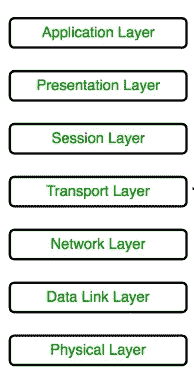

# TCP 是如何工作的？

> 原文：<https://blog.devgenius.io/tcp-icp-deep-dive-d8497e774bc1?source=collection_archive---------5----------------------->

# **OSI 模型的层次**

*   这是一个 7 层架构，每一层执行特定的功能。所有这 7 层协同工作，将数据从一个人传输到另一个人

*   **传输层:**所以有一层负责处理协议(TCP/UDP)。**传输层**还负责创建主机之间的端到端连接，主要使用 TCP 和 UDP。
*   所以接下来我们可以找到几层**应用层**。应用层接口直接与应用程序交互并提供通用的 web 应用程序服务。当我们编写一个应用程序时，大多数 HTTP 应用程序都运行在这个应用层上。但是 HTTP 已经建立在 TCP/IP 协议之上。
*   当我们使用 HTTP 时，有一个持久性 HTTP，然后没有持久性 HTTP。
    **持久性 HTTP**——他们有呃另外两个分支管道有管道和没有管道。
*   今天，我们将讨论两个网络何时需要连接，以及它们如何通过 TCP 相互连接/对话。

TCP 报头格式

让我们看看它们是如何工作的。

*   假设客户端是 10.0.1.1，服务器是 10.0.2.1。

**确认**

1.  第一步客户端尝试发送消息。

*   在第一个请求中，客户端发送一个标志 Syn 标志被启用。它说序列是 0。(这可以是任意随机数，不必是 0。)

2.服务器看到此消息。

*   现在，服务器用 ACK(确认)来响应。这表示 ACK 被设置为 1。(这里 ACK 和 Syn 同时从服务器发送)

3.现在客户端必须确认这个序列，所以客户端发送一个 ACK 给服务器。

4.因此，此时客户机和服务器之间的通信就建立了。

**窗口更新**

5.现在有一个可选的调用，叫做“窗口更新”。

*   当彼此通信时，它们共享窗口大小。(在缓冲区填满之前可以发送多少字节)。如果缓冲区已满，则他们向另一端发送缓冲区已满标志，说明由于缓冲区已满，不要发送消息。
*   因此，一旦应用程序消耗了缓冲区，缓冲区就会获得一些空闲空间。然后它会发送窗口更新调用，说嘿，现在你可以发送消息了。
*   然后，服务器将窗口更新发送回客户端。(长度为 0)

**消息发送**

6.所以 ACK 1 意味着当我们发送序列号时，另一方说这是我下一步期望的。它没有告诉我收到了什么。告诉我接下来会发生什么。

7.现在服务器想要发送消息。

*   假设服务器发送一个消息“你好客户端”。所以长度是 12。Ack 是 1，SEQ 是 1。
*   现在另一边计算下一个数=(当前数+这个数的长度字节数)。lask Ack=1，消息长度=12。所以是 1+12=13。

8.现在，服务器将消息发送给客户端，因此客户端必须向服务器发回确认，即确认 13。现在，消息事务完成。

**连接终止:**

9.现在，服务器向客户端发回一条消息，表示它将终止连接。为此，服务器将 Fin 标志发送到 1(完成标志设置为 1)。

SEQ 是 13 岁，因为最后一次确认是 13 岁。

10.现在客户端需要向 Fin 发送确认消息。

现在 ACK 是 14，因为上一个 SEQ 是 13。

11.所以客户可以终止连接。但与此同时，客户端正在发送其 Fin 数据包。所以 ACK 是 14。SEQ 是 1。

12.所以在服务器端看到消息，它需要向客户端确认。确认=2。SEQ=14。

*   此时，消息通信和连接建立完成。
*   现在看看这些处理是如何实际发生的。在这里，我使用 wireshark 来分析 TCP 是如何工作的。
*   对于连接，我们创建了两个程序，一个用于客户端，另一个用于服务器。

**server.js**

*   *我将我的服务器设置为在本地主机上的* ***端口 42181 上运行。*** *当客户端成功连接时，它会发出“你好，客户端”。然后断开。*

client.js

*   当我们运行客户端程序时，它也设置为**端口 42181。**过一会儿当断线信号到达时，断线。
*   在 wireshark 中，我选择了我的接口作为**回送流量捕获**进行分析。

> 现在，我将过滤这些流量—端口 42181

*所以你可以看到现在没有交通。*

*   现在我正在启动我的服务器(使用 node server.js)。

*   仍然没有交通。
*   所以现在我正在运行 client.js 程序。

*   现在让我们看看 wireshark 界面。

*   因此，在这里您可以看到，它最初发送 Syn 数据包。

*   作为回报，服务器发送同步和确认。

*   在这里你也可以看到窗口更新号。

*   现在服务器正在发送消息。

*   现在服务器终止连接，Fin 标志也被设置。

*   然后客户确认这一点。然后客户端也向客户端发送 Fin 标志，正如我们在上面的步骤 11 中所讨论的，然后服务器向其发送确认。

*   这就是 TCP 的工作原理。

# 引用自: