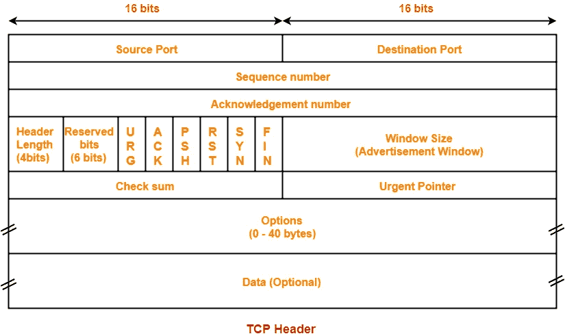
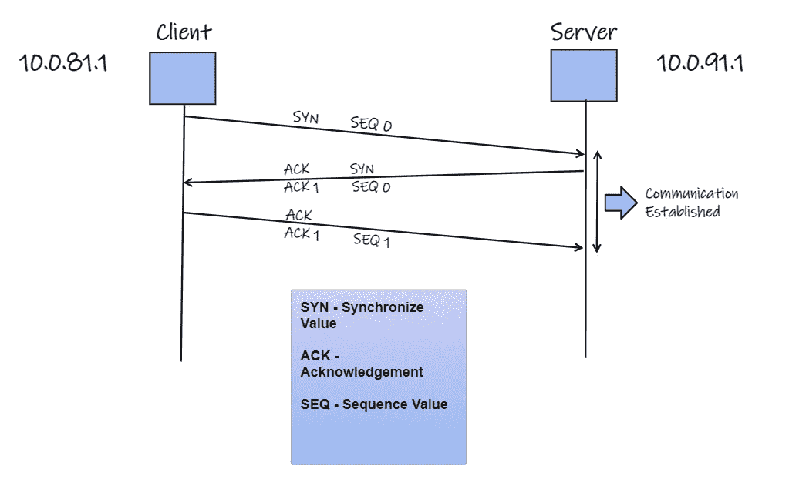
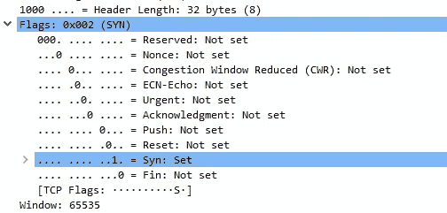
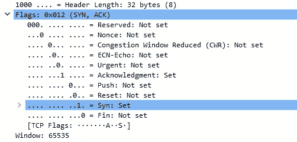
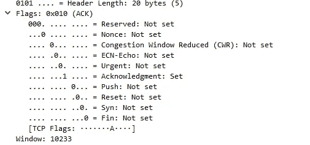
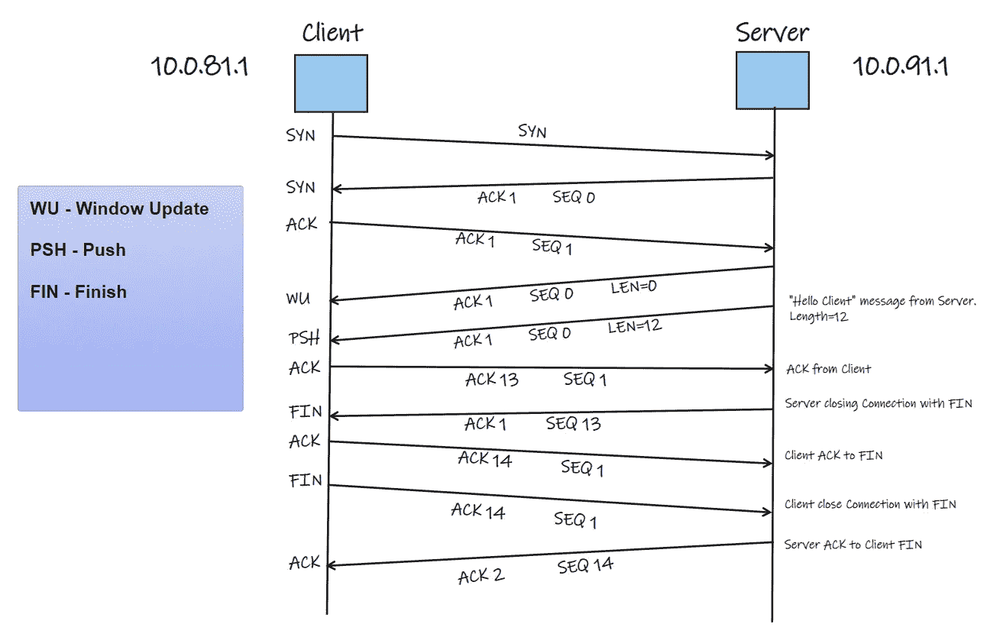
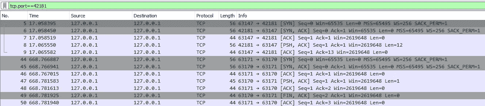
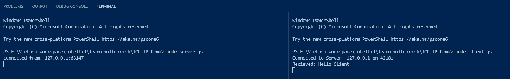

# TCP 生命周期(使用 Wireshark 演示)

> 原文：<https://blog.devgenius.io/tcp-life-cycle-demo-using-wireshark-715171eeceb6?source=collection_archive---------4----------------------->

读者们好，

在 OSI 模型中有一层处理协议，TCP，UDP 等等。接下来我们可以找到应用层。当我们编写 http 应用程序时，我们的 HTTP 应用程序运行在第七层。但是 HTTP 建立在 TCP 之上。让我们看看这些到底是如何工作的。

## 什么是 TCP？

传输控制协议(TCP)是互联网协议族的主要协议之一。它起源于最初的网络实施，其中它补充了互联网协议(IP)。

## TCP 报头格式？

在这里我们可以看到一些重要的部分，如**源端口**和**目的端口。**有**序列号**和**确认号**也有 6 个标志被调用

URG —紧急
ACK —确认
PSH —按下
RST —复位
SYN — Sync
FIN —完成

还有一个**窗口大小。我们需要看看这些联系到底是如何运作的。**

## TCP 三次握手

**三次握手**或 TCP 三次握手是在 TCP/IP 网络中用于在服务器和客户端之间建立连接的过程。这是一个包含三个步骤的过程，要求客户端和服务器在真正的数据通信过程开始之前交换同步和确认数据包。

三向握手过程的设计方式是两端同时帮助您发起、协商和分离 TCP 套接字连接。它允许您同时双向传输多个 TCP 套接字连接。

在第一种情况下**客户端发送消息 SYN** 作为建立连接的第一个请求。其中 SYN 设置为 1

在第二个实例**中，服务器发送 ACK 和 SYN** 作为回复消息，其中 ACK 和 SYN 设置为 1

在第三种情况下**客户端发送 ACK** 作为回复消息，其中 ACK 设置为 1。

现在连接成功建立。**轰！！！**

有一个可选的叫做**的窗口更新。**无论是客户端还是服务器端进行通信时，他们的通信窗口大小。在我的缓冲区失败之前可以发送多少字节。一旦你的应用程序消耗了缓冲区，缓冲区就会获得一些空间来接收来自另一端的消息。

## 它是如何传递信息的

连接建立后，服务器发送一个名为“Hello Client”的消息并断开连接。

下图解释了客户端和服务器如何建立连接和断开连接。

## TCP 如何实际工作

打开 Wireshark 后，选择环回接口。接下来我们有一个代码节点 js，它有客户端和服务器文件。

[在 main black hawk 1212/learn-with-krish(github.com)的 learn-with-krish/client . js](https://github.com/BlackHawk1212/learn-with-krish/blob/main/TCP_IP_Demo/client.js)

在客户端连接到服务器上的端口号 42181。当断开来临时，它将断开。

服务器文件

【github.com】

这里我有运行端口号 42181 的服务器。当客户端连接时，说 Hello Client 并断开会话。

在运行代码之前，我们需要过滤端口 42181 中的流量。我们的做法是，
在搜索栏中键入—***TCP . port = = 42181*** 。

之后，一旦我们首先运行代码，我们需要首先运行服务器，然后运行客户端。

启动服务器后，我们可以看到客户端和服务器在 Wireshark 中是如何相互连接的。

资源—[https://youtu.be/UpUd5zEUUgI](https://youtu.be/UpUd5zEUUgI)