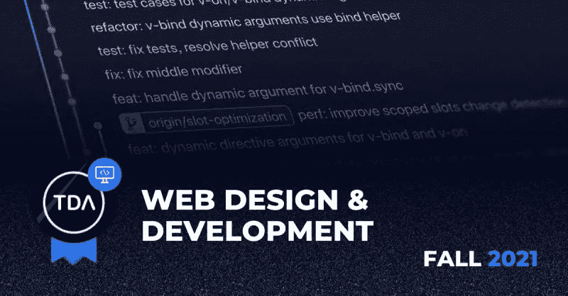
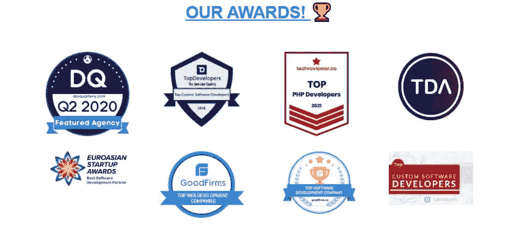

# TDA 认可顶级软件公司中的 CodeRiders

> 原文：<https://blog.devgenius.io/tda-recognizes-coderiders-among-top-software-companies-3ec2dc7cceef?source=collection_archive---------6----------------------->

今年秋天，全球十大数字机构的所在地 TDA 顶级数字机构将 CodeRiders 评为全球“顶级设计和开发公司”。TDA 强调 CodeRiders 作为一个合格的软件供应商的杰出工作，以及对我们通过数字化改善人们生活的使命的贡献。

以下因素在 CodeRiders 作为构建创新软件解决方案的声誉良好、值得信赖的软件供应商的排名中起着重要作用。

●软件服务质量，

●最近的项目及其成功，

●机构在该领域的专业知识和公认的声誉，

●各机构愿意通过发表文章与 TDA 社区分享有用的知识和见解。

除了介绍我们高质量的软件开发服务和在全球范围内代表我们的公司，我们还积极地向 TDA 社区提交有用的文章。我们的文章涵盖了企业主在投资离岸软件开发之前最常想到的问题的答案。Team CodeRiders 还旨在帮助不同行业领域和市场的公司在软件外包方面取得成功，并从与软件供应商的合作中获得最大收益。

查看 CodeRiders 在 TDA 的公司简介。通过我们的文章发布关于软件外包的最新消息，并了解更多关于我们的[案例研究](https://www.coderiders.am/portfolio)。

在 CodeRiders，我们致力于我们的使命，“*时间是宝贵的，自动化应该节省时间*”。我们认为，企业应该通过数字化摆脱日常枯燥的手工任务。

**CodeRiders 的软件开发和设计服务**

自 2014 年以来，CodeRiders 团队一直在构建具有最佳响应外观的可用和可访问的软件解决方案。

在 2014 年成为一家软件开发公司之前，CodeRiders 在 2013 年作为一所软件开发学校进入了 ICT 行业。我们学校有 800 多名校友，其中 15 人后来成为我们的全职软件开发人员，与我们一起工作至今。这是 CodeRiders 与该领域其他合格软件开发公司的区别因素之一。

除了提供公认的软件解决方案，我们还拥有强大的团队精神和公司文化。我们一起开始，知道如何作为一个团队一起工作。我们公司也有一个庞大的人才库，由以前的学生组成，他们目前是合格的软件开发人员。这使得我们在为项目增加更多人力资源方面更加灵活。

**我们提供什么**

**网页开发与设计**

我们创建了具有最佳响应外观的可用和可访问的 web 解决方案。我们高效且经济实惠的 web 开发和设计解决方案包括:

**●全周期网站开发**:我们从零开始建设你的网站，直到最后。完整的网站开发流程包括业务分析、设计、软件开发、实施、质量保证服务以及维护和支持。

**●响应式网页设计**:除了致力于后端和前端功能，我们还提供响应式网页设计服务，这在当今非常重要。50%的网络流量来自移动设备，这使得移动友好设计成为必要。CodeRiders 的团队为每种设备设计网站，无论是台式机、电脑、笔记本电脑、平板电脑还是智能手机。

**●网站迁移和整合**:code riders 团队将您的所有数据迁移到一个新的解决方案，并通过社交网络、API 集成、支付解决方案、高级分析等丰富您的网站。

**●云迁移服务** : CodeRiders 将你的网站迁移到亚马逊网络服务(AWS)、微软 Azure、谷歌云平台和其他云服务，使你的网站更具可扩展性和安全性。

**●维护和支持** : CodeRiders 负责其软件解决方案的维护和支持。因此，我们随时准备支持你，以防出现任何错误和重大差距，确保你保持快速增长。

**●符合 SEO 标准**:我们为您的营销和品牌认知活动构建 SEO 友好的软件解决方案。

**●安全和升级**:在 CodeRiders，我们确保您的数据始终受到保护，并且实施各种安全程序。

**定制软件开发**

我们构建定制的软件解决方案，以满足您公司的特定需求。我们的定制软件解决方案是根据我们独特的客户需求量身定制的。从[免费咨询阶段](https://www.coderiders.am/contact-us)到持续的上市后强化阶段，我们的业务发展专家会仔细检查您的需求。

如果您需要帮助归档精确的 SOW 文档，这里有一个免费的下载。查看我们全新的指南，撰写坦诚的 SOW 文档，并获得现成的样本。立即下载！

 [## 如何撰写可靠的工作范围| code riders 白皮书

### 里面是什么？

www.coderiders.am](https://www.coderiders.am/white-papers/how-to-write-a-solid-scope-of-work) 

我们的定制软件开发服务包括:

o **产品开发和项目恢复**:我们致力于实现您最有创意的想法，或者致力于完善和调整您已经存在的项目。

o **软件升级**:我们的专家利用现代和最新的技术来处理遗留系统。

o **企业解决方案开发**:我们一直在构建各种软件解决方案，以促进和加速大企业的工作系统。我们拥有构建 CRM 和 CMS 系统、BI、分析、电子商务平台等方面的专业知识。与我们的专家一起查看关于 [ERP 软件开发解决方案](https://www.coderiders.am/contact-us)的更多详情。

**手机应用开发**

我们的移动应用程序开发人员致力于为 Android 和 IOS 用户构建量身定制的应用程序。我们使用混合(跨平台)移动应用程序开发方法，以可承受的价格在最短的时间内创建最先进的应用程序。查看混合和本地应用开发的利弊[。](https://www.coderiders.am/blog/reasons-to-choose-hybrid-mobile-app-development-over-native)

**外包和 IT 咨询**

你可以从 CodeRiders 雇佣整个团队和专门的个人软件开发人员。我们专门的软件开发人员会迅速融入您的内部团队(如果您有团队的话)，并与您的员工密切合作，远程解决复杂的技术问题。同时，我们的软件开发人员、项目经理、质量保证专家团队能够提供全周期的软件开发服务。我们提供全周期产品开发、特定功能开发和团队扩充。了解更多关于 [CodeRiders 参与模式的信息](https://www.coderiders.am/software-development-process)。

**我们引以为豪的案例分析**

作为一家在多个行业拥有卓越专业知识的软件供应商，我们知道特定市场的软件解决方案能够真正带来价值。以下是我们在各个行业的一些成功项目。

[**远程医疗和健康技术软件解决方案**](https://www.coderiders.am/blog/telemedicine-vs-covid-19-healthcare-software-past-present-future)

CodeRiders 为药房、患者和医生构建了一个自定义应用程序(带有签名的 NDA)。这个应用程序的最初目的是将药剂师与医生和病人联系起来。该应用程序的一些主要功能包括:

医生、患者和药剂师的安全注册/登录功能

上传三方的适当数据，例如:

医生的诊断、处方、说明、治疗计划更新和跟踪，

患者关注的问题、进展，

药剂师关于各种药物、处方检查，

三方之间的来回通信、聊天、视频通话，

渐进跟踪。

电子处方。

[**FinTech 软件解决方案**](https://www.coderiders.am/blog/innovative-software-solutions-in-fintech-during-covid-19)

CodeRiders 在纳米比亚独立技术解决方案提供商 [Binary City](https://www.bcity.me/) 的现有金融系统上工作，以管理财富管理交易、转账、取款、存款和所需的增强功能。

CodeRiders 的首席开发人员和一名全职开发人员已经为这个项目工作了一年。我们的主要解决方案包括:

●创建交易

●将余额转移到其他账户

●各种文件类型生成，如 XML、CSV、TXT 等。)向银行发送请求

●各种类型的银行响应解析报告生成(Web 视图、pdf 生成、XLSX 生成)，

●在 [CodeRiders 软件开发公司的评审平台](https://www.coderiders.am/portfolio#binarycity)上查看更多关于 Binary City、我们的技术堆栈和客户评审的详细信息。

[**电子商务软件解决方案**](https://www.coderiders.am/blog/e-commerce-and-retail-solutions-are-stepping-up-during-covid-19-pandemic)

在这个忙碌的世界里，我们无法想象没有网上购物、订单和送货服务的生活。实体企业在数字世界面临着激烈的竞争。因此，正在实施先进的电子商务软件解决方案，以跟上不断增长的市场趋势和服务创新。CodeRiders 在电子商务行业拥有丰富的专业知识。我们的项目之一是建立一个在线市场和画廊，[footwall](https://www.footmall.se/)。Footmall gallery 已经成为商店和顾客之间的成功纽带，使购买变得更加容易，更加人性化。

查看《福尔的首席运营官》、Emil Svenson 对 CodeRiders 工作的反馈，或者阅读[完整案例研究](https://www.coderiders.am/portfolio#footmall)。

*“code riders 团队是一群热情的人，他们知道如何在有限的时间内解决业务和技术问题，并与我们自己的核心团队一起提供全面的端到端解决方案。我们已经与他们合作了几年，合作仍在继续。我的最佳推荐。”*

[**ERP 软件解决方案**](https://www.coderiders.am/blog/is-erp-software-implementation-a-justified-investment)

ERP 软件解决方案是当今后 COVID 时代繁忙的商业世界的最高需求。这些解决方案确保了大公司有效的工作程序和生产力。

Worldsoft Business Suite (WBS) 是我们成功的大型项目之一。这是一个商业管理的 CRM 和电子邮件营销系统。来自 CodeRiders 的两名软件开发人员一直致力于后端功能和 API 集成。该系统目前拥有超过 17 万名活跃粉丝。查看 Worldsoft AG 的首席技术官 Laurentiu Nat 对 CodeRiders 合作的看法，或者阅读完整的案例研究[点击这里](https://www.coderiders.am/portfolio#worldsoft-ag)。

*“团队在我们系统的后端功能上做得非常好，这几年我们一直在一起工作，非常有成效。随时参与讨论、按时交付结果、寻求新的解决方案以及保护产品——这就是我强烈推荐他们的原因！”*

作为一家软件外包公司，我们非常高兴和兴奋能够在授权和复杂软件解决方案的帮助下，让这个世界变得更加方便和灵活。

我们感谢所有支持者和知名组织，感谢他们对我们努力工作和致力于改进软件服务和解决方案的赞赏，包括 TDA 对我们公司成为国际 ICT 行业顶级设计和开发公司的认可。

**要了解更多关于我们的服务和解决方案** [**请联系团队 CodeRiders**](https://www.coderiders.am/contact-us) **。**