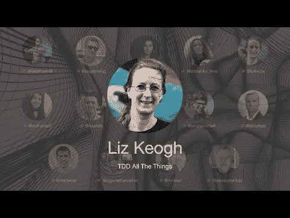

# TDD 所有的东西——利兹·基奥

> 原文：<https://blog.devgenius.io/tdd-all-the-things-liz-keogh-5ad498cee128?source=collection_archive---------3----------------------->

第一次国际测试驱动开发发生在 7 月 10 日。

在这一系列中，我将把每一个演讲连同我的笔记和进一步的阅读包括在内。

希望有很多读者会观看和重新观看这些演讲，因为它们值得多看几遍。

让我们继续…

# 个人简历

利兹·基奥是一位驻伦敦的精干而敏捷的顾问。她是一个著名的博客作者和国际演说家，BDD 社区的核心成员，Cynefin 框架和 Wardley Mapping 的热情倡导者。她有很强的技术背景，在交付和指导他人交付软件方面有超过 20 年的经验，从小型初创企业到全球企业。她现在的大部分工作都集中在精益、敏捷和组织变革上，以及在让变革变得创新、简单和有趣的过程中，使用透明性、积极的语言、形式良好的结果和不会失败的实验。

> TL；博士:放大你的积极态度！

# 讨论

# 我的个人笔记

*   BDD 建议我们应该以“应该”而不是“测试”开始方法。
*   现在，我们在考试上有注释。
*   BDD 迫使我们思考行为。
*   TDD 循环即行为:测试=描述行为，通过=改变行为，重构=放大积极因素
*   三明治方法论:先说好的，然后说坏的，之后又说好的。
*   三明治做得好:描述你想要的，不要让别人写自己的代码。
*   努力寻找心理安全。
*   新手可以通过复制现有的来编写测试。
*   有经验的初学者可以从头开始使用 TDD。
*   从业者在编写代码之前编写测试。
*   有知识的实践者将 TDD 传授给其他人。
*   重构时，要追求更好，而不是完美。
*   重构人的时候，要发挥自己的长处，要宽容。
*   在复杂性中，行为的测试和描述只是可能发生的例子。

# 扬声器链接

*   推特 [@lunivore](https://twitter.com/lunivore)
*   领英 [@liz-keogh-6240071](https://www.linkedin.com/in/liz-keogh-6240071/)
*   地点【https://lizkeogh.com 

请关注 TDD 会议:

*   [YouTube](https://www.youtube.com/channel/UCKn-DadPoyYssfAOMk1LSew)
*   [推特](https://twitter.com/tddconf)