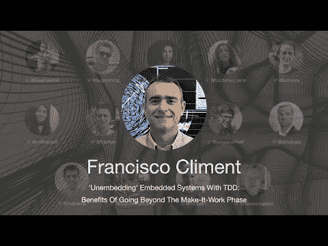

# TDD 会议 2021 —超越制造-工作阶段的好处— Francisco Climent

> 原文：<https://blog.devgenius.io/tdd-conference-2021-benefits-of-going-beyond-the-make-it-work-phase-francisco-climent-2aad23693991?source=collection_archive---------2----------------------->

第一次国际测试驱动开发发生在 7 月 10 日。

在这一系列中，我将把每一个演讲连同我的笔记和进一步的阅读包括在内。

希望有很多读者会观看和重新观看这些演讲，因为它们值得多看几遍。

让我们继续…

# 个人简历

Fran 是一名电信工程师，拥有超过 15 年的电子产品开发经验，包括硬件和软件。在这些年的大部分时间里，他在参与的每个项目中都没有遵循可持续的、迭代的和无缺陷的开发过程。他并不孤单。每个团队成员都相信“嵌入很难”。

六年前，他发现了 TDD，这让他走向了 XP、敏捷和工艺。这是一个发人深省的时刻:他感觉自己一直生活在柏拉图的洞穴里。就像一个囚犯与他心爱的硬件一起遭受斯德哥尔摩综合症，缺乏适当的原则，知识和工具，认为自己是一个真正的专业人士。如今，他帮助团队和组织改进他们的开发过程，这是他通往软件工艺的漫长道路的一部分。

> *TL；DR:在嵌入式系统上使用双目标 TDD。隐藏意外层。*

# 讨论

# 我的个人笔记

*   在嵌入式系统中，有几个微控制器以自治的方式响应。
*   固件变得过时是因为它依赖于硬件。软件可以改。
*   谬误 1:“第一次迭代的正确解”。更复杂，因为在嵌入式系统上数量级更高。
*   嵌入式系统代码依赖于当前的架构。
*   代码完全知道组件是如何连接的。
*   驱动程序层违反了依赖倒置和开放/封闭原则，并耦合到实现中。
*   我们没有业务实体或模块。
*   在硬件上调试是困难的，因为我们不能将缺陷映射到错误。
*   具有最高安全完整性级别的系统需要 100 个测试覆盖。
*   我们使用突变测试来衡量我们的测试。
*   我们的测试不执行的代码的任何部分都在我们的控制之外。
*   100%的代码覆盖率是拥有一套全面测试的先决条件。
*   突变测试向我们展示了测试和提高语义稳定性的极限情况。
*   一些开发人员通过欺骗编码来达到人为的 100%覆盖率。
*   在绿色 TDD 阶段，所有 sins 都是允许的。
*   我们应该改进重构阶段的内部依赖性。
*   全局性能预优化陷阱:

> *教训是:即使你确切地知道你的系统正在发生什么，衡量性能，不要推测。你会学到东西，而且十有八九不会是你对了！*

*罗恩·杰弗里斯*

> 除了硬实时环境，快速软件的秘密在于首先编写可调整的软件，然后调整到足够的速度。

*马丁福勒*

> *如果对“非事故”进行调查，公众会发现，在事故发生后看起来像是“等待发生的事故”的工程实践的内部混乱不外乎是“正常的技术”*

*黛安·沃恩*

*   [邓宁-克鲁格效应](https://en.wikipedia.org/wiki/Dunning%E2%80%93Kruger_effect)是另一个陷阱:我们认为我们知道的比我们真正知道的多。
*   嵌入式 TDD:双目标(我们的机器和目标)。
*   我们的目标应该是可重用的驱动程序，增加一个额外的层。
*   通过使用工厂和装饰设计模式，我们可以抽象和分离我们的设计。
*   调试是一种耻辱。
*   如果你的代码很糟糕，你就不可能敏捷。

# 扬声器链接

*   推特 [@fraclipe](https://twitter.com/fraclipe)
*   LinkedIn[@ Francisco climentperez](https://www.linkedin.com/in/franciscoclimentperez/)
*   网站[https://francliment.com/](https://francliment.com/)

请关注 TDD 会议:

*   [YouTube](https://www.youtube.com/channel/UCKn-DadPoyYssfAOMk1LSew)
*   [推特](https://twitter.com/tddconf)