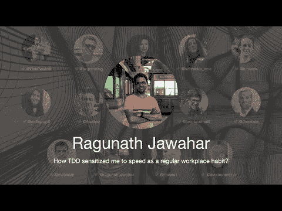

# TDD 会议 2021——TDD 如何让我对速度敏感起来，并将其作为一种常规的工作习惯？Ragunath Jawahar

> 原文：<https://blog.devgenius.io/tdd-conference-2021-how-tdd-sensitized-me-to-speed-as-a-regular-workplace-habit-ec3c8fec24c8?source=collection_archive---------3----------------------->

第一次国际测试驱动开发发生在 7 月 10 日。

在这一系列中，我将把每一个演讲连同我的笔记和进一步的阅读包括在内。

希望有很多读者会观看和重新观看这些演讲，因为它们值得多看几遍。

让我们继续…

# 个人简历

Ragunath 咨询过 Gojek、Dunzo、Tiffany & Co .、水野彩香等组织。，十年了。他稳定快速增长的团队，并回收团队害怕改变的代码库。他是快速反馈周期的粉丝，也相信你和你建立的团队一样优秀。

> *TL；DR:简短的反馈循环应该很快失败，抓住注意力并建议纠正措施*

# 讨论

# 我的个人笔记

*   在一个良好的反馈回路中，系统会告诉你什么时候出了问题。
*   它们帮助我们在早期发现错误。
*   好的反馈回路不如告诉你有问题的反馈回路好。
*   负反馈循环有助于更快地进行实验，并找出小的解决方案
*   IDEs 缩短反馈循环
*   我们必须缩短行动和结果之间的潜伏期
*   ide 通过可用选项提供出色的反馈指导
*   我们将刺激分为(潜伏期、注意力和反应)
*   Grammar.ly 以同样的方式工作，缩短反馈循环
*   ui 很难进行单元测试
*   优秀的反馈循环应该很快失效，抓住注意力并提出纠正措施
*   改善衡量成本效益的反馈周期

> *走得快唯一的方法就是走得好*

*罗伯特·马丁*

# 扬声器链接

*   推特 [@ragunathjawahar](https://twitter.com/ragunathjawahar)
*   LinkedIn[@ ragunathjawahar](https://www.linkedin.com/in/ragunathjawahar//)
*   地点[https://www.ragunath.xyz/](https://www.ragunath.xyz/%5Dhttps://www.ragunath.xyz/)

请关注 TDD 会议:

*   [YouTube](https://www.youtube.com/channel/UCKn-DadPoyYssfAOMk1LSew)
*   [推特](https://twitter.com/tddconf)